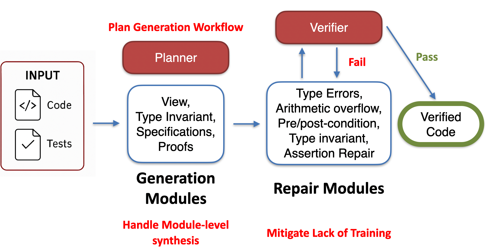

# VeriStruct

**An AI-Powered Assistant for Verus Formal Verification**

VeriStruct is an automated system that helps develop, debug, and refine Rust code with Verus formal specifications. It uses Large Language Models (LLMs) to generate specifications, infer invariants, and repair verification errors.

📄 **Paper**: [VeriStruct: AI-assisted Automated Verification of Data-Structure Modules in Verus](https://arxiv.org/abs/2510.25015) (arXiv:2510.25015)

---

## 🎯 Overview

VeriStruct automates the challenging process of formal verification by:

- **Generating specifications** (preconditions, postconditions, invariants)
- **Inferring mathematical abstractions** (View functions)
- **Detecting and repairing verification errors** automatically
- **Learning from examples** in the knowledge base
- **Iteratively improving** code until verification succeeds

### Key Features

✅ **Automated Specification Inference**: Generates requires/ensures clauses
✅ **View Function Generation**: Creates mathematical abstractions for data structures
✅ **Invariant Inference**: Discovers data structure invariants
✅ **Smart Error Repair**: 14+ specialized repair modules for different error types
✅ **Timeout Protection**: Automatic timeout detection and retry mechanisms
✅ **LLM Caching**: Reduces API costs and improves response times
✅ **Comprehensive Statistics**: Tracks performance metrics for research

---

## 🚀 Quick Start

### Prerequisites

- **Python 3.8+**
- **Verus** (install from [verus-lang.github.io](https://verus-lang.github.io))
- **LLM API access** (OpenAI, Azure OpenAI, Anthropic, or DeepSeek)
  - API key and endpoint configured in `src/configs/config-azure.json` or your custom config

### Installation

```bash
# Clone the repository
git clone https://github.com/ChuyueSun/VeriStruct.git
cd VeriStruct

# Install dependencies
pip install -r requirements.txt

# Configure your LLM API
# Option 1: Use existing Azure OpenAI configuration
# Edit src/configs/config-azure.json with your credentials

# Option 2: Create new configuration from template
cp src/configs/config.json.template src/configs/config-custom.json
# Edit config-custom.json with your API keys and settings

# 🔒 SECURITY: All config*.json files are automatically ignored by git
# Your API keys will NEVER be committed to the repository

# See src/configs/README.md for detailed configuration instructions
```

### Running VeriStruct

#### Quick Reference: Which Script to Use?

| Goal | Script | Key Arguments |
|------|--------|---------------|
| Single file, one config | `run_agent.py` | `--test-file <path>` `--config <name>` |
| Single benchmark, one/multiple configs | `run_bench.py` | `--benchmark <name>` `--configs <name(s)>` |
| All benchmarks, one/multiple configs | `run_all_benchmarks.py` | `--configs <name(s)>` |
| Benchmark without cache | `run_bench_no_cache.py` | `--benchmark <name>` `--configs <name(s)>` |

#### Usage Examples

```bash
# Single file with run_agent.py (most flexible, any file path)
python run_agent.py --test-file benchmarks-complete/vectors_todo.rs --config config-azure

# Single benchmark with run_bench.py (benchmark name only, supports multiple configs)
python run_bench.py --configs config-azure --benchmark vectors_todo

# Multiple configs for the same benchmark
python run_bench.py --configs config-azure config-openai --benchmark vectors_todo

# All benchmarks
python run_all_benchmarks.py --configs config-azure

# With additional options
python run_agent.py --test-file benchmarks-complete/rb_type_invariant.rs \
  --config config-azure --immutable-functions test
```

---

## 📚 Architecture

### Core Components

```
┌─────────────┐
│   Planner   │  ← Decides which module to execute
└──────┬──────┘
       │
       ▼
┌─────────────────────────────────────┐
│          Modules                    │
│  • Spec Inference                   │
│  • View Inference                   │
│  • Invariant Inference              │
│  • Proof Generation                 │
│  • Repair Modules (14 types)        │
└──────┬──────────────────────────────┘
       │
       ▼
┌─────────────┐
│   Verus     │  ← Verifies the code
└─────────────┘
```

### Workflow

VeriStruct follows a **Plan Generation Workflow** that handles module-level synthesis and mitigates lack of training data:



**Key Design Principles:**

1. **Plan Generation**: The Planner intelligently selects which module to run based on verification feedback
2. **Module-Level Synthesis**: Generation modules produce specifications, views, invariants, and proofs to handle module-level synthesis
3. **Iterative Repair**: Failed verification triggers specialized repair modules for different error types
4. **Training Mitigation**: Few-shot examples and repair modules compensate for limited training data to mitigate lack of training

---

## 📝 Design Rationale: Script Arguments

The different scripts use different argument patterns for specific reasons:

### `run_agent.py` - General Purpose Runner

- **Uses**: `--test-file` (full path) + `--config` (singular)
- **Purpose**: Maximum flexibility for running any Rust file
- **Use when**: Testing custom files, development, one-off verification tasks
- **Why singular `--config`**: Designed for focused, single-configuration runs

### `run_bench.py` / `run_all_benchmarks.py` - Benchmark Runners

- **Uses**: `--benchmark` (name only) + `--configs` (plural)
- **Purpose**: Structured benchmark evaluation with multiple configurations
- **Use when**: Running standard benchmarks, comparing configurations, experiments
- **Why plural `--configs`**: Supports running the same benchmark with multiple configs for comparison
- **Why name only**: Enforces consistent benchmark location (`benchmarks-complete/`)

This separation keeps the codebase clean while supporting both exploratory development and systematic evaluation.

---

## 🧩 Modules

VeriStruct includes specialized modules for different verification tasks:

### Inference Modules

| Module | Description |
|--------|-------------|
| **Spec Inference** | Generates preconditions and postconditions for functions |
| **View Inference** | Creates View functions (mathematical abstractions) for data structures |
| **View Refinement** | Improves existing View functions |
| **Invariant Inference** | Generates invariant functions for complex data structures |
| **Proof Generation** | Generates proof code (assert/assume statements) |

### Repair Modules

| Module | Fixes |
|--------|-------|
| **Assertion Repair** | Invalid assertions |
| **Arithmetic Repair** | Integer overflow/underflow |
| **Decrease Repair** | Termination proofs (decreases clauses) |
| **Invariant Repair** | Loop invariants |
| **Missing Repair** | Missing requires/ensures/invariants |
| **Mode Repair** | exec/proof/spec mode errors |
| **Old-Self Repair** | Incorrect use of `old()` |
| **Postcondition Repair** | Invalid ensures clauses |
| **Precondition Repair** | Invalid requires clauses |
| **Remove Invariant** | Over-specified invariants |
| **Syntax Repair** | Verus syntax errors |
| **Test Assertion Repair** | Failed test assertions |
| **Type Repair** | Type mismatches |
| **Regex Repair** | Pattern-based error fixes |

See [`documentation/technical/modules/`](documentation/technical/modules/) for detailed documentation.

---

## 📂 Project Structure

```
VeriStruct/
├── src/                              # Source code
│   ├── modules/                      # Module implementations
│   │   ├── spec_inference.py         # Specification generation
│   │   ├── proof_generation.py       # Proof code generation
│   │   ├── repair_*.py               # Repair modules
│   │   └── ...
│   ├── prompts/                      # LLM prompt templates
│   ├── configs/                      # Configuration files
│   ├── examples/                     # Example inputs/outputs for learning
│   ├── main.py                       # Main entry point
│   └── planner.py                    # Module selection logic
│
├── benchmarks/                       # Original benchmarks
├── benchmarks-complete/              # Complete (verified) benchmarks
├── benchmarks-too-complicated/       # Complex benchmarks
│
├── output/                           # Experiment results and analysis
│   ├── atomics_todo/                 # Results for atomics benchmark
│   ├── vectors_todo/                 # Results for vectors benchmark
│   └── ...
│
├── documentation/                    # Comprehensive documentation
│   ├── technical/                    # Technical design docs
│   │   ├── modules/                  # Per-module documentation
│   │   └── workflow.md               # System workflow
│   └── tutorial/                     # Getting started guides
│
├── tests/                            # Test files
├── utils/                            # Utility scripts
│
├── run_agent.py                      # Run on single file (--test-file, --config)
├── run_bench.py                      # Run benchmark (--benchmark, --configs)
├── run_all_benchmarks.py             # Run all benchmarks (--configs)
├── run_bench_no_cache.py             # Run benchmark without cache (--benchmark, --configs)
├── run_baseline_bench.py             # Run baseline experiments
├── run_repair_effectiveness_experiment.py  # Test repair modules
├── run_all_benchmarks_no_cache.sh    # Shell script for no-cache runs
├── run_model_comparison.sh           # Compare different models
│
└── README.md                         # This file
```

---

## ⚙️ Configuration

Configuration files are in `src/configs/`. Key settings:

### LLM Configuration

```json
{
  "aoai_api_key": "your-api-key",
  "aoai_generation_model": "gpt-4",
  "aoai_api_base": "https://api.openai.com/v1",
  "aoai_api_version": "2023-05-15"
}
```

### Available Configurations

- `config-azure.json` - Azure OpenAI (currently configured)
- `config.json.template` - Template for creating custom configurations

**Note:** You can create additional configurations for OpenAI, Anthropic Claude, or DeepSeek by copying the template and filling in your credentials. See `src/configs/README.md` for details.

### Environment Variables

```bash
# Optional customization
export VERUS_PATH="/path/to/verus"
export ENABLE_LLM_CACHE=1
export LLM_CACHE_DIR="llm_cache"
```

---

## 🧪 Benchmarks

VeriStruct includes multiple benchmark suites:

| Benchmark | Description | Functions |
|-----------|-------------|-----------|
| `vectors_todo` | Dynamic array with Vec | 8 |
| `bitmap_todo` | Bitmap data structure | 11 |
| `bitmap_2_todo` | Extended bitmap operations | 11 |
| `node_todo` | Linked list node | 9 |
| `bst_map_todo` | Binary search tree map | 11 |
| `treemap_todo` | Tree map data structure | 12 |
| `atomics_todo` | Atomic operations | 6 |
| `option_todo` | Option type wrapper | 5 |
| `rb_type_invariant_todo` | Ring Buffer | 12 |
| `transfer_todo` | State transfer protocol | 7 |
| `rwlock_vstd_todo` | Read-write lock | 8 |
| `set_from_vec_todo` | Set from vector | 6 |
| `invariants_todo` | Various invariants | 10 |

### Running Benchmarks

```bash
# Run all benchmarks with one config
python run_all_benchmarks.py --configs config-azure

# Run all benchmarks with multiple configs (for comparison)
python run_all_benchmarks.py --configs config-azure config-openai

# Run specific benchmark (recommended for benchmarks)
python run_bench.py --configs config-azure --benchmark vectors_todo

# Run specific file (for any file, not just benchmarks)
python run_agent.py --test-file benchmarks-complete/vectors_todo.rs --config config-azure

# Run without cache (for testing, disables LLM cache)
python run_bench_no_cache.py --configs config-azure --benchmark vectors_todo

# Run all benchmarks without cache using shell script
bash run_all_benchmarks_no_cache.sh

# Run model comparison experiments
bash run_model_comparison.sh
```

---

## 📊 Statistics & Analysis

VeriStruct collects comprehensive statistics for research:

- **LLM call counts** per stage/module
- **Iteration counts** and convergence metrics
- **Repair success rates** by error type
- **Execution times** and performance metrics
- **Verification outcomes** (success/failure)

Statistics are automatically saved in the `output/` directory for each run.

### Generating Reports

```bash
# Statistics are automatically collected during runs
python run_all_benchmarks.py --configs config-azure

# View results in output/ directory
# - JSON files: Raw statistics
# - CSV files: Summary tables
# - MD files: Analysis reports
```

---

## 🔧 Advanced Features

### LLM Caching

Reduce API costs and improve performance:

```bash
# Enable caching (default)
export ENABLE_LLM_CACHE=1

# Set cache directory
export LLM_CACHE_DIR="llm_cache"

# Set cache expiration (days)
export LLM_CACHE_MAX_AGE_DAYS=7
```

Cache files are stored as:

- `.json` - LLM responses with metadata
- `.md` - Original prompts for debugging

### Custom Examples

Add domain-specific examples to improve results:

1. Add input example: `src/examples/input-proof/my_example.rs`
2. Add output example: `src/examples/output-proof/my_example.rs`
3. Examples are automatically matched and used by modules

### Custom Repair Modules

Create specialized repair modules:

```python
from src.modules.baserepair import BaseRepairModule

class MyRepairModule(BaseRepairModule):
    ERROR_TYPE = "my_error_pattern"

    def exec(self, context):
        # Your repair logic
        return repaired_code
```

Register in `src/modules/repair_registry.py`.

---

## 📖 Documentation

### Getting Started

- **README.md** (this file) - Overview and quick start
- [`YOUR_CONFIG_SETUP.md`](YOUR_CONFIG_SETUP.md) - Azure OpenAI configuration guide

### Technical Documentation

- [`README_modules.md`](README_modules.md) - Module overview
- [`src/configs/README.md`](src/configs/README.md) - Configuration options
- [`documentation/`](documentation/) - Comprehensive technical documentation

### Research & Results

- **Paper**: [VeriStruct: AI-assisted Automated Verification of Data-Structure Modules in Verus](https://arxiv.org/abs/2510.25015)
- [`README_BASELINE.md`](README_BASELINE.md) - Baseline experiments
- [`output/`](output/) - Experimental results and analysis

---

## 📄 Citation

If you use VeriStruct in your research, please cite our paper:

```bibtex
@article{sun2025veristruct,
  title={VeriStruct: AI-assisted Automated Verification of Data-Structure Modules in Verus},
  author={Sun, Chuyue and Sun, Yican and Amrollahi, Daneshvar and Zhang, Ethan and Lahiri, Shuvendu and Lu, Shan and Dill, David and Barrett, Clark},
  journal={arXiv preprint arXiv:2510.25015},
  year={2025}
}
```

**Paper**: [https://arxiv.org/abs/2510.25015](https://arxiv.org/abs/2510.25015)

---

## 📧 Contact

For questions or issues, please open an issue on GitHub.

---

## 🔗 Related Projects

- [Verus](https://github.com/verus-lang/verus) - A verification system for Rust

---

**Happy Verifying! 🚀**
