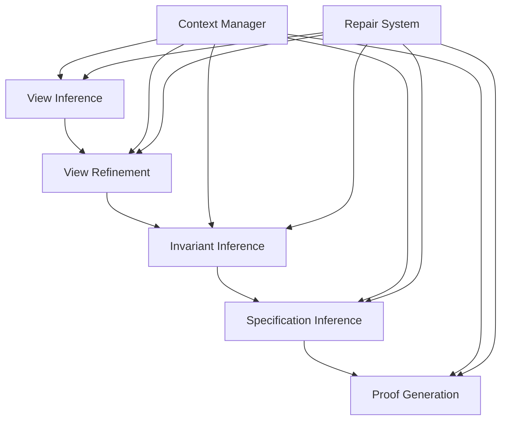

# VerusAgent Modules Documentation

## Overview

This directory provides documentation for each VerusAgent module, which together form a comprehensive verification solution.

## Running Example

See the [RingBuffer Example](examples/rb_type_invariant.md) for a walkthrough showing how the modules handle a real verification task.

## Core Verification Modules

### 1. [View Inference](view_inference.md)
- Generates mathematical abstractions for data structures
- Creates View functions for formal specifications
- Handles vector and collection abstractions
- Maintains type safety and semantic correctness

### 2. [View Refinement](view_refinement.md)
- Improves existing View functions
- Optimizes mathematical abstractions
- Simplifies representations
- Maintains semantic equivalence

### 3. [Invariant Inference](inv_inference.md)
- Generates invariant functions
- Captures data structure constraints
- Implements well-formed conditions
- Ensures type safety

### 4. [Specification Inference](spec_inference.md)
- Adds requires/ensures clauses
- Implements spec functions
- Handles trait specifications
- Maintains code safety

### 5. [Proof Generation](proof_generation.md)
- Generates verification proofs
- Implements loop invariants
- Handles proof assertions
- Manages proof blocks

### 6. [Lemma Preprocessor](lemma_preprocessor.md)
- Loads lemma files based on keywords found in the code
- Inserts lemmas after the `verus!{` marker before planning
- Uses explicit keyword-to-file mapping for precise lemma selection

## Module Relationships

## Common Features

All modules share these common features:

1. Safety Checking:
   - Code change validation
   - Type safety verification
   - Semantic preservation
   - Structure maintenance

2. Error Handling:
   - Multiple retry attempts
   - Temperature adjustment
   - Type error fixing
   - Compilation error repair

3. Result Management:
   - Best result tracking
   - Sample preservation
   - Score-based evaluation
   - Global optimization

4. Extension Points:
   - Custom patterns
   - Evaluation metrics
   - Example management
   - Result processing

## Module Integration

The modules work together in a coordinated workflow:

1. Initial Phase:
   - View Inference creates base abstractions
   - View Refinement optimizes representations
   - Invariant Inference adds constraints

2. Specification Phase:
   - Specification Inference adds contracts
   - Proof Generation verifies correctness
   - Error handling manages failures

3. Verification Phase:
   - All modules contribute to verification
   - Repair system handles failures
   - Context manager tracks progress
   - Result manager optimizes output

## Best Practices

When working with modules:

1. Module Selection:
   - Use appropriate module for task
   - Follow dependency order
   - Handle errors appropriately
   - Track progress consistently

2. Code Safety:
   - Validate all changes
   - Maintain type safety
   - Preserve semantics
   - Check compilation

3. Error Recovery:
   - Use multiple attempts
   - Adjust parameters
   - Follow fallbacks
   - Log progress

4. Result Optimization:
   - Track best results
   - Evaluate samples
   - Preserve history
   - Maintain context

## Extension Guidelines

When extending modules:

1. Pattern Addition:
   - Follow module conventions
   - Maintain safety checks
   - Handle errors properly
   - Update documentation

2. Metric Creation:
   - Define clear criteria
   - Implement evaluation
   - Handle edge cases
   - Document usage

3. Example Management:
   - Provide clear examples
   - Include edge cases
   - Document patterns
   - Maintain consistency

## Conclusion

The VerusAgent module system provides a comprehensive approach to code verification. Each module focuses on a specific aspect while maintaining integration with the overall system. The modular architecture allows for continuous improvement and adaptation to new verification challenges. Together, the modules collaborate to transform individual analyses into a cohesive verification workflow.
