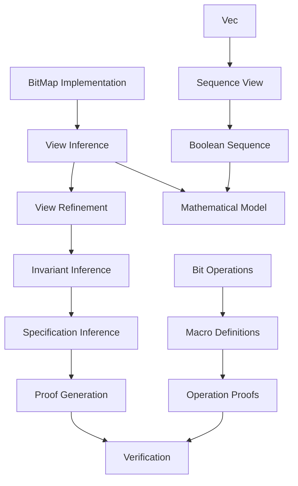

# BitMap Example - Module Workflow

This document illustrates how each VerusAgent module processes the BitMap example (`bitmap_2.rs`), a more complex data structure with bit-level operations.

## View Inference Module

The View Inference Module generates the mathematical abstraction for the BitMap:

```rust
pub struct BitMap {
    bits: Vec<u64>,
}

// Generated View implementation
impl BitMap {
    spec fn view(&self) -> Seq<bool> {
        let total_bits = self.bits@.len() * 64;
        Seq::new(total_bits, |i: int|
            get_bit64!(self.bits@[i / 64], (i % 64) as u64)
        )
    }
}
```

Key decisions:

1. Uses `Seq<bool>` for the mathematical sequence type
2. Flattens the bit vector into a sequence of booleans
3. Handles bit-level operations through mathematical mapping
4. Maintains total bit count through multiplication

## View Refinement Module

The View Refinement Module analyzes the View implementation:

```rust
// The View implementation is optimal because:
1. Uses minimal representation (sequence of booleans)
2. Handles bit-level operations mathematically
3. Maintains all necessary information
4. Provides clear mapping between implementation and abstraction
```

No refinement needed as the view effectively abstracts the bitmap.

## Invariant Inference Module

The Invariant Inference Module would generate type invariants:

```rust
#[verifier::type_invariant]
closed spec fn inv(&self) -> bool {
    // No explicit invariants needed as Vec<u64> maintains its own invariants
    // and bit operations are handled through macros and proofs
    true
}
```

Key aspects:

1. Relies on Vec invariants
2. Bit operations verified through separate proofs
3. No additional structural invariants needed

## Specification Inference Module

The Specification Inference Module adds specifications:

```rust
// Example: set_bit method
fn set_bit(&mut self, index: u32, bit: bool)
    requires
        index < old(self)@.len(),  // Index within bounds
    ensures
        self@ == old(self)@.update(index as int, bit),  // Only target bit changes
{
    // Implementation
}

// Example: or method
fn or(&self, bm: &BitMap) -> (ret: BitMap)
    requires
        self@.len() == bm@.len(),  // Equal lengths
    ensures
        self@.len() == ret@.len(),  // Length preserved
        forall|i: int| #![auto] 0 <= i < ret@.len() ==>
            get_bit64!(ret.bits@[i / 64], (i % 64) as u64) ==
            (get_bit64!(self.bits@[i / 64], (i % 64) as u64) ||
             get_bit64!(bm.bits@[i / 64], (i % 64) as u64)),  // Bitwise OR semantics
```

Key specifications:

1. Bounds checking
2. State updates
3. Bitwise operation semantics
4. Length preservation

## Proof Generation Module

The Proof Generation Module adds proof blocks:

```rust
// Example: set_bit proof
fn set_bit(&mut self, index: u32, bit: bool) {
    let seq_index: usize = (index / 64) as usize;
    let bit_index: u32 = index % 64;
    let bv_old: u64 = self.bits[seq_index];
    let bv_new: u64 = set_bit64_macro!(bv_old, bit_index as u64, bit);
    proof {
        set_bit64_proof(bv_new, bv_old, bit_index as u64, bit);
    }
    self.bits.set(seq_index, bv_new);
    proof {
        assert_seqs_equal!(
            self.view(),
            old(self).view().update(index as int, bit)
        );
    }
}

// Example: or proof
fn or(&self, bm: &BitMap) -> (ret: BitMap) {
    // ... implementation ...
    proof {
        bit_or_64_proof(u1, u2, or_int);
    }
    // ... continue implementation ...
}
```

Key proof elements:

1. Bit operation correctness
2. Sequence equality assertions
3. Bitwise operation proofs
4. State update verification

## Module Interaction Diagram



## Verification Challenges

The BitMap example presents unique challenges:

1. Bit-Level Operations:
   - Requires macro support
   - Needs bit manipulation proofs
   - Maintains mathematical abstraction

2. Index Calculations:
   - Handles division and modulo
   - Manages type conversions
   - Maintains bounds safety

3. Sequence Mapping:
   - Maps bits to booleans
   - Handles vector operations
   - Maintains length invariants

4. Proof Integration:
   - Combines multiple proof types
   - Uses specialized bit proofs
   - Maintains operation correctness

## Comparison with RingBuffer

The BitMap example differs from RingBuffer in several ways:

1. Abstraction Level:
   - BitMap: Bit-level operations with mathematical mapping
   - RingBuffer: Sequence operations with wrap-around handling

2. Invariant Structure:
   - BitMap: Relies on Vec and bit operation proofs
   - RingBuffer: Requires explicit structural invariants

3. Proof Complexity:
   - BitMap: Focuses on bit operation correctness
   - RingBuffer: Focuses on sequence manipulation

4. Specification Style:
   - BitMap: Uses bit-level and sequence specifications
   - RingBuffer: Uses sequence and capacity specifications

This example demonstrates how VerusAgent modules handle different verification challenges and adapt to various data structure requirements.
