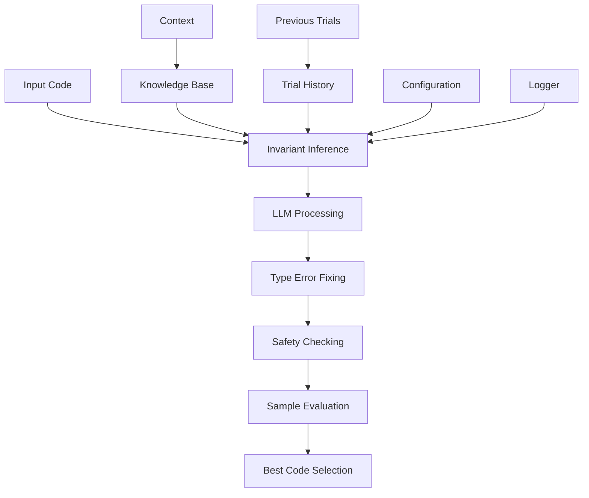

# Invariant Inference Module

## Overview

The Invariant Inference Module is responsible for generating and implementing invariant functions in Verus code. It focuses on capturing essential data structure properties and constraints through well-formed invariants.

## Architecture



The pipeline processes each output sequentially: results from the LLM are fixed for type errors, checked for safety, and then evaluated as samples before selecting the best code.

## Core Components

### 1. Invariant Function Generator

The module specializes in implementing invariant functions with specific characteristics:

- Common function names: `well_formed`, `inv`, `invariant`
- Direct access to private fields
- Support for `struct_with_invariants` patterns
- Bidirectional equivalence using `===`

Example instruction template:
```python
inv_instruction = """
You are an expert in Verus (a Rust-based verification framework). 
Given the following Rust code that defines a data structure with private fields, 
implement the invariant functions that are already declared in the code.

IMPORTANT:
- ONLY implement invariant functions that already exist
- Look for functions named well_formed, inv, invariant
- Do NOT rename existing functions
- Use === instead of ==> for bidirectional equivalence
- Do not modify other parts of the code
"""
```

### 2. Safety Checking System

The module implements comprehensive safety checks:

```python
def check_code_safety(self, original_code: str, generated_code: str) -> bool:
    """Check if generated code is safe to use."""
    # Check code changes using Lynette
    if not code_change_is_safe(
        original_code, generated_code, self.immutable_funcs, self.logger
    ):
        return False
        
    # Additional safety checks specific to invariants
    return True
```

### 3. Type Invariant Processing

Special handling for type invariants:

```python
def replace_at_len_in_type_invariant(self, content: str) -> str:
    """Replace @.len() with .len() in type_invariant blocks."""
    type_invariant_pattern = (
        r"(#\[verifier::type_invariant\][^{]*{((?:[^{}]|(?:\{[^{}]*\}))*)})"
    )
    matches = re.finditer(type_invariant_pattern, content, re.DOTALL)
    
    modified_content = content
    for match in matches:
        function_block = match.group(2)
        modified_block = re.sub(r"@\.len\(\)", r".len()", function_block)
        # Update content with modifications
```

## Workflow

### 1. Initialization
```python
def __init__(self, config, logger):
    super().__init__(
        name="inv_inference",
        desc="Generate invariant functions for the data structure",
        config=config,
        logger=logger,
    )
    self.llm = LLM(config, logger)
```

### 2. Execution Process

The module follows a systematic execution process:

1. Code Analysis:
```python
def exec(self, context) -> str:
    code = context.trials[-1].code
    original_code = code  # Store for safety checking
```

2. Multiple Retry Attempts:
```python
max_retries = 3
for retry_attempt in range(max_retries):
    instruction = build_instruction(
        base_instruction=self.inv_instruction,
        add_common=True,
        add_invariant=True,
        code=code,
        knowledge=context.gen_knowledge(),
    )
```

3. Response Processing:
```python
def _process_responses(self, responses: List[str], original_code: str):
    safe_responses = []
    for response in responses:
        processed = self.replace_at_len_in_type_invariant(response)
        fixed_processed, _ = debug_type_error(processed)
        if self.check_code_safety(original_code, fixed_processed):
            safe_responses.append(fixed_processed)
```
This step fixes type errors prior to running safety checks, mirroring the architectural flow from LLM output to sample evaluation.

4. Best Result Selection:
```python
best_code, best_score, _ = evaluate_samples(
    samples=safe_responses,
    output_dir=output_dir,
    prefix="03_inv_inference_processed",
    logger=self.logger,
)
```

## Features

### 1. Intelligent Invariant Generation
- Understands data structure semantics
- Preserves existing function names
- Maintains code structure
- Handles complex invariant patterns

### 2. Safety Mechanisms
- Code change validation
- Type safety checking
- Semantic preservation
- Structure preservation

### 3. Error Handling
- Multiple retry attempts
- Temperature adjustment
- Fallback strategies
- Comprehensive logging

### 4. Result Management
- Best result tracking
- Sample preservation
- Score-based evaluation
- Global optimization

## Best Practices

1. Invariant Implementation:
   - Use direct field access
   - Prefer `===` for equivalence
   - Preserve existing names
   - Maintain code structure

2. Safety Checks:
   - Validate code changes
   - Check type safety
   - Preserve semantics
   - Maintain structure

3. Error Recovery:
   - Multiple attempts
   - Temperature adjustment
   - Fallback options
   - Detailed logging

4. Result Optimization:
   - Track best results
   - Evaluate samples
   - Preserve history
   - Global tracking

## Extension Points

1. Custom Safety Checks:
```python
def add_safety_check(self, check_function):
    """Add custom safety check."""
    self.safety_checks.append(check_function)
```

2. Invariant Patterns:
```python
def add_invariant_pattern(self, pattern: str, handler: Callable):
    """Register new invariant pattern handler."""
    self.invariant_patterns[pattern] = handler
```

3. Result Evaluation:
```python
def add_evaluation_metric(self, metric: Callable):
    """Add custom evaluation metric."""
    self.evaluation_metrics.append(metric)
```

## Conclusion

The Invariant Inference Module provides a robust system for generating and implementing invariant functions in Verus code. Its combination of intelligent generation, comprehensive safety checks, and sophisticated error handling makes it a reliable tool for maintaining data structure invariants. The module's extensible architecture allows for continuous improvement and adaptation to new verification challenges.
