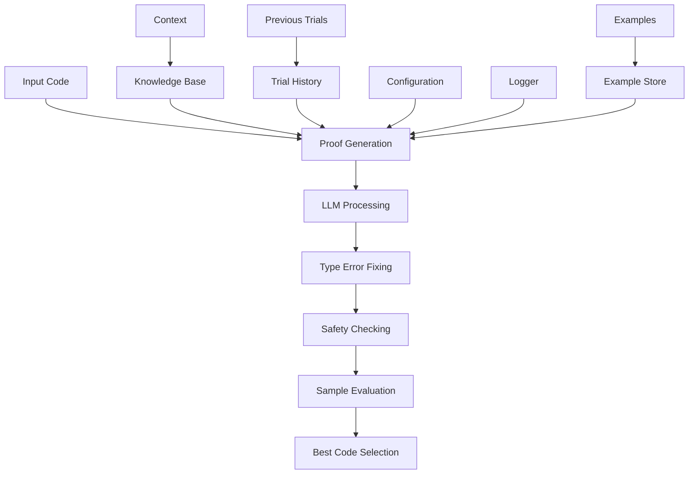

# Proof Generation Module

## Overview

The Proof Generation Module is responsible for generating and implementing proof blocks in Verus code. It focuses on replacing `// TODO: add proof` markers with appropriate proof blocks and loop invariants that help Verus verify the program.

## Architecture



## Core Components

### 1. Proof Block Generator

The module specializes in generating proof blocks with specific characteristics:

```python
proof_instruction = """
You are an expert in Verus. Your task is to replace every occurrence of
`// TODO: add proof` or `// TODO: add invariants` with appropriate proof blocks
or loop invariants that help Verus verify the program.

1. PROOF BLOCK STRUCTURE:
   - For regular functions: Add proof blocks using `proof { ... }`
   - For proof functions: Write assertions directly in function body
   - Each proof block should be focused and minimal

2. PROOF BLOCK CONTENTS:
   - Start with type invariant usage
   - Use lemmas appropriately
   - Use strategic assertions
   - Apply by(...) syntax for proof steps
"""
```

### 2. Loop Invariant Generator

Specialized handling for loop invariants:

```python
"""
When adding loop invariants, follow these steps:
1. Identify and add invariants for EVERY variable that is READ:
   - Scalar variables
   - Array/vector elements
   - Initial value invariants

2. Identify and add invariants for EVERY variable that is WRITTEN:
   - Direct assignments
   - Vector/array updates
   - Repeat relevant invariants
"""
```

### 3. Safety Checking System

Comprehensive safety validation: the module logs type errors, falls back to the
original response when necessary, and only accepts changes that pass safety
checks.

```python
def _process_responses(self, responses: List[str], original_code: str):
    safe_responses = []
    for response in responses:
        # Fix type errors
        fixed_response, _ = debug_type_error(response, logger=self.logger)
        final_response = fixed_response if fixed_response else response

        # Check safety
        if code_change_is_safe(
            origin_code=original_code,
            changed_code=final_response,
            verus_path=verus_path,
            logger=self.logger,
        ):
            safe_responses.append(final_response)
    return safe_responses
```

## Workflow

### 1. Initialization

```python
def __init__(self, config, logger):
    super().__init__(
        name="proof_generation",
        desc="Generate proofs for Verus functions",
        config=config,
        logger=logger,
    )
    self.llm = LLM(config, logger)
```

### 2. Execution Process

1. Code Analysis:

```python
def exec(self, context) -> str:
    code = context.trials[-1].code

    # Check for proof markers
    if self._should_skip(code):
        return code
```

2. Multiple Retry Attempts:

```python
max_retries = 3
for retry_attempt in range(max_retries):
    instruction = build_instruction(
        base_instruction=self.proof_instruction,
        add_common=True,
        code=code,
        knowledge=context.gen_knowledge(),
    )
```

3. Response Processing:
The module logs type errors, uses the original response when fixes are not
produced, and then validates safety.

```python
def _process_responses(self, responses, original_code, verus_path):
    safe_responses = []
    for response in responses:
        fixed_response, _ = debug_type_error(response, logger=self.logger)
        final_response = fixed_response if fixed_response else response
        if code_change_is_safe(original_code, final_response):
            safe_responses.append(final_response)
```

## Features

### 1. Proof Block Generation

- Regular function proofs
- Proof function assertions
- Type invariant usage
- Lemma integration
- Strategic assertions

### 2. Loop Invariant Generation

- Variable read tracking
- Variable write tracking
- Initial value invariants
- Vector/array handling
- Invariant repetition

### 3. Error Handling

- Multiple retry attempts
- Temperature adjustment
- Type error fixing
- Comprehensive logging

### 4. Result Management

- Best result tracking
- Sample preservation
- Score-based evaluation
- Global optimization

## Best Practices

### 1. Proof Implementation

- Use appropriate block structure:

  ```rust
  proof {
      use_type_invariant(&*self);
      assert(condition);
      by(nonlinear_arith);
  }
  ```

### 2. Loop Invariant Implementation

- Track all variables:

  ```rust
  proof {
      invariant i >= 0 && i <= v.len();
      invariant forall|j: int| 0 <= j < i ==> v[j] == old(v)[j];
  }
  ```

### 3. Safety Checks

- Validate code changes
- Check type safety
- Preserve semantics
- Maintain structure

### 4. Result Optimization

- Track best results
- Evaluate samples
- Preserve history
- Global tracking

## Common Proof Locations

1. Function Start:

```rust
fn example(&self) {
    proof {
        use_type_invariant(&*self);
    }
    // ... function body
}
```

2. Before Loops:

```rust
proof {
    // Setup loop invariants
    invariant i >= 0;
    invariant sum == old(sum);
}
while i < n {
    // ... loop body
}
```

3. After Key Operations:

```rust
v.push(x);
proof {
    assert(v.len() == old(v.len()) + 1);
    assert(v[v.len() - 1] == x);
}
```

## Extension Points

1. Custom Proof Patterns:

```python
def add_proof_pattern(self, pattern: str, handler: Callable):
    """Register new proof pattern handler."""
    self.proof_patterns[pattern] = handler
```

2. Invariant Patterns:

```python
def add_invariant_pattern(self, pattern: str, handler: Callable):
    """Register new invariant pattern handler."""
    self.invariant_patterns[pattern] = handler
```

3. Result Evaluation:

```python
def add_evaluation_metric(self, metric: Callable):
    """Add custom evaluation metric."""
    self.evaluation_metrics.append(metric)
```

## Guidelines

### 1. Proof Structure

- Use appropriate block type
- Include necessary assertions
- Apply relevant lemmas
- Follow verification patterns

### 2. Loop Invariants

- Track all variables
- Handle array bounds
- Maintain state relations
- Ensure completeness

### 3. Implementation Style

- Keep proofs minimal
- Use clear assertions
- Apply appropriate lemmas
- Follow verification patterns

## Conclusion

The Proof Generation Module provides a sophisticated system for generating and implementing proof blocks and loop invariants in Verus code. Its combination of intelligent generation, comprehensive safety checks, and robust error handling makes it a reliable tool for program verification. The module's extensible architecture and clear guidelines ensure consistent and correct proof generation.
