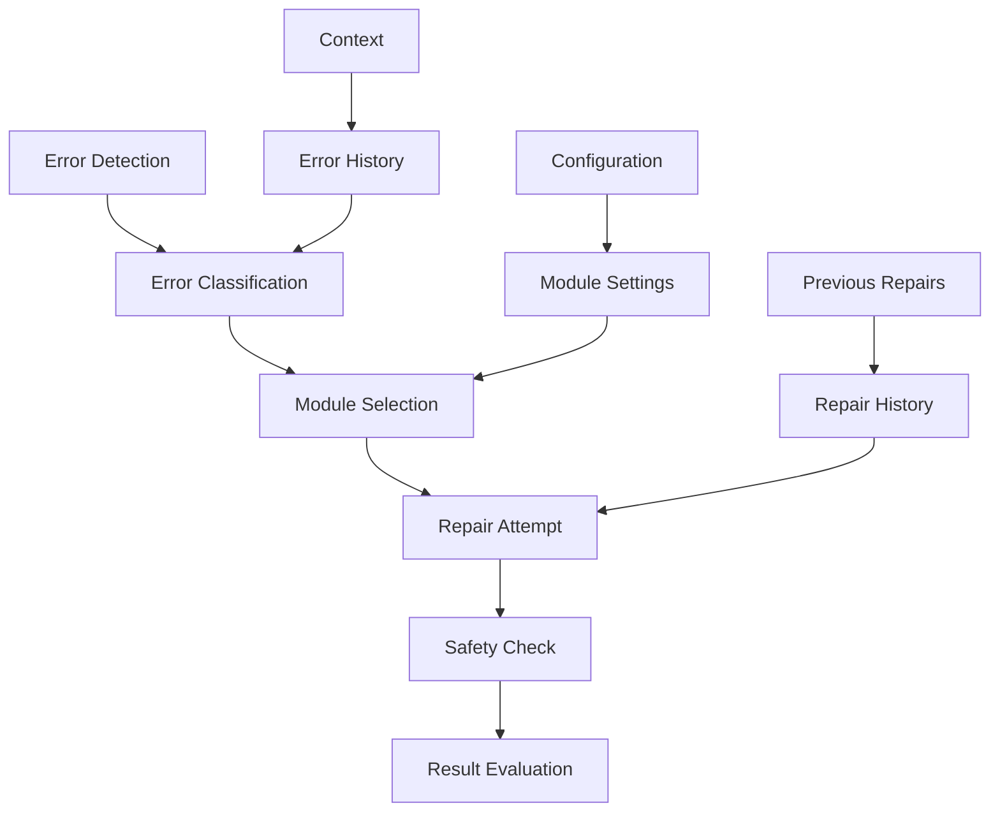

# VerusAgent Repair Modules

## Overview

VerusAgent includes a comprehensive set of repair modules that handle different types of verification errors. Each module specializes in fixing specific issues while maintaining code safety and correctness.

## Error Priority Order

Errors are handled in the following priority order (lower number = higher priority):

1. Type Errors (MismatchedType)
2. Vector Length Errors (PreCondFailVecLen)
3. Arithmetic Errors (ArithmeticFlow)
4. Loop Invariant Failures at Start (InvFailFront)
5. Loop Invariant Failures at End (InvFailEnd)
6. Constructor Type Invariant Errors (ConstructorFailTypeInvariant)
7. Type Annotation Errors (TypeAnnotation)
8. Decrease Failures at End (DecFailEnd)
9. Decrease Failures at Continue (DecFailCont)
10. Missing Imports (MissingImport)
11. Missing Implementations (MissImpl)
12. Mode Errors (CannotCallFunc)
13. Assertion Failures (AssertFail)
14. Test Assertion Failures (TestAssertFail)
15. Precondition Failures (PreCondFail)
16. Old(self) Requirements (RequiresOldSelf)
17. Postcondition Failures (PostCondFail)
18. Private Field Access in Ensures (ensure_private)
19. Private Function Access in Requires (require_private)
20. Recommendation Not Met (RecommendNotMet)

## Module Architecture



## Available Modules

### Core Repairs

1. [Syntax Repair](syntax.md) - General syntax and compilation errors
2. [Type Repair](type.md) - Type mismatches and annotations
3. [Arithmetic Repair](arithmetic.md) - Arithmetic overflow/underflow

### Specification Repairs

1. [Precondition Repair](precondition.md) - Precondition failures
2. [Postcondition Repair](postcondition.md) - Postcondition failures
3. [Invariant Repair](invariant.md) - Invariant failures

### Structural Repairs

1. [Missing Element Repair](missing.md) - Missing imports/implementations
2. [Mode Repair](mode.md) - Mode and visibility issues
3. [Old(self) Repair](old_self.md) - Old(self) usage issues

### Verification Repairs

1. [Assertion Repair](assertion.md) - Assertion failures
2. [Decrease Repair](decrease.md) - Termination proofs
3. [Invariant Removal](remove_inv.md) - Private field access

## Common Features

All repair modules share these features:

1. Safety Checking:
   - Code change validation
   - Type safety verification
   - Semantic preservation
   - Structure maintenance

2. Error Handling:
   - Multiple retry attempts
   - Temperature adjustment
   - Fallback strategies
   - Progress tracking

3. Result Management:
   - Best result tracking
   - Sample preservation
   - Score-based evaluation
   - Global optimization

## Module Integration

The repair system integrates modules through:

1. Registry Management:

```python
def register_module(
    self,
    name: str,
    module: BaseRepairModule,
    error_types: List[VerusErrorType],
    output_path: str = None,
):
    self.repair_modules[name] = module
    for error_type in error_types:
        self.error_to_module_map[error_type] = module
```

2. Error Handling:

```python
def get_module_for_error(self, error: VerusError) -> Optional[BaseRepairModule]:
    if error.error in self.error_to_module_map:
        return self.error_to_module_map[error.error]
    return None
```

3. Repair Process:

```python
def repair_error(self, context, error: VerusError) -> Optional[str]:
    module = self.get_module_for_error(error)
    if module:
        return module.exec(context, error)
    return None
```

## Best Practices

1. Module Development:
   - Follow base module interface
   - Implement safety checks
   - Handle errors gracefully
   - Document behavior

2. Error Handling:
   - Check error types
   - Use appropriate module
   - Handle failures
   - Track progress

3. Result Management:
   - Validate results
   - Track improvements
   - Save progress
   - Handle fallbacks

4. Integration:
   - Register modules
   - Map error types
   - Track results
   - Log progress

## Extension Points

1. New Repair Modules:

```python
class CustomRepairModule(BaseRepairModule):
    def exec(self, context, error) -> str:
        # Implement repair logic
```

2. Error Type Mapping:

```python
registry.register_module(
    "custom_repair",
    custom_module,
    [CustomErrorType],
)
```

3. Result Processing:

```python
def process_repair(self, result: str) -> str:
    # Add custom processing
```

## Conclusion

The repair module system provides:

1. Comprehensive error handling
2. Safe code modifications
3. Extensible architecture
4. Robust integration

See individual module documentation for specific details.
