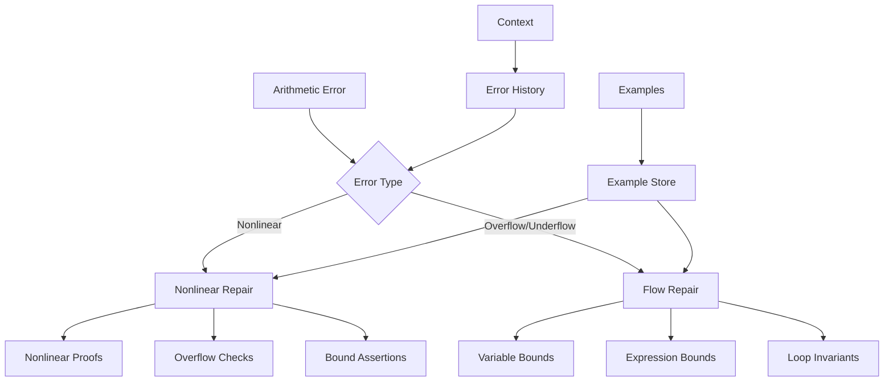
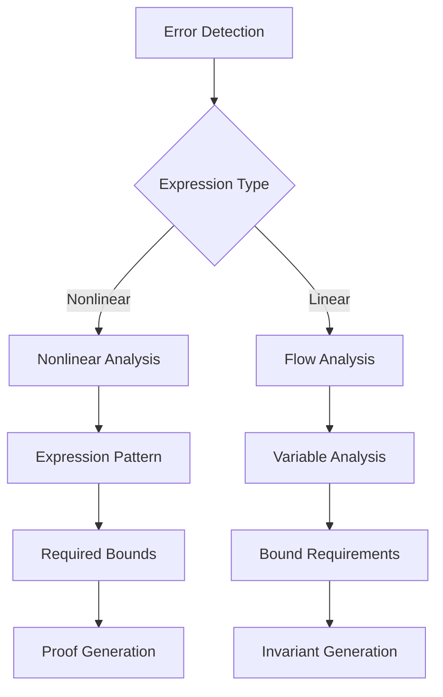

# Arithmetic Repair Module

## Overview

The Arithmetic Repair Module (`RepairArithmeticModule`) specializes in fixing arithmetic errors in Verus code. It handles both arithmetic overflow/underflow errors and nonlinear arithmetic proof issues.

## Architecture



## Core Components

### 1. Error Classification

The module handles different types of arithmetic errors:

```python
def exec(self, context, failure_to_fix: VerusError) -> str:
    # Try nonlinear repair first
    nonlinear_result = self.repair_nonlinear_arith_error(
        context, failure_to_fix
    )
    if nonlinear_result:
        return nonlinear_result

    # Fall back to general arithmetic repair
    return self.repair_arithmetic_flow(context, failure_to_fix)
```

### 2. Nonlinear Arithmetic Repair

Specialized handling for nonlinear arithmetic:

```python
def repair_nonlinear_arith_error(self, context, failure_to_fix: VerusError) -> str:
    instruction = """Add assertions for nonlinear properties:
    1. Use nonlinear_arith keyword
    2. Include all required bounds
    3. Handle overflow checks
    4. Maintain variable ranges

    Example:
    assert(X+1 == Y) by (nonlinear_arith)
        requires
            X == k*k+2*k,
            Y == (k+1)*(k+1),
            0 < k,
            k < N
    """
```

### 3. Arithmetic Flow Repair

Handling overflow/underflow issues:

```python
def repair_arithmetic_flow(self, context, failure_to_fix: VerusError) -> str:
    instruction = """Fix arithmetic overflow/underflow:
    1. Specify variable bounds
    2. Add expression bounds
    3. Use loop invariants
    4. Handle index variables

    Focus on expression: {error_highlight}
    """
```

## Workflow

### 1. Error Analysis



### 2. Repair Process

1. Error Detection:

```python
failures = last_trial.eval.get_failures(
    error_type=VerusErrorType.ArithmeticFlow
)
```

2. Expression Analysis:

```python
# Check for nonlinear expressions
nl_lines = get_nonlinear_lines(code, self.logger)
filtered_nl_lines = [
    (st, ed, text) for st, ed, text in nl_lines
    if text in failure_to_fix.get_text()
]
```

3. Repair Generation:

```python
# For nonlinear arithmetic
assert(expression) by (nonlinear_arith)
    requires
        bounds,
        ranges,
        constraints

# For overflow/underflow
invariant
    lower_bound <= variable,
    variable <= upper_bound
```

## Features

### 1. Nonlinear Handling

- Expression identification
- Bound requirements
- Overflow prevention
- Proof generation

### 2. Flow Control

- Variable bounds
- Expression limits
- Loop invariants
- Index handling

### 3. Proof Generation

- Nonlinear proofs
- Bound assertions
- Range checks
- Overflow prevention

### 4. Result Management

- Best result tracking
- Sample preservation
- Context updates
- Progress logging

## Common Repairs

### 1. Nonlinear Arithmetic

```rust
// Before
x * x * x <= max_value

// After
assert(x * x * x <= 1000) by (nonlinear_arith)
    requires
        x >= 0,
        x <= 10,
        1000 >= 10 * 10 * 10
```

### 2. Expression Bounds

```rust
// Before
result = a * b + c

// After
invariant
    a >= 0 && a <= max_a,
    b >= 0 && b <= max_b,
    c >= 0 && c <= max_c,
    a * b + c <= max_result
```

### 3. Loop Variables

```rust
// Before
while i < n {
    sum += arr[i] * i;
}

// After
while i < n
    invariant
        i >= 0,
        i <= n,
        sum <= i * max_value
{
    sum += arr[i] * i;
}
```

## Best Practices

1. Nonlinear Handling:
   - Use nonlinear_arith
   - Specify all bounds
   - Handle overflow
   - Check ranges

2. Flow Control:
   - Track variables
   - Set bounds
   - Use invariants
   - Handle indices

3. Proof Generation:
   - Clear assertions
   - Complete bounds
   - Range checks
   - Overflow guards

4. Result Management:
   - Track progress
   - Save samples
   - Update context
   - Validate repairs

## Extension Points

1. Expression Analysis:

```python
def add_expression_analyzer(self, analyzer: Callable):
    """Add new expression analyzer."""
    self.expression_analyzers.append(analyzer)
```

2. Bound Generation:

```python
def add_bound_generator(self, generator: Callable):
    """Add new bound generator."""
    self.bound_generators.append(generator)
```

3. Proof Strategy:

```python
def add_proof_strategy(self, strategy: Callable):
    """Add new proof strategy."""
    self.proof_strategies.append(strategy)
```

## Common Issues

### 1. Missing Bounds

```rust
// Problem: Unbounded multiplication
result = x * y;

// Solution: Add bounds
invariant
    x >= 0 && x <= max_x,
    y >= 0 && y <= max_y,
    result <= max_x * max_y
```

### 2. Nonlinear Overflow

```rust
// Problem: Nonlinear overflow
cube = x * x * x;

// Solution: Add bounds and proof
assert(x * x * x <= max_cube) by (nonlinear_arith)
    requires
        x >= 0,
        x <= max_x,
        max_cube >= max_x * max_x * max_x
```

### 3. Loop Indices

```rust
// Problem: Unbounded loop
while i < n {
    product *= i;
}

// Solution: Add bounds
invariant
    i >= 0,
    i <= n,
    n <= max_n,
    product <= factorial(i)
```

## Conclusion

The Arithmetic Repair Module provides:

1. Comprehensive error handling
2. Nonlinear arithmetic support
3. Overflow/underflow prevention
4. Context-aware repairs

Key strengths:

1. Multiple error types
2. Proof generation
3. Bound handling
4. Clear repairs
