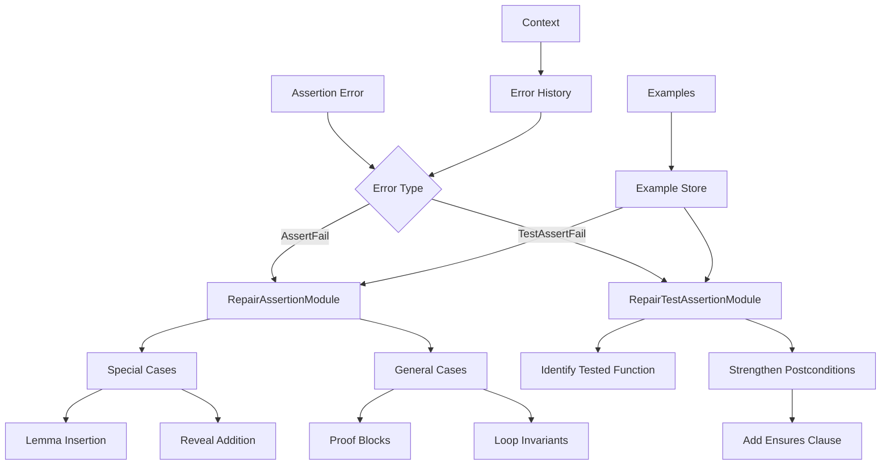
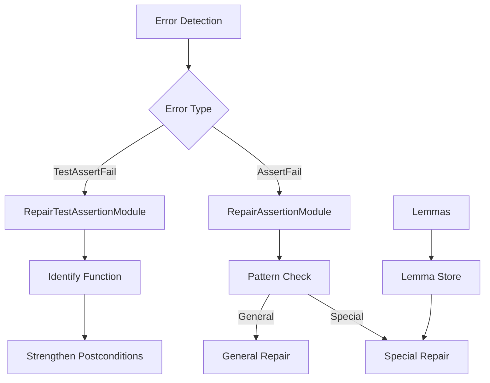

# Assertion Repair Modules

## Overview

VeriStruct has two specialized modules for fixing assertion failures:

1. **`RepairAssertionModule`**: Fixes assertion failures in production code by adding proof blocks, lemmas, and loop invariants.
2. **`RepairTestAssertionModule`**: Fixes test assertion failures by strengthening postconditions in production functions (test functions are immutable).

This separation ensures clear responsibility and appropriate repair strategies for each context.

## Architecture



The **Repair Registry** routes errors to the appropriate module:

- `VerusErrorType.AssertFail` → `RepairAssertionModule`
- `VerusErrorType.TestAssertFail` → `RepairTestAssertionModule`

## Core Components

### 1. RepairAssertionModule (Production Code)

Handles `VerusErrorType.AssertFail` errors:

```python
def exec(self, context, failure_to_fix: VerusError) -> str:
    """Repair production code assertion failures."""
    # Only handles AssertFail errors
    if failure_to_fix.error != VerusErrorType.AssertFail:
        return code

    # Try special case repairs first
    candidates = self.repair_assert_fail(context, failure_to_fix)
    return self.evaluate_repair_candidates(code, candidates, output_dir, "repair_assertion")
```

### 2. RepairTestAssertionModule (Test Assertions)

Handles `VerusErrorType.TestAssertFail` errors:

```python
def exec(self, context, failure_to_fix: VerusError) -> str:
    """Repair test assertion failures by strengthening production code postconditions."""
    # Test functions are IMMUTABLE - we fix production code instead
    tested_function = self._identify_tested_function(code, error_trace)
    # Strengthen postconditions to satisfy test expectations
    return best_code
```

### 3. Special Case Handling (Production Assertions)

`RepairAssertionModule` provides specialized handling for common patterns:

```python
def repair_special_assertion_error(self, code: str, failure_to_fix: VerusError) -> str:
    # Handle filter operations
    if ".filter(" in assertion_info:
        # Add reveal for filter
        instruction = """Add `reveal(Seq::filter);' at function start"""

    # Handle subrange operations
    if ".subrange(" in assertion_info:
        # Add subrange lemmas
        newcode = insert_lemma_func(
            code,
            ["seq_subrange_ascend", "seq_subrange_all"],
            self.lemma_path
        )
```

## Workflow

### 1. Error Routing (Repair Registry)



### 2. Production Assertion Repair Process

1. Error Detection (in `RepairAssertionModule`):

```python
# Only fetches AssertFail errors
assert_failures = last_trial.eval.get_failures(
    error_type=VerusErrorType.AssertFail
)
```

### 3. Test Assertion Repair Process

1. Error Detection (in `RepairTestAssertionModule`):

```python
# Receives TestAssertFail from registry
# Identifies which production function is being tested
tested_function = self._identify_tested_function(code, error_trace)
```

2. Pattern Recognition (in `RepairAssertionModule` for production code):

```python
# Check for special patterns in production code assertions
if ".filter(" in assertion_info:
    # Handle filter operations
elif ".subrange(" in assertion_info:
    # Handle subrange operations
elif ".take(" in assertion_info:
    # Handle take operations
```

3. Lemma Management (for production assertions):

```python
def insert_lemma_func(code, lemmas, lemma_path):
    # Add necessary lemmas
    for lemma in lemmas:
        if not f"lemma_{lemma}" in code:
            # Insert lemma
```

## Features

### RepairAssertionModule (Production Code)

#### 1. Pattern Recognition

- Filter operations
- Subrange operations
- Take operations
- Contains operations

#### 2. Lemma Management

- Automatic insertion
- Pattern matching
- Dependency handling
- Context awareness

#### 3. Repair Strategies

- Special case handling
- General repairs
- Proof generation
- Loop invariants

### RepairTestAssertionModule (Test Assertions)

#### 1. Test Analysis

- Identify tested functions
- Analyze test expectations
- Preserve test immutability

#### 2. Postcondition Strengthening

- Add ensures clauses
- Bidirectional specifications
- Return value properties
- State relationships

### Common Features (Both Modules)

#### Result Management

- Best result tracking
- Sample evaluation
- Context updates
- Progress logging

## Common Repairs

### Production Code Repairs (RepairAssertionModule)

#### 1. Filter Operations

```rust
// Before
assert(vec.filter(|x| x > 0).len() > 0);

// After
proof {
    reveal(Seq::filter);
    assert(vec.filter(|x| x > 0).len() > 0);
}
```

#### 2. Subrange Operations

```rust
// Before
assert(vec.subrange(0, i).len() == i);

// After
proof {
    lemma_seq_subrange_all();
    assert(vec.subrange(0, i).len() == i);
}
```

### Test Assertion Repairs (RepairTestAssertionModule)

#### Strengthen Postconditions

```rust
// Before - Test fails because postcondition is missing
#[test]
fn test_push() {
    let mut v = Vec::new();
    v.push(1);
    assert(v.len() == 1);  // ← Fails
}

fn push(&mut self, val: T) {
    // Implementation (no ensures clause)
}

// After - Add postcondition to production function
fn push(&mut self, val: T)
    ensures
        self.len() == old(self).len() + 1  // ← Added
{
    // Implementation (unchanged)
}

// Test remains UNCHANGED - it's immutable!
```

## Best Practices

### For Production Code Assertions (RepairAssertionModule)

1. Pattern Analysis:
   - Check common patterns first (filter, subrange, take)
   - Use appropriate lemmas for data structures
   - Add necessary reveals for opaque functions
   - Maintain proof context

2. Repair Strategy:
   - Try special cases first (fast, deterministic)
   - Fall back to LLM-based general repairs
   - Add proof blocks strategically
   - Consider loop invariants when needed

3. Lemma Usage:
   - Insert required lemmas automatically
   - Check dependencies between lemmas
   - Maintain minimality (don't over-lemmatize)
   - Ensure correctness of lemma applications

### For Test Assertions (RepairTestAssertionModule)

1. Function Analysis:
   - Identify which production function is being tested
   - Understand test expectations
   - Never modify test code (immutable!)
   - Focus on postcondition strengthening

2. Postcondition Strategy:
   - Add ensures clauses to tested functions
   - Make specifications bidirectional when possible
   - Ensure postconditions are provable
   - Consider state relationships

3. Safety:
   - Validate repairs don't break existing code
   - Check for unintended side effects
   - Maintain consistency with preconditions
   - Preserve function semantics

### Common Practices (Both Modules)

4. Result Management:
   - Evaluate multiple candidate repairs
   - Track improvements in verification scores
   - Handle failures gracefully
   - Update context with best results

## Extension Points

1. Pattern Recognition:

```python
def add_pattern(self, pattern: str, handler: Callable):
    """Add new pattern recognition."""
    self.patterns[pattern] = handler
```

2. Lemma Management:

```python
def add_lemma_source(self, source: str):
    """Add new lemma source."""
    self.lemma_sources.append(source)
```

3. Repair Strategies:

```python
def add_repair_strategy(self, error_type: str, strategy: Callable):
    """Add new repair strategy."""
    self.repair_strategies[error_type] = strategy
```

## Common Issues

### 1. Missing Lemmas

```rust
// Problem: Missing lemma
assert(vec.subrange(0, i).len() == i);

// Solution: Add lemma
lemma_seq_subrange_all();
assert(vec.subrange(0, i).len() == i);
```

### 2. Reveal Missing

```rust
// Problem: Hidden function
assert(seq.filter(|x| x > 0).len() > 0);

// Solution: Add reveal
reveal(Seq::filter);
assert(seq.filter(|x| x > 0).len() > 0);
```

### 3. Test Failures

```rust
// Problem: Missing ensures
fn push(&mut self, val: T) {
    // Implementation
}

// Solution: Add ensures
fn push(&mut self, val: T)
    ensures
        self.len() == old(self).len() + 1
{
    // Implementation
}
```

## Conclusion

VeriStruct's assertion repair system uses **two specialized modules** for optimal repair strategies:

### RepairAssertionModule (Production Code)

- Pattern-based special case repairs (filter, subrange, take, contains)
- Automatic lemma insertion and management
- Proof block generation
- Loop invariant assistance

### RepairTestAssertionModule (Test Assertions)

- Test function immutability enforcement
- Production code postcondition strengthening
- Function identification and analysis
- Test expectation satisfaction

### Key Design Principles

1. **Separation of Concerns**: Different error types get different repair strategies
2. **Registry Routing**: Repair registry automatically routes errors to correct module
3. **Test Immutability**: Test functions are never modified - only production code
4. **Pattern Recognition**: Special cases handled efficiently before general LLM repairs
5. **Context Awareness**: Both modules integrate with VeriStruct's context system

This two-module architecture ensures:

- ✅ Clear responsibility boundaries
- ✅ Appropriate repair strategies per context
- ✅ Maintainable and extensible codebase
- ✅ Optimal repair success rates
