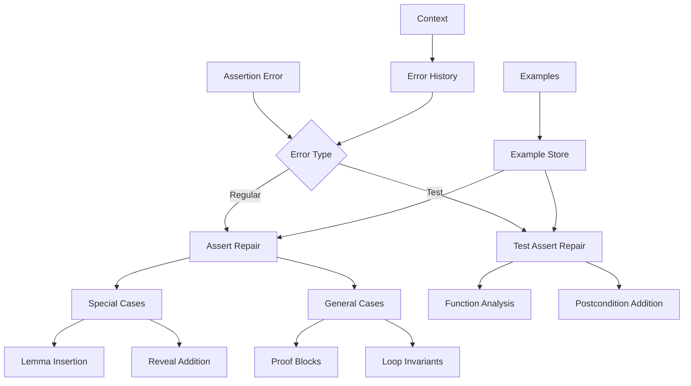
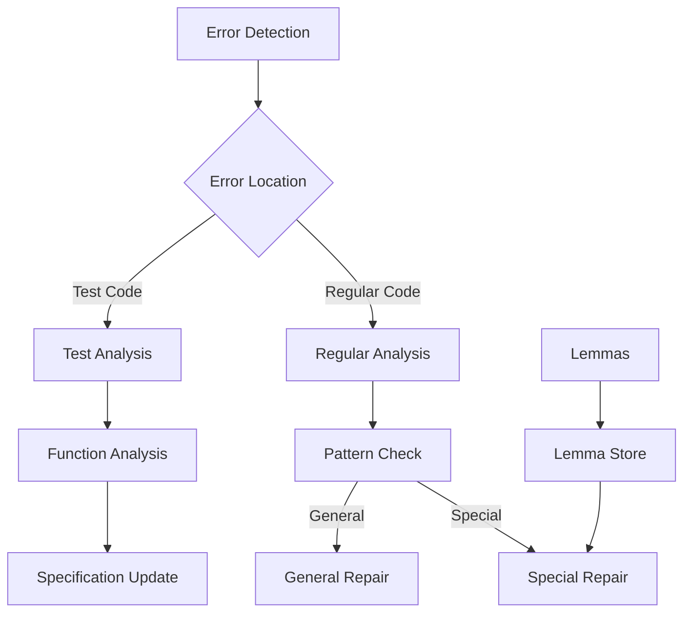

# Assertion Repair Module

## Overview

The Assertion Repair Module (`RepairAssertionModule`) specializes in fixing assertion failures in Verus code. It handles both regular assertions and test assertions, with particular support for sequence-related assertions and common data structure patterns.

## Architecture



## Core Components

### 1. Error Classification

The module handles different types of assertion failures:

```python
def exec(self, context, failure_to_fix: VerusError) -> str:
    # Check error type
    if failure_to_fix.error == VerusErrorType.AssertFail:
        return self.repair_assert_fail(context, failure_to_fix)
    elif failure_to_fix.error == VerusErrorType.TestAssertFail:
        return self.repair_test_assert_fail(context, failure_to_fix)
```

### 2. Special Case Handling

Specialized handling for common patterns:

```python
def repair_special_assertion_error(self, code: str, failure_to_fix: VerusError) -> str:
    # Handle filter operations
    if ".filter(" in assertion_info:
        # Add reveal for filter
        instruction = """Add `reveal(Seq::filter);' at function start"""
    
    # Handle subrange operations
    if ".subrange(" in assertion_info:
        # Add subrange lemmas
        newcode = insert_lemma_func(
            code,
            ["seq_subrange_ascend", "seq_subrange_all"],
            self.lemma_path
        )
```

### 3. Test Assertion Repair

Special handling for test assertions:

```python
def repair_test_assert_fail(self, context, failure_to_fix: VerusError) -> str:
    instruction = """Fix assertion errors in test functions:
    1. Analyze how P is derived
    2. Check if P can be a postcondition
    3. Add essential postconditions
    4. Preserve test code"""
```

## Workflow

### 1. Error Analysis



### 2. Repair Process

1. Error Detection:
```python
assert_failures = last_trial.eval.get_failures(
    error_type=VerusErrorType.AssertFail
)
test_failures = last_trial.eval.get_failures(
    error_type=VerusErrorType.TestAssertFail
)
```

2. Pattern Recognition:
```python
# Check for special patterns
if ".filter(" in assertion_info:
    # Handle filter operations
elif ".subrange(" in assertion_info:
    # Handle subrange operations
elif ".take(" in assertion_info:
    # Handle take operations
```

3. Lemma Management:
```python
def insert_lemma_func(code, lemmas, lemma_path):
    # Add necessary lemmas
    for lemma in lemmas:
        if not f"lemma_{lemma}" in code:
            # Insert lemma
```

## Features

### 1. Pattern Recognition
- Filter operations
- Subrange operations
- Take operations
- Contains operations

### 2. Lemma Management
- Automatic insertion
- Pattern matching
- Dependency handling
- Context awareness

### 3. Repair Strategies
- Special case handling
- General repairs
- Test-specific repairs
- Proof generation

### 4. Result Management
- Best result tracking
- Sample preservation
- Context updates
- Progress logging

## Common Repairs

### 1. Filter Operations
```rust
// Before
assert(vec.filter(|x| x > 0).len() > 0);

// After
proof {
    reveal(Seq::filter);
    assert(vec.filter(|x| x > 0).len() > 0);
}
```

### 2. Subrange Operations
```rust
// Before
assert(vec.subrange(0, i).len() == i);

// After
proof {
    lemma_seq_subrange_all();
    assert(vec.subrange(0, i).len() == i);
}
```

### 3. Test Assertions
```rust
// Before
#[test]
fn test_push() {
    let mut v = Vec::new();
    v.push(1);
    assert(v.len() == 1);
}

// After
fn push(&mut self, val: T)
    ensures
        self.len() == old(self).len() + 1
{
    // Implementation
}
```

## Best Practices

1. Pattern Analysis:
   - Check common patterns
   - Use appropriate lemmas
   - Add necessary reveals
   - Maintain context

2. Repair Strategy:
   - Try special cases first
   - Fall back to general
   - Handle test cases
   - Track progress

3. Lemma Usage:
   - Insert required lemmas
   - Check dependencies
   - Maintain minimality
   - Ensure correctness

4. Result Management:
   - Save progress
   - Track improvements
   - Handle failures
   - Update context

## Extension Points

1. Pattern Recognition:
```python
def add_pattern(self, pattern: str, handler: Callable):
    """Add new pattern recognition."""
    self.patterns[pattern] = handler
```

2. Lemma Management:
```python
def add_lemma_source(self, source: str):
    """Add new lemma source."""
    self.lemma_sources.append(source)
```

3. Repair Strategies:
```python
def add_repair_strategy(self, error_type: str, strategy: Callable):
    """Add new repair strategy."""
    self.repair_strategies[error_type] = strategy
```

## Common Issues

### 1. Missing Lemmas
```rust
// Problem: Missing lemma
assert(vec.subrange(0, i).len() == i);

// Solution: Add lemma
lemma_seq_subrange_all();
assert(vec.subrange(0, i).len() == i);
```

### 2. Reveal Missing
```rust
// Problem: Hidden function
assert(seq.filter(|x| x > 0).len() > 0);

// Solution: Add reveal
reveal(Seq::filter);
assert(seq.filter(|x| x > 0).len() > 0);
```

### 3. Test Failures
```rust
// Problem: Missing ensures
fn push(&mut self, val: T) {
    // Implementation
}

// Solution: Add ensures
fn push(&mut self, val: T)
    ensures
        self.len() == old(self).len() + 1
{
    // Implementation
}
```

## Conclusion

The Assertion Repair Module provides:
1. Pattern-based repairs
2. Lemma management
3. Test assertion handling
4. Comprehensive repair strategies

Key strengths:
1. Pattern recognition
2. Lemma integration
3. Test support
4. Context awareness
