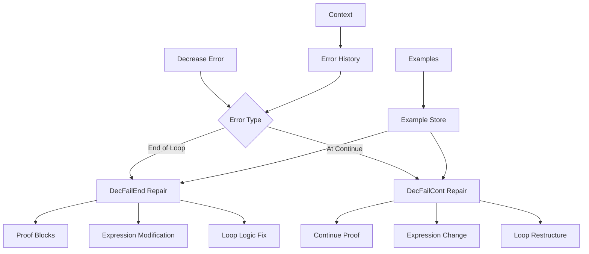
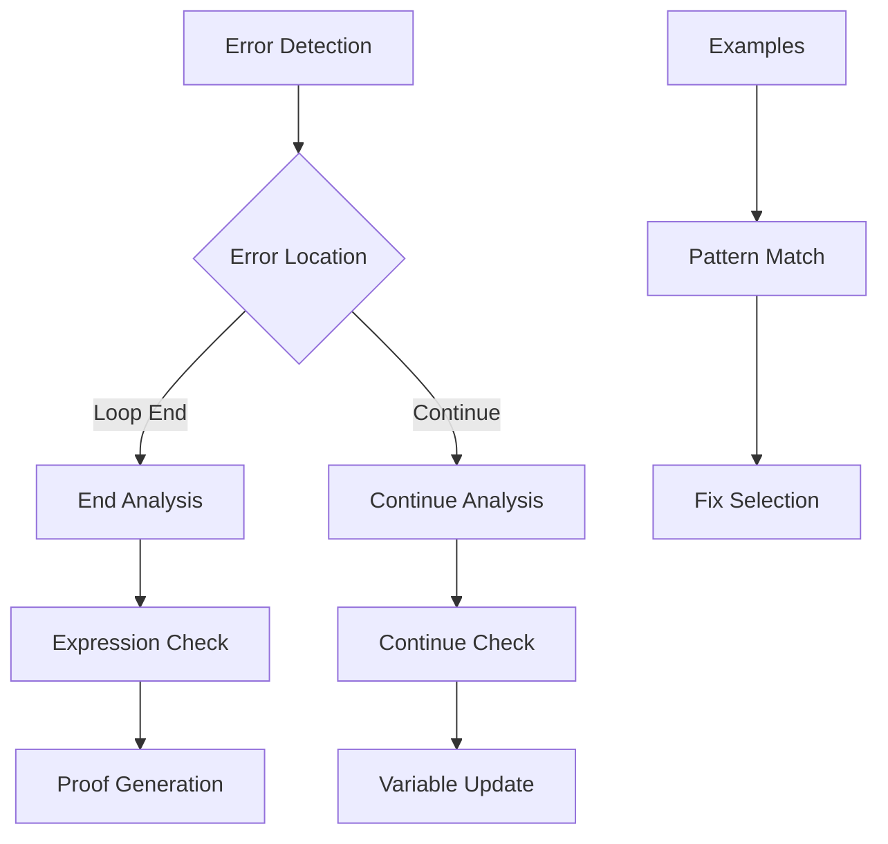

# Decrease Repair Module

## Overview

The Decrease Repair Module (`RepairDecreaseModule`) specializes in fixing decreases-related errors in Verus code. It handles both 'decreases not satisfied at end of loop' (DecFailEnd) and 'decreases not satisfied at continue' (DecFailCont) errors, ensuring proper termination of loops and recursive functions.

## Architecture



## Core Components

### 1. Error Classification

The module handles two main types of decrease errors:

```python
if failure_to_fix.error == VerusErrorType.DecFailEnd:
    return self.repair_decfail_end(context, failure_to_fix)
else:  # VerusErrorType.DecFailCont
    return self.repair_decfail_cont(context, failure_to_fix)
```

### 2. End of Loop Repair

Handles cases where the decreases clause isn't satisfied at loop end:

```python
def repair_decfail_end(self, context, failure_to_fix: VerusError):
    """
    Common fixes:
    1. Add proof blocks
    2. Modify decreases expression
    3. Add assertions
    4. Fix loop logic
    """
```

### 3. Continue Statement Repair

Specializes in fixing decreases failures at continue statements:

```python
def repair_decfail_cont(self, context, failure_to_fix: VerusError):
    """
    Common fixes:
    1. Add proofs before continue
    2. Modify decreases expression
    3. Restructure loop
    4. Update variables before continue
    """
```

## Workflow

### 1. Error Analysis



### 2. Repair Process

1. Error Detection:

```python
end_failures = last_trial.eval.get_failures(
    error_type=VerusErrorType.DecFailEnd
)
cont_failures = last_trial.eval.get_failures(
    error_type=VerusErrorType.DecFailCont
)
```

2. Repair Selection:

```python
# Choose repair strategy based on error type
if error_type == DecFailEnd:
    repair_loop_end()
else:
    repair_continue_point()
```

3. Fix Application:

```python
# Add proof blocks or modify expressions
proof {
    assert(decreases_expr > next_decreases_expr);
}
```

## Features

### 1. Loop End Handling

- Expression analysis
- Proof generation
- Loop logic fixes
- Assertion addition

### 2. Continue Handling

- Continue point analysis
- Variable updates
- Loop restructuring
- Proof insertion

### 3. Expression Management

- Value tracking
- Decrease verification
- Bound checking
- Termination proof

### 4. Result Management

- Best result tracking
- Sample preservation
- Context updates
- Progress logging

## Common Repairs

### 1. Loop End Decreases

```rust
// Before
while i < n {
    i += 1;
}

// After
while i < n
    decreases n - i
{
    proof {
        assert(n - i > n - (i + 1));
    }
    i += 1;
}
```

### 2. Continue Statement

```rust
// Before
while i < n {
    if condition {
        continue;
    }
    i += 1;
}

// After
while i < n
    decreases n - i
{
    if condition {
        proof {
            assert(n - i > n - (i + 1));
        }
        i += 1;
        continue;
    }
    i += 1;
}
```

### 3. Complex Decreases

```rust
// Before
while !vec.is_empty() {
    vec.pop();
}

// After
while !vec.is_empty()
    decreases vec.len()
{
    proof {
        assert(vec.len() > vec.len() - 1);
    }
    vec.pop();
}
```

## Best Practices

1. Loop End Handling:
   - Clear decreases expressions
   - Proof blocks
   - Loop invariants
   - Variable tracking

2. Continue Management:
   - Pre-continue proofs
   - Variable updates
   - Clear decreases
   - Loop structure

3. Expression Selection:
   - Simple expressions
   - Clear decreases
   - Easy proofs
   - Bound checks

4. Result Validation:
   - Safety checks
   - Code review
   - Test cases
   - Error handling

## Extension Points

1. Expression Analysis:

```python
def add_expression_analyzer(self, analyzer: Callable):
    """Add new expression analyzer."""
    self.expression_analyzers.append(analyzer)
```

2. Proof Generation:

```python
def add_proof_generator(self, generator: Callable):
    """Add new proof generator."""
    self.proof_generators.append(generator)
```

3. Loop Analysis:

```python
def add_loop_analyzer(self, analyzer: Callable):
    """Add new loop analyzer."""
    self.loop_analyzers.append(analyzer)
```

## Common Issues

### 1. Complex Decreases

```rust
// Problem: Complex decreases expression
while i < n && j < m {
    i += 1;
    j += 1;
}

// Solution: Use lexicographic ordering
while i < n && j < m
    decreases (n - i, m - j)
{
    proof {
        assert((n - i, m - j) > (n - (i + 1), m - (j + 1)));
    }
    i += 1;
    j += 1;
}
```

### 2. Continue Without Update

```rust
// Problem: Continue without updating decreases
while i < n {
    if skip_condition {
        continue;  // Decreases not satisfied
    }
    i += 1;
}

// Solution: Update before continue
while i < n
    decreases n - i
{
    if skip_condition {
        i += 1;  // Update before continue
        continue;
    }
    i += 1;
}
```

### 3. Nested Loops

```rust
// Problem: Nested loop decreases
while i < n {
    while j < m {
        // Complex termination
    }
}

// Solution: Clear decreases for each loop
while i < n
    decreases n - i
{
    while j < m
        decreases m - j
        invariant i < n  // Maintain outer loop invariant
    {
        proof {
            assert(m - j > m - (j + 1));
        }
        j += 1;
    }
    i += 1;
}
```

## Conclusion

The Decrease Repair Module provides:

1. Comprehensive decrease error handling
2. Multiple repair strategies
3. Clear proof generation
4. Context-aware fixes

Key strengths:

1. Loop termination proofs
2. Continue statement handling
3. Expression management
4. Clear repairs
