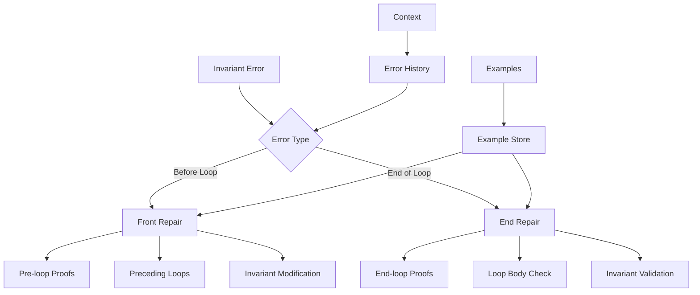
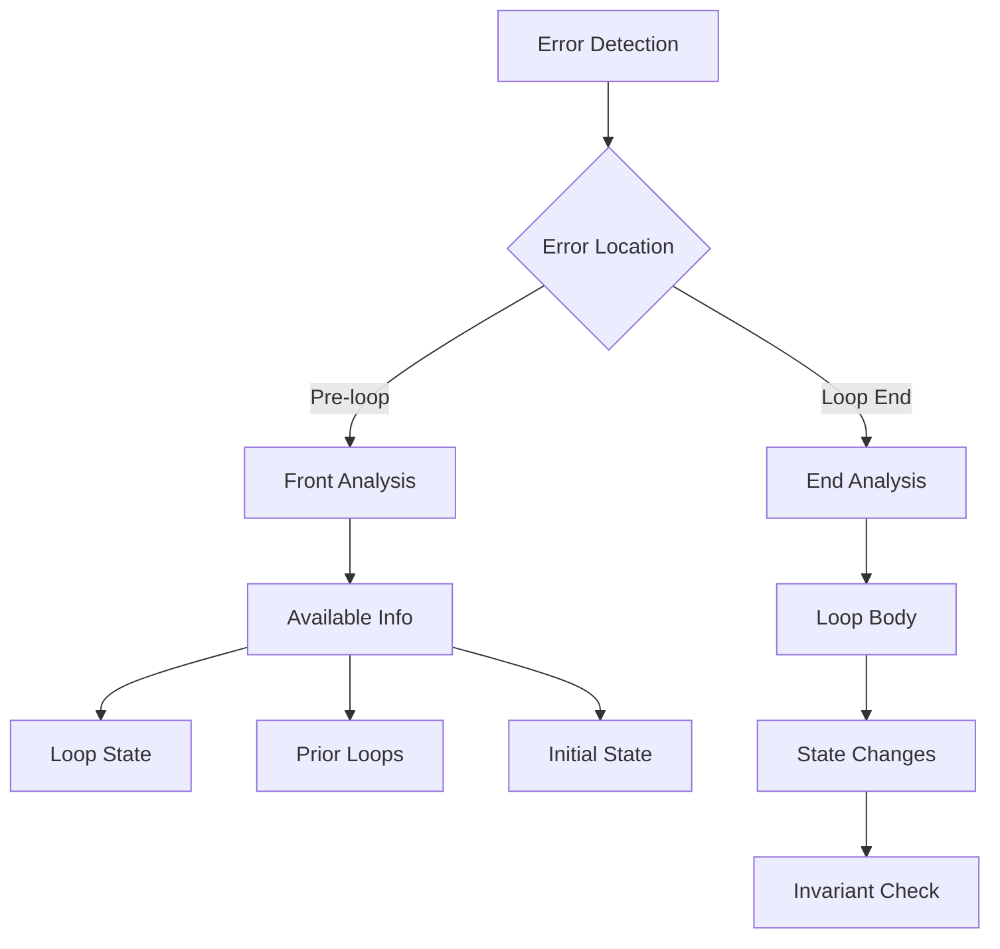

# Invariant Repair Module

## Overview

The Invariant Repair Module (`RepairInvariantModule`) specializes in fixing invariant failures in Verus code. It handles both "invariant not satisfied before loop" (InvFailFront) and "invariant not satisfied at end of loop" (InvFailEnd) errors.

## Architecture



## Core Components

### 1. Error Classification

The module handles different types of invariant failures:

```python
def exec(self, context, failure_to_fix: VerusError) -> str:
    # Check error type
    if failure_to_fix.error == VerusErrorType.InvFailFront:
        return self.repair_invfail_front(context, failure_to_fix)
    else:  # VerusErrorType.InvFailEnd
        return self.repair_invfail_end(context, failure_to_fix)
```

### 2. Front Invariant Repair

Multiple strategies for fixing pre-loop invariant failures:

```python
def repair_invfail_front(self, context, failure_to_fix: VerusError) -> str:
    instruction = """Fix invariant before loop:
    1. Add assertions before loop body
    2. Add failed invariant to preceding loops
    3. Modify/delete incorrect invariants

    Consider which approach best fits the context!
    """
```

### 3. End Invariant Repair

Specialized handling for end-of-loop invariant failures:

```python
def repair_invfail_end(self, context, failure_to_fix: VerusError) -> str:
    instruction = """Fix invariant at loop end:
    1. Add assertions in proof blocks
    2. Verify loop body maintains invariant
    3. Correct/remove invalid invariants

    DO NOT modify existing proof functions.
    """
```

## Workflow

### 1. Error Analysis



### 2. Repair Process

1. Error Detection:
```python
front_failures = last_trial.eval.get_failures(
    error_type=VerusErrorType.InvFailFront
)
end_failures = last_trial.eval.get_failures(
    error_type=VerusErrorType.InvFailEnd
)
```

2. Error Analysis:
```python
error_trace = failure_to_fix.trace[0]
error_highlight = error_trace.get_highlights()[0]
line_info = f"Line {error_trace.lines[0]}-{error_trace.lines[1]}"
```

3. Repair Generation:
```python
# For pre-loop failures
proof {
    // Establish invariant
    assert(initial_condition);
    assert(invariant_holds);
}

// For end-of-loop failures
proof {
    // Verify maintenance
    assert(loop_condition);
    assert(invariant_preserved);
}
```

## Features

### 1. Error Handling
- Pre-loop invariants
- End-of-loop invariants
- Multiple loops
- Invariant modification

### 2. Repair Strategies
- Proof generation
- Loop analysis
- State verification
- Invariant correction

### 3. Context Integration
- Loop state
- Prior loops
- Initial state
- State changes

### 4. Result Management
- Best result tracking
- Sample preservation
- Context updates
- Progress logging

## Common Repairs

### 1. Pre-loop Invariants
```rust
// Before
while i < n
    invariant
        sum == arr.subrange(0, i).sum()
{
    sum += arr[i];
    i += 1;
}

// After
proof {
    assert(i == 0);  // Initial state
    assert(sum == 0);  // Initial sum
    assert(sum == arr.subrange(0, i).sum());  // Initial invariant
}
while i < n
    invariant
        sum == arr.subrange(0, i).sum()
{
    sum += arr[i];
    i += 1;
}
```

### 2. End-of-loop Invariants
```rust
// Before
while i < n
    invariant
        sorted(arr, 0, i)
{
    if arr[i] > arr[i+1] {
        swap(&mut arr, i, i+1);
    }
    i += 1;
}

// After
while i < n
    invariant
        sorted(arr, 0, i)
{
    if arr[i] > arr[i+1] {
        swap(&mut arr, i, i+1);
    }
    i += 1;
    proof {
        assert(sorted(arr, 0, i-1));  // Previous state
        assert(arr[i-1] <= arr[i]);  // New element
        assert(sorted(arr, 0, i));  // Combined property
    }
}
```

### 3. Multiple Loops
```rust
// Before
while i < n {
    // First loop
}
while j < m
    invariant
        property(j)
{
    // Second loop
}

// After
while i < n
    invariant
        property(i)  // Add shared invariant
{
    // First loop
}
while j < m
    invariant
        property(j)
{
    // Second loop
}
```

## Best Practices

1. Error Analysis:
   - Check error type
   - Analyze context
   - Identify requirements
   - Use available info

2. Proof Generation:
   - Minimal proofs
   - Clear assertions
   - Use invariants
   - Maintain context

3. Loop Handling:
   - Check initial state
   - Verify maintenance
   - Handle multiple loops
   - Track changes

4. Result Management:
   - Track progress
   - Save samples
   - Update context
   - Validate repairs

## Extension Points

1. Error Handling:
```python
def add_error_handler(self, error_type: str, handler: Callable):
    """Add new error handler."""
    self.error_handlers[error_type] = handler
```

2. Repair Strategies:
```python
def add_repair_strategy(self, strategy_type: str, strategy: Callable):
    """Add new repair strategy."""
    self.repair_strategies[strategy_type] = strategy
```

3. Context Integration:
```python
def add_context_source(self, source: str):
    """Add new context source."""
    self.context_sources.append(source)
```

## Common Issues

### 1. Missing Initial State
```rust
// Problem: Unproven initial state
invariant
    sum == arr.subrange(0, i).sum()

// Solution: Add initial proof
proof {
    assert(i == 0 && sum == 0);
    assert(arr.subrange(0, 0).sum() == 0);
}
```

### 2. Loop Maintenance
```rust
// Problem: Unproven maintenance
while i < n
    invariant sorted(arr, 0, i)
{
    swap(&mut arr, i, i+1);
}

// Solution: Add maintenance proof
proof {
    assert(sorted(arr, 0, i-1));
    assert(arr[i-1] <= arr[i]);
}
```

### 3. Multiple Loops
```rust
// Problem: Missing shared invariant
while i < n { /* First loop */ }
while j < m
    invariant property(j)
{ /* Second loop */ }

// Solution: Add to both loops
invariant property(i)  // First loop
invariant property(j)  // Second loop
```

## Conclusion

The Invariant Repair Module provides:
1. Comprehensive error handling
2. Multiple repair strategies
3. Loop state management
4. Context-aware repairs

Key strengths:
1. Multiple error types
2. Proof generation
3. Loop handling
4. Clear repairs
