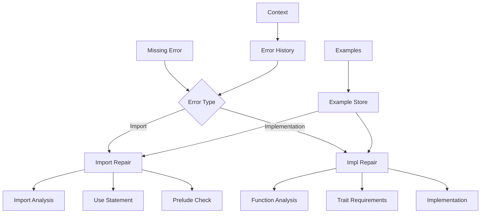
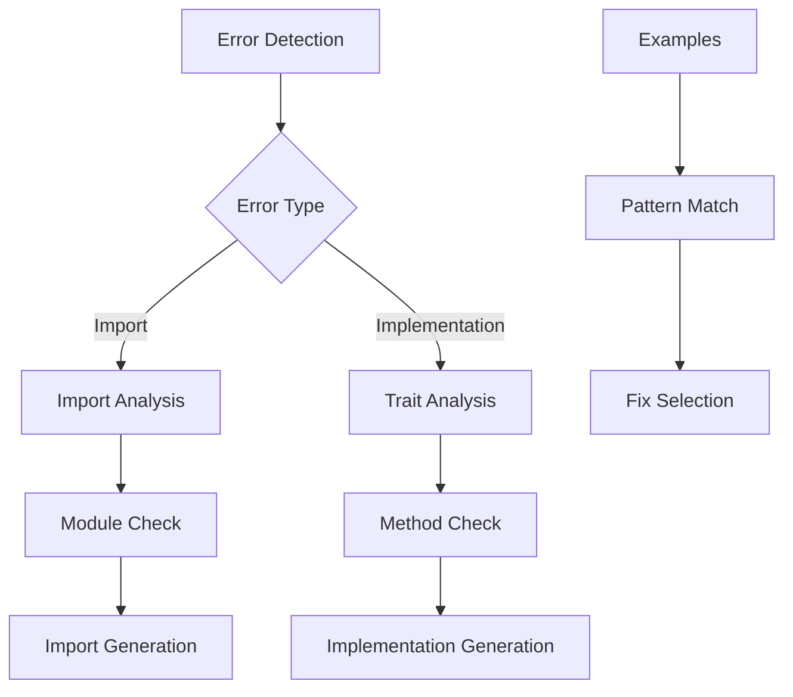

# Missing Repair Module

## Overview

The Missing Repair Module (`RepairMissingModule`) specializes in fixing missing elements in Verus code. It handles missing imports, trait implementations, and other missing elements that are required for the code to compile and verify correctly.

## Architecture



## Core Components

### 1. Error Classification

The module handles two main types of missing errors:

```python
if failure_to_fix.error == VerusErrorType.MissingImport:
    return self.repair_missing_import(context, failure_to_fix)
elif failure_to_fix.error == VerusErrorType.MissImpl:
    return self.repair_missing_impl(context, failure_to_fix)
```

### 2. Import Repair

Handles missing import statements:

```python
def repair_missing_import(self, context, failure_to_fix: VerusError):
    """
    Common fixes:
    1. Add use statements
    2. Import prelude
    3. Add main function
    4. Fix module paths
    """
```

### 3. Implementation Repair

Specializes in fixing missing trait implementations:

```python
def repair_missing_impl(self, context, failure_to_fix: VerusError):
    """
    Common fixes:
    1. Implement missing methods
    2. Match trait signatures
    3. Add requires/ensures
    4. Handle edge cases
    """
```

## Workflow

### 1. Error Analysis



### 2. Repair Process

1. Error Detection:
```python
import_failures = last_trial.eval.get_failures(
    error_type=VerusErrorType.MissingImport
)
impl_failures = last_trial.eval.get_failures(
    error_type=VerusErrorType.MissImpl
)
```

2. Repair Selection:
```python
# Choose repair strategy based on error type
if error_type == MissingImport:
    repair_imports()
else:
    repair_implementations()
```

3. Fix Application:
```python
# Add imports or implementations
use vstd::prelude::*;
impl Trait for Type {
    fn method(&self) -> T { ... }
}
```

## Features

### 1. Import Management
- Module analysis
- Use statements
- Prelude handling
- Path resolution

### 2. Implementation Handling
- Trait analysis
- Method generation
- Signature matching
- Edge case handling

### 3. Code Generation
- Style matching
- Safety checks
- Invariant maintenance
- Error handling

### 4. Result Management
- Best result tracking
- Sample preservation
- Context updates
- Progress logging

## Common Repairs

### 1. Missing Imports
```rust
// Before
fn main() {
    let x = Seq::empty();
}

// After
use vstd::prelude::*;
use vstd::seq::*;

fn main() {
    let x = Seq::empty();
}
```

### 2. Missing Implementations
```rust
// Before
trait MyTrait {
    fn method(&self) -> bool;
}

struct MyType {}

impl MyTrait for MyType {}  // Missing implementation

// After
trait MyTrait {
    fn method(&self) -> bool;
}

struct MyType {}

impl MyTrait for MyType {
    fn method(&self) -> bool {
        true  // Implemented with appropriate logic
    }
}
```

### 3. Complex Implementations
```rust
// Before
pub trait Collection {
    fn is_empty(&self) -> bool;
    fn add(&mut self, item: T);
}

// After
pub trait Collection {
    fn is_empty(&self) -> bool {
        ensures(|result: bool| result == (self.len() == 0))
    }

    fn add(&mut self, item: T)
        ensures(self.len() == old(self).len() + 1)
}
```

## Best Practices

1. Import Management:
   - Check prelude first
   - Use specific imports
   - Group related imports
   - Maintain order

2. Implementation Handling:
   - Match signatures exactly
   - Include all methods
   - Handle edge cases
   - Maintain invariants

3. Code Generation:
   - Follow style
   - Add documentation
   - Include tests
   - Handle errors

4. Result Validation:
   - Safety checks
   - Code review
   - Test cases
   - Error handling

## Extension Points

1. Import Analysis:
```python
def add_import_analyzer(self, analyzer: Callable):
    """Add new import analyzer."""
    self.import_analyzers.append(analyzer)
```

2. Implementation Generation:
```python
def add_impl_generator(self, generator: Callable):
    """Add new implementation generator."""
    self.impl_generators.append(generator)
```

3. Safety Check:
```python
def add_safety_check(self, check: Callable):
    """Add new safety check."""
    self.safety_checks.append(check)
```

## Common Issues

### 1. Missing Prelude
```rust
// Problem: Basic Verus features unavailable
fn verify_seq(s: Seq<u64>) { }

// Solution: Add prelude import
use vstd::prelude::*;
use vstd::seq::*;

fn verify_seq(s: Seq<u64>) { }
```

### 2. Incomplete Implementation
```rust
// Problem: Missing required methods
trait DataStructure {
    fn new() -> Self;
    fn insert(&mut self, value: T);
    fn remove(&mut self, value: T) -> bool;
}

// Solution: Implement all methods
impl DataStructure for MyType {
    fn new() -> Self {
        Self { data: vec![] }
    }

    fn insert(&mut self, value: T)
        ensures(self.contains(value))
    {
        self.data.push(value);
    }

    fn remove(&mut self, value: T) -> bool
        ensures(|result: bool| !self.contains(value))
    {
        if let Some(idx) = self.data.iter().position(|x| *x == value) {
            self.data.remove(idx);
            true
        } else {
            false
        }
    }
}
```

### 3. Missing Module Features
```rust
// Problem: Missing module features
struct MyStruct {
    data: Map<K, V>
}

// Solution: Add required imports
use vstd::map::*;
use vstd::prelude::*;

struct MyStruct {
    data: Map<K, V>
}
```

## Conclusion

The Missing Repair Module provides:
1. Comprehensive import handling
2. Complete implementation generation
3. Style-matching fixes
4. Context-aware repairs

Key strengths:
1. Import management
2. Implementation generation
3. Safety validation
4. Clear fixes
