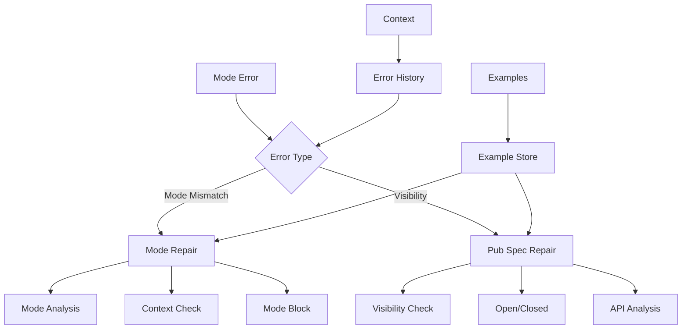
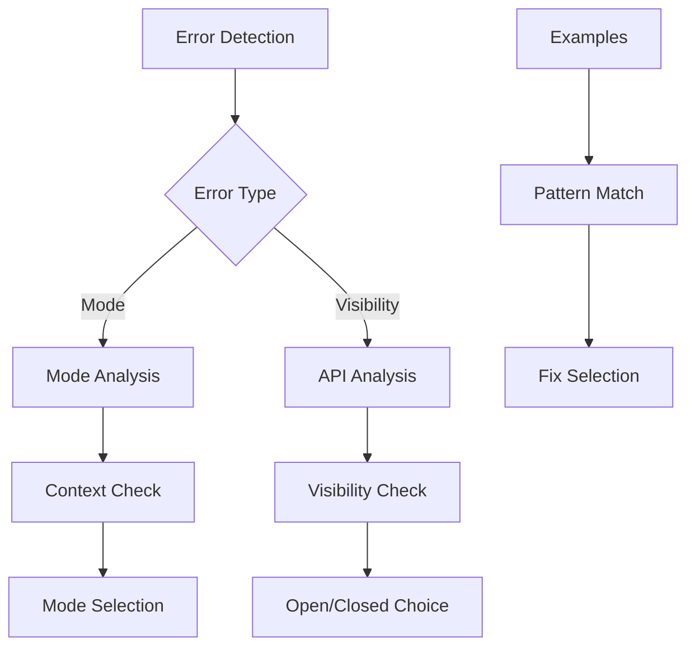

# Mode Repair Module

## Overview

The Mode Repair Module (`RepairModeModule`) specializes in fixing mode-related errors in Verus code. It handles mode mismatches between `exec`, `spec`, and `proof` modes, as well as visibility issues with public spec functions.

## Architecture



## Core Components

### 1. Error Classification

The module handles two main types of mode errors:

```python
if failure_to_fix.error == VerusErrorType.CannotCallFunc:
    return self.repair_mode_error(context, failure_to_fix)
elif failure_to_fix.error == VerusErrorType.PubSpecVisibility:
    return self.repair_pub_spec_visibility(context, failure_to_fix)
```

### 2. Mode Mismatch Repair

Handles mode compatibility issues:

```python
def repair_mode_error(self, context, failure_to_fix: VerusError):
    """
    Common fixes:
    1. Add mode blocks
    2. Adjust function modes
    3. Reimplement functionality
    4. Add trusted bridges
    """
```

### 3. Visibility Repair

Specializes in fixing pub spec visibility:

```python
def repair_pub_spec_visibility(self, context, failure_to_fix: VerusError):
    """
    Common fixes:
    1. Mark as open/closed
    2. Analyze API needs
    3. Check visibility
    4. Preserve privacy
    """
```

## Workflow

### 1. Error Analysis



### 2. Repair Process

1. Error Detection:
```python
mode_failures = last_trial.eval.get_failures(
    error_type=VerusErrorType.CannotCallFunc
)
visibility_failures = last_trial.eval.get_failures(
    error_type=VerusErrorType.PubSpecVisibility
)
```

2. Repair Selection:
```python
# Choose repair strategy based on error type
if error_type == CannotCallFunc:
    repair_mode_mismatch()
else:
    repair_visibility()
```

3. Fix Application:
```python
# Add mode blocks or visibility modifiers
proof {
    // Proof code here
}

pub open spec fn visible_to_clients() -> bool {
    // Implementation
}
```

## Features

### 1. Mode Management
- Context analysis
- Mode blocks
- Function modes
- Trusted bridges

### 2. Visibility Control
- Open/closed analysis
- API requirements
- Privacy preservation
- Client access

### 3. Code Generation
- Mode blocks
- Visibility modifiers
- Function bridges
- API design

### 4. Result Management
- Best result tracking
- Sample preservation
- Context updates
- Progress logging

## Common Repairs

### 1. Mode Blocks
```rust
// Before
fn exec_function() {
    let x = spec_function();
}

// After
fn exec_function() {
    let x = spec {
        spec_function()
    };
}
```

### 2. Function Modes
```rust
// Before
fn calculate_property(&self) -> bool {
    self.spec_value()
}

// After
spec fn calculate_property(&self) -> bool {
    self.spec_value()
}
```

### 3. Visibility Control
```rust
// Before
pub spec fn get_abstract_state(&self) -> bool {
    self.internal_state
}

// After
pub closed spec fn get_abstract_state(&self) -> bool {
    self.internal_state
}
```

## Best Practices

1. Mode Management:
   - Clear mode blocks
   - Explicit modes
   - Minimal bridges
   - Context awareness

2. Visibility Control:
   - API design
   - Privacy control
   - Client needs
   - Documentation

3. Code Organization:
   - Mode separation
   - Clear boundaries
   - API structure
   - Documentation

4. Result Validation:
   - Safety checks
   - Code review
   - Test cases
   - Error handling

## Extension Points

1. Mode Analysis:
```python
def add_mode_analyzer(self, analyzer: Callable):
    """Add new mode analyzer."""
    self.mode_analyzers.append(analyzer)
```

2. Visibility Analysis:
```python
def add_visibility_analyzer(self, analyzer: Callable):
    """Add new visibility analyzer."""
    self.visibility_analyzers.append(analyzer)
```

3. Bridge Generation:
```python
def add_bridge_generator(self, generator: Callable):
    """Add new bridge generator."""
    self.bridge_generators.append(generator)
```

## Common Issues

### 1. Mode Mismatches
```rust
// Problem: Calling spec from exec
fn process_data(&mut self) {
    let value = self.spec_calculation();
}

// Solution: Add mode block
fn process_data(&mut self) {
    let value = spec {
        self.spec_calculation()
    };
}
```

### 2. Visibility Issues
```rust
// Problem: Unclear visibility
pub spec fn get_state(&self) -> State {
    self.internal_state
}

// Solution: Explicit visibility
pub closed spec fn get_state(&self) -> State
    ensures(|s: State| s.is_valid())
{
    self.internal_state
}
```

### 3. Complex Mode Interactions
```rust
// Problem: Mixed mode operations
fn verify_state(&self) {
    let spec_val = self.get_spec_value();
    let exec_val = self.get_exec_value();
    assert(spec_val == exec_val);
}

// Solution: Clear mode separation
fn verify_state(&self) {
    let exec_val = self.get_exec_value();
    proof {
        let spec_val = self.get_spec_value();
        assert(spec_val == exec_val);
    }
}
```

## Conclusion

The Mode Repair Module provides:
1. Comprehensive mode handling
2. Visibility control
3. Clear mode separation
4. Context-aware fixes

Key strengths:
1. Mode management
2. Visibility control
3. Bridge generation
4. Clear fixes
