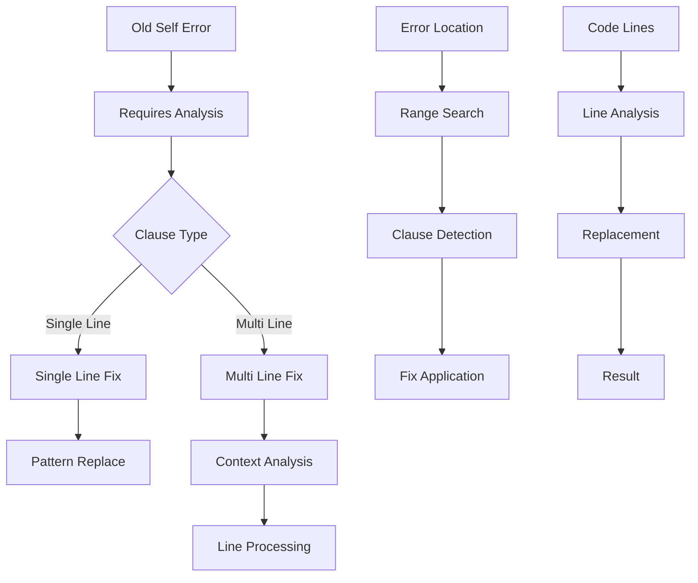
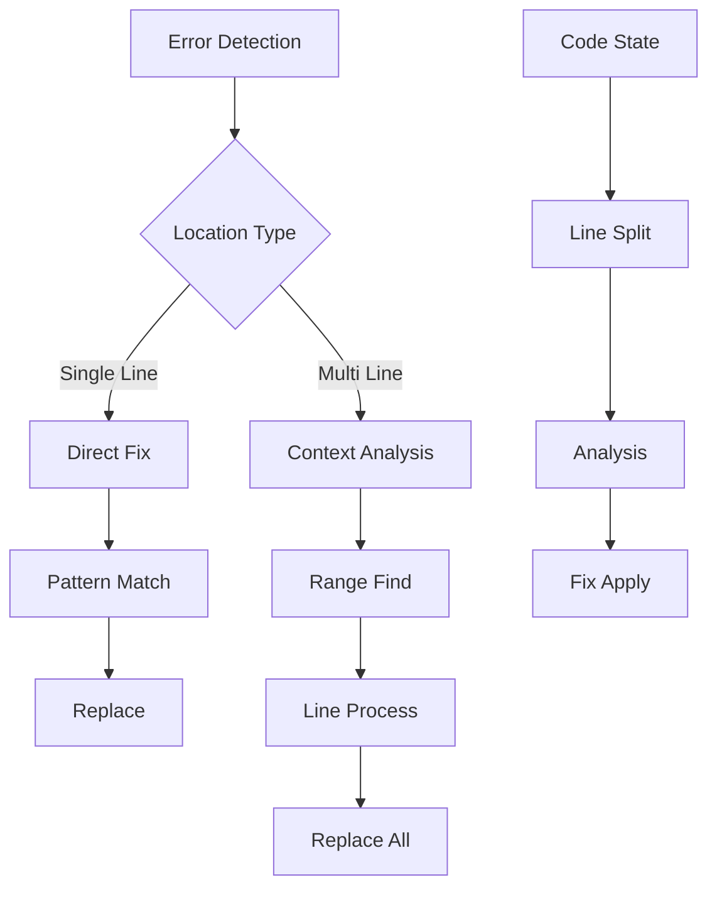

# Old Self Repair Module

## Overview

The Old Self Repair Module (`RepairOldSelfModule`) specializes in fixing requires clauses that need `old(self)` for `&mut` variables in Verus code. It handles the error "in requires, use `old(self)` to refer to the pre-state of an &mut variable" by replacing all instances of `self.` with `old(self).` in requires clauses.

## Architecture



## Core Components

### 1. Error Detection

The module focuses on `RequiresOldSelf` errors:

```python
if failure_to_fix.error != VerusErrorType.RequiresOldSelf:
    self.logger.warning(
        f"Received non-old(self) error: {failure_to_fix.error.name}"
    )
    return code
```

### 2. Requires Clause Analysis

Sophisticated requires clause detection:

```python
def _find_requires_clause(self, lines: list[str], error_line: int):
    """
    Finds requires clause by:
    1. Searching context around error
    2. Tracking parentheses balance
    3. Handling multi-line clauses
    4. Managing nested structures
    """
```

### 3. Pattern Replacement

Careful replacement of self references:

```python
# Replace self with old(self) in requires
if self.SELF_PATTERN in lines[i]:
    lines[i] = lines[i].replace(
        self.SELF_PATTERN,
        self.OLD_SELF_PATTERN
    )
```

## Workflow

### 1. Error Analysis



### 2. Repair Process

1. Error Location:
```python
error_line = error_trace.get_lines()[0] - 1  # 0-based
error_text = error_trace.get_text()
```

2. Clause Detection:
```python
requires_range = self._find_requires_clause(
    lines, error_line
)
requires_start, requires_end = requires_range
```

3. Fix Application:
```python
# Replace each self reference
for i in range(requires_start, requires_end + 1):
    if "self." in lines[i]:
        lines[i] = lines[i].replace("self.", "old(self).")
```

## Features

### 1. Clause Detection
- Context search
- Multi-line support
- Nested handling
- Format preservation

### 2. Pattern Management
- Self references
- Old self syntax
- Multiple occurrences
- Line preservation

### 3. Error Handling
- Location tracking
- Range validation
- Error reporting
- Context preservation

### 4. Result Management
- Line tracking
- Change logging
- Context updates
- Progress tracking

## Common Repairs

### 1. Single Line Requires
```rust
// Before
fn push(&mut self, value: i32)
    requires self.len() < 100
{
    // Implementation
}

// After
fn push(&mut self, value: i32)
    requires old(self).len() < 100
{
    // Implementation
}
```

### 2. Multi-line Requires
```rust
// Before
fn complex_op(&mut self, value: i32)
    requires
        self.len() < 100,
        self.capacity() > self.len(),
        value >= 0
{
    // Implementation
}

// After
fn complex_op(&mut self, value: i32)
    requires
        old(self).len() < 100,
        old(self).capacity() > old(self).len(),
        value >= 0
{
    // Implementation
}
```

### 3. Mixed Conditions
```rust
// Before
fn conditional_push(&mut self, value: i32)
    requires
        self.len() < 100 && value >= 0,
        self.can_accept(value)
{
    // Implementation
}

// After
fn conditional_push(&mut self, value: i32)
    requires
        old(self).len() < 100 && value >= 0,
        old(self).can_accept(value)
{
    // Implementation
}
```

## Best Practices

1. Clause Analysis:
   - Check context
   - Track balance
   - Handle nesting
   - Preserve format

2. Pattern Handling:
   - Full replacement
   - Context check
   - Multiple instances
   - Format preservation

3. Error Management:
   - Clear messages
   - Location tracking
   - Range validation
   - Context preservation

4. Result Validation:
   - Change tracking
   - Code review
   - Test cases
   - Error handling

## Extension Points

1. Pattern Analysis:
```python
def add_pattern_analyzer(self, analyzer: Callable):
    """Add new pattern analyzer."""
    self.pattern_analyzers.append(analyzer)
```

2. Clause Detection:
```python
def add_clause_detector(self, detector: Callable):
    """Add new clause detector."""
    self.clause_detectors.append(detector)
```

3. Fix Generation:
```python
def add_fix_generator(self, generator: Callable):
    """Add new fix generator."""
    self.fix_generators.append(generator)
```

## Common Issues

### 1. Nested References
```rust
// Problem: Nested self references
requires
    self.data.get(self.index()) == Some(value)

// Solution: Replace all instances
requires
    old(self).data.get(old(self).index()) == Some(value)
```

### 2. Complex Conditions
```rust
// Problem: Complex condition structure
requires
    self.len() < 100 &&
    (self.capacity() > self.len() || self.can_grow())

// Solution: Replace all self references
requires
    old(self).len() < 100 &&
    (old(self).capacity() > old(self).len() || old(self).can_grow())
```

### 3. Mixed Contexts
```rust
// Problem: Mixed self and parameter references
requires
    self.len() < max_len &&
    self.can_accept(value)

// Solution: Only replace self references
requires
    old(self).len() < max_len &&
    old(self).can_accept(value)
```

## Conclusion

The Old Self Repair Module provides:
1. Comprehensive requires clause handling
2. Pattern-based fixes
3. Format preservation
4. Context-aware repairs

Key strengths:
1. Multi-line support
2. Pattern management
3. Error handling
4. Clear fixes
