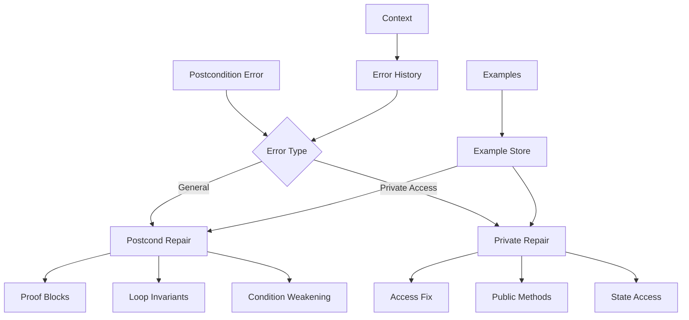
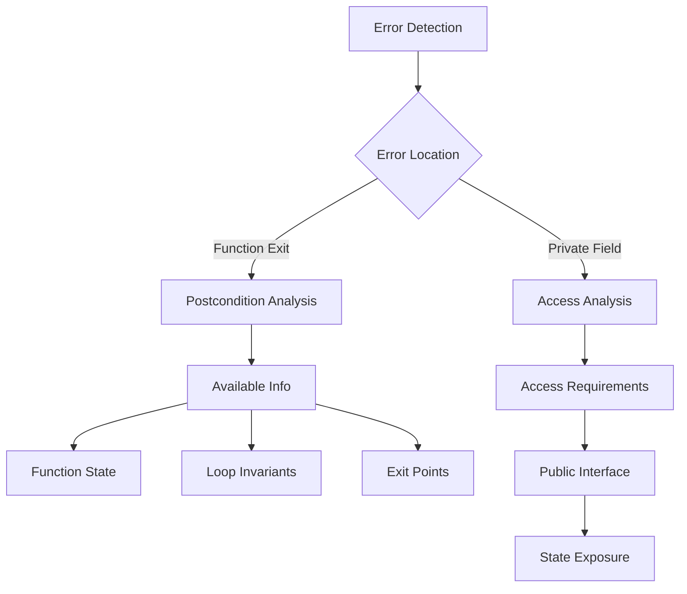

# Postcondition Repair Module

## Overview

The Postcondition Repair Module (`RepairPostcondModule`) specializes in fixing postcondition failures in Verus code. It handles both general postcondition failures and private field access issues in ensures clauses.

## Architecture



## Core Components

### 1. Error Classification

The module handles different types of postcondition failures:

```python
def exec(self, context, failure_to_fix: VerusError) -> str:
    # Check error type
    if failure_to_fix.error == VerusErrorType.PostCondFail:
        return self.repair_postcond_fail(context, failure_to_fix)
    elif failure_to_fix.error == VerusErrorType.ensure_private:
        return self.repair_ensure_private(context, failure_to_fix)
```

### 2. Postcondition Repair

Multiple strategies for fixing postcondition failures:

```python
def repair_postcond_fail(self, context, failure_to_fix: VerusError) -> str:
    instruction = """Fix post-condition failure:
    1. Add/modify proof blocks at exit points
    2. Modify loop invariants
    3. Add loop invariants for final loops
    4. Consider weakening postcondition
    """
```

### 3. Private Access Repair

Specialized handling for private field access:

```python
def repair_ensure_private(self, context, failure_to_fix: VerusError) -> str:
    instruction = """Fix private field access:
    1. Use public accessor methods
    2. Create public ghost functions
    3. Rewrite with public state
    4. Make field public if appropriate
    5. Remove problematic ensures
    """
```

## Workflow

### 1. Error Analysis



### 2. Repair Process

1. Error Detection:

```python
postcond_failures = last_trial.eval.get_failures(
    error_type=VerusErrorType.PostCondFail
)
private_failures = last_trial.eval.get_failures(
    error_type=VerusErrorType.ensure_private
)
```

2. Error Analysis:

```python
# Extract error information
location_trace, postcond_trace = failure_to_fix.trace[0], failure_to_fix.trace[1]
if location_trace.label == VerusErrorLabel.FailedThisPostCond:
    location_trace, postcond_trace = postcond_trace, location_trace
```

3. Repair Generation:

```python
# For postcondition failures
proof {
    // Add necessary proofs
    assert(condition_1);
    assert(condition_2);
    // Use loop invariants
    assert(loop_invariant);
}

// For private access
pub spec fn get_private_state(&self) -> T {
    self.private_field  // Public accessor
}
```

## Features

### 1. Error Handling

- General postconditions
- Private field access
- Loop invariants
- Exit points

### 2. Repair Strategies

- Proof generation
- Invariant modification
- Access control
- State exposure

### 3. Context Integration

- Function state
- Loop invariants
- Exit points
- Public interface

### 4. Result Management

- Best result tracking
- Sample preservation
- Context updates
- Progress logging

## Common Repairs

### 1. General Postconditions

```rust
// Before
fn method(&mut self) -> bool
    ensures
        self.value > old(self.value)
{
    self.value += 1;
    true
}

// After
fn method(&mut self) -> bool
    ensures
        self.value > old(self.value)
{
    self.value += 1;
    proof {
        assert(self.value == old(self.value) + 1);
        assert(self.value > old(self.value));
    }
    true
}
```

### 2. Loop Invariants

```rust
// Before
while i < n {
    sum += arr[i];
    i += 1;
}

// After
while i < n
    invariant
        i <= n,
        sum == old(sum) + arr.subrange(0, i).sum()
{
    sum += arr[i];
    i += 1;
}
```

### 3. Private Access

```rust
// Before
fn method(&mut self)
    ensures
        self.private_data > 0
{
    // Implementation
}

// After
pub spec fn private_data_positive(&self) -> bool {
    self.private_data > 0
}

fn method(&mut self)
    ensures
        self.private_data_positive()
{
    // Implementation
}
```

## Best Practices

1. Error Analysis:
   - Check error type
   - Analyze context
   - Identify requirements
   - Use available info

2. Proof Generation:
   - Minimal proofs
   - Clear assertions
   - Use invariants
   - Maintain context

3. Access Control:
   - Public interface
   - Ghost functions
   - State exposure
   - Visibility rules

4. Result Management:
   - Track progress
   - Save samples
   - Update context
   - Validate repairs

## Extension Points

1. Error Handling:

```python
def add_error_handler(self, error_type: str, handler: Callable):
    """Add new error handler."""
    self.error_handlers[error_type] = handler
```

2. Repair Strategies:

```python
def add_repair_strategy(self, strategy_type: str, strategy: Callable):
    """Add new repair strategy."""
    self.repair_strategies[strategy_type] = strategy
```

3. Context Integration:

```python
def add_context_source(self, source: str):
    """Add new context source."""
    self.context_sources.append(source)
```

## Common Issues

### 1. Missing Proofs

```rust
// Problem: Unproven postcondition
ensures
    result > old(value)

// Solution: Add proof
proof {
    assert(result == old(value) + 1);
    assert(result > old(value));
}
```

### 2. Loop Invariants

```rust
// Problem: Missing invariant
while i < vec.len() {
    sum += vec[i];
}

// Solution: Add invariant
invariant
    i <= vec.len(),
    sum == vec.subrange(0, i).sum()
```

### 3. Private Access

```rust
// Problem: Direct private access
ensures
    self.private_field > 0

// Solution: Public accessor
pub spec fn private_field_positive(&self) -> bool {
    self.private_field > 0
}
ensures
    self.private_field_positive()
```

## Conclusion

The Postcondition Repair Module provides:

1. Comprehensive error handling
2. Multiple repair strategies
3. Access control management
4. Context-aware repairs

Key strengths:

1. Multiple error types
2. Proof generation
3. Access control
4. Clear repairs
