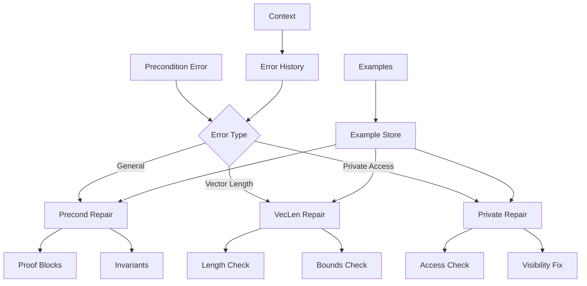
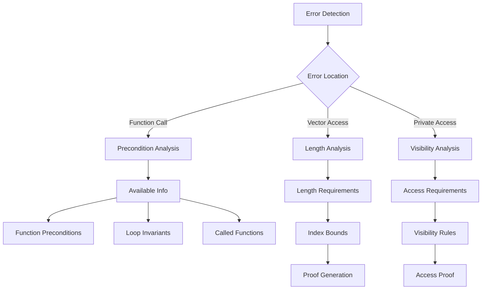

# Precondition Repair Module

## Overview

The Precondition Repair Module (`RepairPrecondModule`) specializes in fixing precondition failures in Verus code. It handles three types of precondition errors: general precondition failures, vector length preconditions, and private access preconditions.

## Architecture



## Core Components

### 1. Error Classification

The module handles different types of precondition failures:

```python
def exec(self, context, failure_to_fix: VerusError) -> str:
    # Check error type
    if failure_to_fix.error == VerusErrorType.PreCondFail:
        return self.repair_precond_fail(context, failure_to_fix)
    elif failure_to_fix.error == VerusErrorType.PreCondFailVecLen:
        return self.repair_precond_veclen(context, failure_to_fix)
    elif failure_to_fix.error == VerusErrorType.require_private:
        return self.repair_require_private(context, failure_to_fix)
```

### 2. Vector Length Handling

Specialized handling for vector length preconditions:

```python
def repair_precond_veclen(self, context, failure_to_fix: VerusError) -> str:
    instruction = f"""Fix vector length precondition error:
    1. Identify array/vector accesses
    2. For each access, establish:
       - Vector length requirements
       - Index bounds
    3. Use available information from:
       - Function preconditions
       - Loop invariants
       - Called functions
    """
```

### 3. Proof Generation

Proof block generation for preconditions:

```python
def repair_precond_fail(self, context, failure_to_fix: VerusError) -> str:
    instruction = """Add proof blocks to establish:
    1. Current function's preconditions
    2. Active loop invariants
    3. Called functions' preconditions
    
    DO NOT modify the function whose precondition failed.
    """
```

## Workflow

### 1. Error Analysis



### 2. Repair Process

1. Error Detection:
```python
precond_failures = last_trial.eval.get_failures(
    error_type=VerusErrorType.PreCondFail
)
veclen_failures = last_trial.eval.get_failures(
    error_type=VerusErrorType.PreCondFailVecLen
)
private_failures = last_trial.eval.get_failures(
    error_type=VerusErrorType.require_private
)
```

2. Error Analysis:
```python
# Extract error information
precond_trace, location_trace = failure_to_fix.trace[0], failure_to_fix.trace[1]
if location_trace.label == VerusErrorLabel.FailedThisPreCond:
    precond_trace, location_trace = location_trace, precond_trace
```

3. Proof Generation:
```python
# Generate appropriate proofs
proof {
    // Establish preconditions
    assert(condition_1);
    assert(condition_2);
    // Use available information
    use_type_invariant(&*self);
}
```

## Features

### 1. Error Handling
- General preconditions
- Vector length checks
- Private access rules
- Visibility requirements

### 2. Proof Generation
- Precondition proofs
- Length requirements
- Bounds checking
- Access validation

### 3. Context Integration
- Function preconditions
- Loop invariants
- Called functions
- Type invariants

### 4. Result Management
- Best result tracking
- Sample preservation
- Context updates
- Progress logging

## Common Repairs

### 1. General Preconditions
```rust
// Before
fn_with_precond(x);

// After
proof {
    assert(x > 0);  // Establish precondition
    assert(x < 100);  // Additional requirement
}
fn_with_precond(x);
```

### 2. Vector Length
```rust
// Before
vec[index] = value;

// After
proof {
    assert(index as int < vec.view().len());  // Length check
    assert(index >= 0);  // Bounds check
}
vec[index] = value;
```

### 3. Private Access
```rust
// Before
self.private_field.method();

// After
proof {
    assert(self.has_permission());  // Access check
    assert(self.well_formed());  // State check
}
self.private_field.method();
```

## Best Practices

1. Error Analysis:
   - Check error type
   - Analyze context
   - Identify requirements
   - Use available info

2. Proof Generation:
   - Minimal proofs
   - Clear assertions
   - Use invariants
   - Maintain context

3. Vector Handling:
   - Check lengths
   - Verify bounds
   - Use view functions
   - Handle indices

4. Access Control:
   - Check permissions
   - Verify visibility
   - Maintain state
   - Follow rules

## Extension Points

1. Error Handling:
```python
def add_error_handler(self, error_type: str, handler: Callable):
    """Add new error handler."""
    self.error_handlers[error_type] = handler
```

2. Proof Generation:
```python
def add_proof_template(self, template: str, conditions: List[str]):
    """Add new proof template."""
    self.proof_templates[template] = conditions
```

3. Context Integration:
```python
def add_context_source(self, source: str):
    """Add new context source."""
    self.context_sources.append(source)
```

## Common Issues

### 1. Missing Preconditions
```rust
// Problem: Unchecked precondition
fn_requiring_positive(x);

// Solution: Add proof
proof {
    assert(x > 0);  // Check requirement
}
fn_requiring_positive(x);
```

### 2. Vector Bounds
```rust
// Problem: Unchecked bounds
vec.set(i, val);

// Solution: Add bounds check
proof {
    assert(i as int < vec.view().len());
    assert(i >= 0);
}
vec.set(i, val);
```

### 3. Private Access
```rust
// Problem: Invalid access
private_method();

// Solution: Add permission check
proof {
    assert(has_permission());
    assert(well_formed());
}
private_method();
```

## Conclusion

The Precondition Repair Module provides:
1. Comprehensive error handling
2. Intelligent proof generation
3. Vector length management
4. Access control verification

Key strengths:
1. Multiple error types
2. Context awareness
3. Safe repairs
4. Clear proofs
