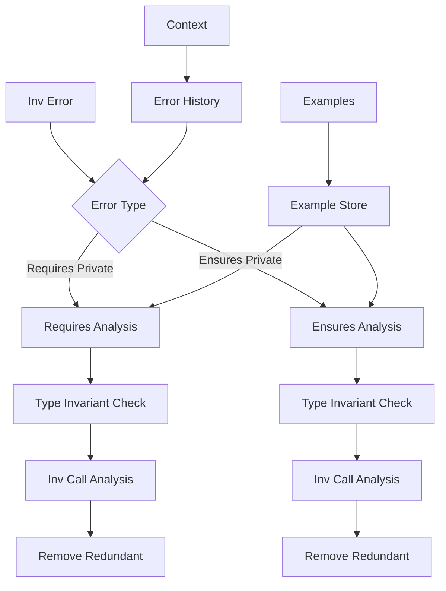
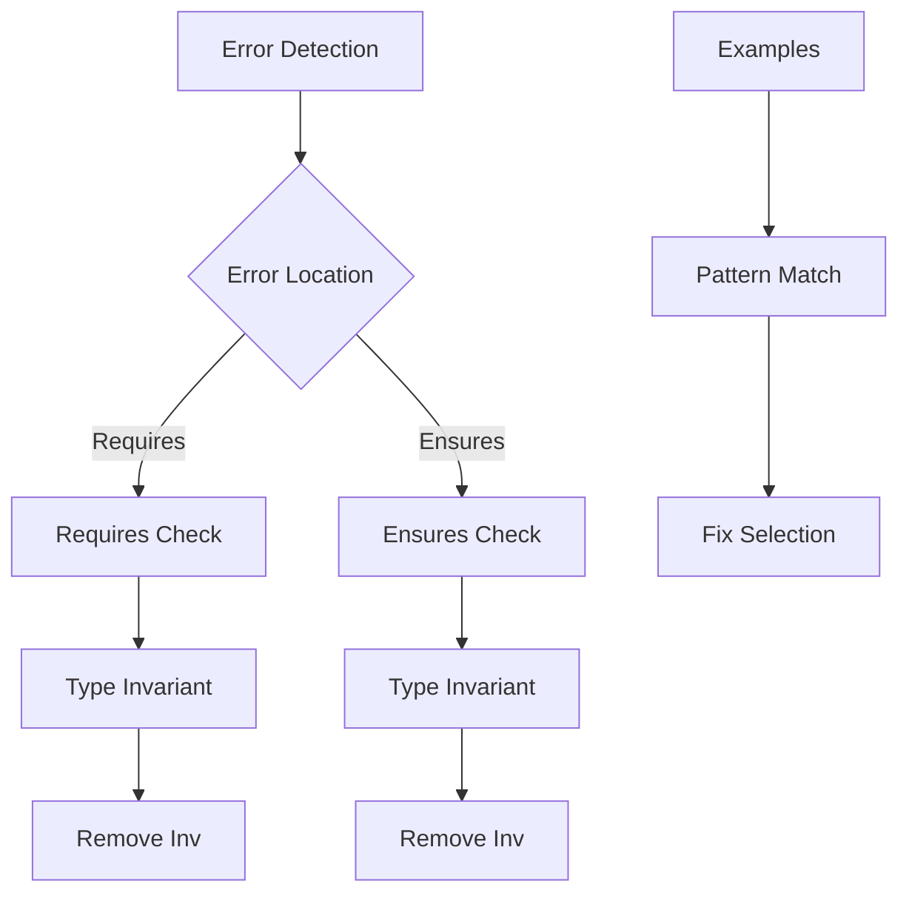

# Remove Inv Repair Module

## Overview

The Remove Inv Repair Module (`RepairRemoveInv`) specializes in fixing redundant `inv()` calls in Verus code. It handles errors related to `#[verifier::type_invariant]` and removes unnecessary `inv()` calls in pre/post-conditions when type invariants are already in use.

## Architecture



## Core Components

### 1. Error Classification

The module handles two main types of privacy errors that indicate redundant inv calls:

```python
if failure_to_fix.error not in [
    VerusErrorType.require_private,
    VerusErrorType.ensure_private,
]:
    self.logger.warning(
        f"Received non-privacy error: {failure_to_fix.error.name}"
    )
    return code
```

### 2. Inv Call Analysis

Identifies and removes redundant inv() calls:

```python
def repair_remove_inv(self, context, failure_to_fix: VerusError):
    """
    Common fixes:
    1. Remove self.inv() from requires
    2. Remove self.inv() from ensures
    3. Check type_invariant presence
    4. Preserve other conditions
    """
```

### 3. Type Invariant Handling

Ensures proper interaction with type invariants:

```python
# When type_invariant is present:
#[verifier::type_invariant]
pub fn inv(&self) -> bool {
    // Type invariant definition
}

// Remove redundant calls:
fn method(&mut self)
    // Before: requires self.inv()
    // After: requires true  // type_invariant handles it
```

## Workflow

### 1. Error Analysis



### 2. Repair Process

1. Error Detection:
```python
failures = last_trial.eval.get_failures(
    error_type=VerusErrorType.require_private
)
if not failures:
    failures = last_trial.eval.get_failures(
        error_type=VerusErrorType.ensure_private
    )
```

2. Fix Selection:
```python
# Remove redundant inv() calls when type_invariant is present
instruction = """DO NOT add `self.inv()` to pre/post-conditions
if `#[verifier::type_invariant]` is used"""
```

3. Fix Application:
```python
# Remove redundant inv() calls
# Before:
requires self.inv() && x > 0
# After:
requires x > 0  // type_invariant handles inv
```

## Features

### 1. Privacy Error Handling
- Requires private
- Ensures private
- Type invariant check
- Condition preservation

### 2. Inv Call Management
- Redundancy detection
- Safe removal
- Context preservation
- Invariant checking

### 3. Type Invariant Integration
- Presence detection
- Compatibility check
- Proper usage
- Error prevention

### 4. Result Management
- Best result tracking
- Sample preservation
- Context updates
- Progress logging

## Common Repairs

### 1. Requires Clause
```rust
// Before
pub fn push(&mut self, value: T)
    requires
        self.inv(),
        self.len() < self.capacity()
{
    // Implementation
}

// After
pub fn push(&mut self, value: T)
    requires
        self.len() < self.capacity()
{
    // Implementation
}
```

### 2. Ensures Clause
```rust
// Before
pub fn pop(&mut self) -> Option<T>
    ensures
        self.inv(),
        self.len() == old(self).len() - 1
{
    // Implementation
}

// After
pub fn pop(&mut self) -> Option<T>
    ensures
        self.len() == old(self).len() - 1
{
    // Implementation
}
```

### 3. Multiple Conditions
```rust
// Before
pub fn insert(&mut self, index: usize, value: T)
    requires
        self.inv(),
        index <= self.len(),
        self.len() < self.capacity()
    ensures
        self.inv(),
        self.len() == old(self).len() + 1
{
    // Implementation
}

// After
pub fn insert(&mut self, index: usize, value: T)
    requires
        index <= self.len(),
        self.len() < self.capacity()
    ensures
        self.len() == old(self).len() + 1
{
    // Implementation
}
```

## Best Practices

1. Error Analysis:
   - Check error type
   - Verify privacy
   - Check invariants
   - Preserve conditions

2. Inv Management:
   - Remove redundant
   - Keep necessary
   - Check context
   - Maintain safety

3. Type Invariant:
   - Verify presence
   - Check usage
   - Ensure coverage
   - Maintain rules

4. Result Validation:
   - Safety checks
   - Code review
   - Test cases
   - Error handling

## Extension Points

1. Error Analysis:
```python
def add_error_analyzer(self, analyzer: Callable):
    """Add new error analyzer."""
    self.error_analyzers.append(analyzer)
```

2. Inv Detection:
```python
def add_inv_detector(self, detector: Callable):
    """Add new inv detector."""
    self.inv_detectors.append(detector)
```

3. Fix Generation:
```python
def add_fix_generator(self, generator: Callable):
    """Add new fix generator."""
    self.fix_generators.append(generator)
```

## Common Issues

### 1. Mixed Conditions
```rust
// Problem: Mixed inv with other conditions
requires
    self.inv() && self.len() < 100 && self.inv()

// Solution: Remove redundant inv calls
requires
    self.len() < 100  // type_invariant handles inv
```

### 2. Nested Structures
```rust
// Problem: Nested inv calls
requires
    self.inv() &&
    (self.len() < 100 || (self.can_grow() && self.inv()))

// Solution: Remove all redundant inv calls
requires
    self.len() < 100 || self.can_grow()
```

### 3. Complex Conditions
```rust
// Problem: Complex condition structure
requires
    self.inv() &&
    match self.state {
        State::Ready => self.inv() && self.can_proceed(),
        _ => false
    }

// Solution: Remove redundant inv calls
requires
    match self.state {
        State::Ready => self.can_proceed(),
        _ => false
    }
```

## Conclusion

The Remove Inv Repair Module provides:
1. Comprehensive inv handling
2. Type invariant integration
3. Privacy error fixes
4. Clean condition management

Key strengths:
1. Privacy handling
2. Inv management
3. Type integration
4. Clear fixes
