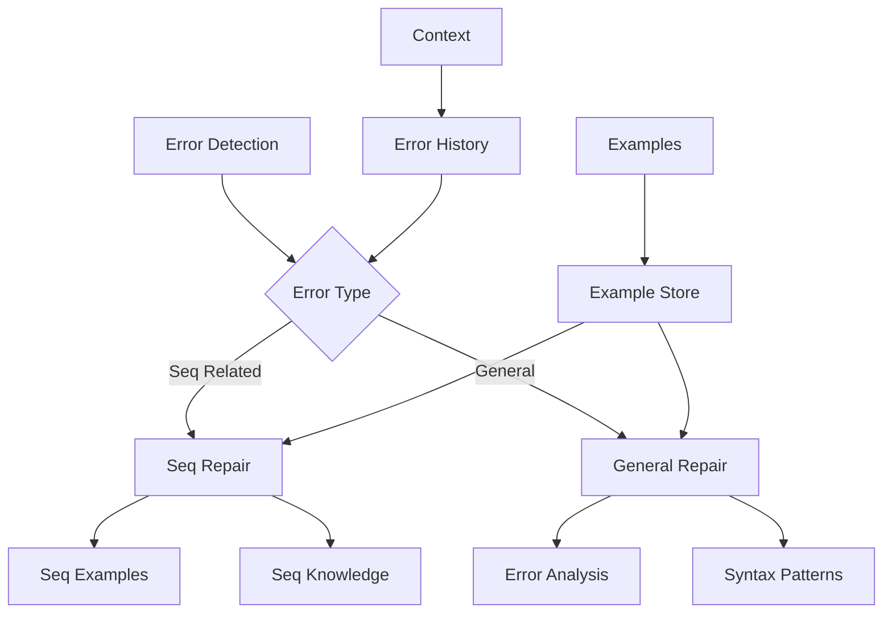
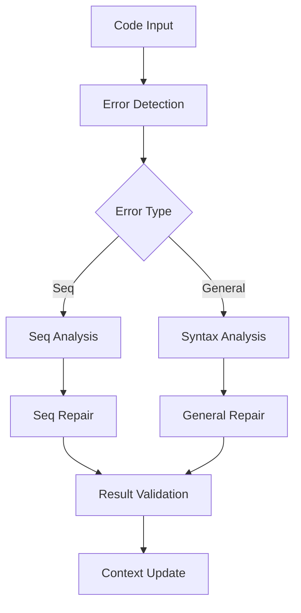

# Syntax Repair Module

## Overview

The Syntax Repair Module (`RepairSyntaxModule`) specializes in fixing syntax errors in Verus code, with particular emphasis on sequence-related syntax issues. It serves as both a general syntax repair tool and a specialized handler for sequence operations.

## Architecture



## Core Components

### 1. Error Detection

The module detects different types of syntax errors:

```python
def is_seq_syntax_error(self, failure: VerusError, rustc_out: str) -> bool:
    seq_related_terms = [
        "Seq",
        "seq!",
        "verus::seq",
        "seq::",
        "vec.view()",
        ".subrange(",
        ".filter(",
        ".take(",
        ".push(",
        ".update(",
    ]

    # Check error message and traces
    for term in seq_related_terms:
        if term in error_text:
            return True
```

### 2. Sequence Repair

Specialized handling for sequence-related errors:

```python
def repair_seq_syntax_error(self, context, failure_to_fix: VerusError) -> str:
    # Extract error information
    error_line = error_trace.lines[0]
    error_text = error_trace.get_text().strip()

    # Build repair instruction
    instruction = f"""
    Fix syntax error on line {error_line} in expression:
    {error_text}

    Use Seq operations correctly:
    - Proper view() usage
    - Correct subrange syntax
    - Valid sequence operations
    """
```

### 3. General Syntax Repair

Handles general syntax issues:

```python
def repair_general_syntax_error(self, context, failure_to_fix: VerusError) -> str:
    # Common syntax errors to check:
    common_errors = [
        "Missing/misplaced parentheses",
        "Missing/incorrect semicolons",
        "Incorrect operators/methods",
        "Wrong function call syntax",
        "Incorrect generics usage",
        "Invalid Verus syntax"
    ]
```

## Workflow

### 1. Error Analysis



### 2. Repair Process

1. Error Detection:
```python
if "error[E0433]: failed to resolve" in rustc_out:
    # Name resolution error
elif "unexpected token" in rustc_out:
    # Syntax error
```

2. Repair Selection:
```python
if is_seq_syntax_error(failure, rustc_out):
    return repair_seq_syntax_error(context, failure)
else:
    return repair_general_syntax_error(context, failure, rustc_out)
```

3. Result Validation:
```python
def evaluate_repair_candidates(self, original_code, candidates):
    for candidate in candidates:
        if self.check_code_safety(original_code, candidate):
            return candidate
```

## Features

### 1. Sequence Handling
- View function syntax
- Sequence operations
- Type safety
- Operation correctness

### 2. Error Detection
- Compilation errors
- Token errors
- Resolution errors
- Syntax patterns

### 3. Repair Strategies
- Multiple attempts
- Temperature adjustment
- Example-based repair
- Safety checking

### 4. Result Management
- Best result tracking
- Sample preservation
- Context updates
- Progress logging

## Common Repairs

### 1. Sequence Operations
```rust
// Before
vec.subrange(0, len)

// After
vec.view().subrange(0, len as int)
```

### 2. View Functions
```rust
// Before
self.data.len()

// After
self.data.view().len()
```

### 3. Type Conversions
```rust
// Before
index < vec.len()

// After
index as int < vec.view().len()
```

## Best Practices

1. Error Analysis:
   - Check error type
   - Analyze context
   - Consider patterns
   - Use examples

2. Repair Strategy:
   - Start specific
   - Fall back general
   - Validate results
   - Track progress

3. Safety Checks:
   - Code structure
   - Type safety
   - Operation validity
   - Context preservation

4. Result Management:
   - Save progress
   - Track improvements
   - Handle failures
   - Update context

## Extension Points

1. Error Detection:
```python
def add_error_pattern(self, pattern: str, handler: Callable):
    """Add new error detection pattern."""
    self.error_patterns[pattern] = handler
```

2. Repair Strategies:
```python
def add_repair_strategy(self, error_type: str, strategy: Callable):
    """Add new repair strategy."""
    self.repair_strategies[error_type] = strategy
```

3. Example Management:
```python
def add_example_source(self, source: str):
    """Add new example source."""
    self.example_sources.append(source)
```

## Common Issues

### 1. Sequence Operations
```rust
// Problem: Missing view
vec.subrange(0, len)

// Solution: Add view
vec.view().subrange(0, len as int)
```

### 2. Type Conversions
```rust
// Problem: Type mismatch
index < sequence.len()

// Solution: Add conversion
(index as int) < sequence.view().len()
```

### 3. Method Calls
```rust
// Problem: Invalid method
vec.push(element)

// Solution: Correct method
vec.set(index, element)
```

## Conclusion

The Syntax Repair Module provides:
1. Specialized sequence handling
2. General syntax repair
3. Safe code modifications
4. Robust error recovery

Key strengths:
1. Sequence expertise
2. Multiple strategies
3. Safe repairs
4. Context awareness
