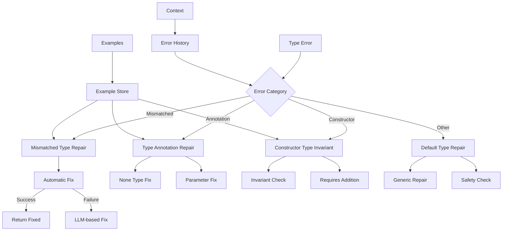
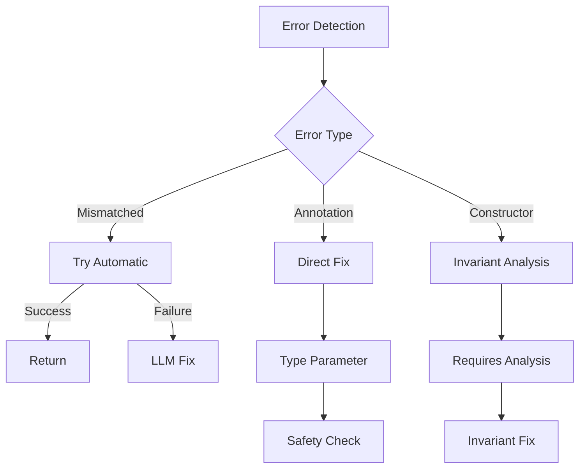

# Type Repair Module

## Overview

The Type Repair Module (`RepairTypeModule`) specializes in fixing type-related errors in Verus code. It handles mismatched types, type annotations, constructor type invariants, and other type-related issues.

## Architecture



## Core Components

### 1. Error Classification

The module handles three main types of errors:

```python
if failure_to_fix.error == VerusErrorType.MismatchedType:
    result = self.repair_mismatched_type(context, failure_to_fix)
elif failure_to_fix.error == VerusErrorType.TypeAnnotation:
    return self.repair_type_annotation(context, failure_to_fix)
elif failure_to_fix.error == VerusErrorType.ConstructorFailTypeInvariant:
    return self.repair_constructor_type_invariant(context, failure_to_fix)
```

### 2. Mismatched Type Repair

Handles type mismatches with both automatic and LLM-based approaches:

```python
def repair_mismatched_type(self, context, failure_to_fix: VerusError):
    # Try automatic fix first
    newcode = fix_one_type_error_in_code(
        code, failure_to_fix.trace[0]
    )
    
    # Fall back to LLM if needed
    if not newcode:
        # LLM-based repair with type-specific instructions
```

### 3. Type Annotation Repair

Specializes in fixing missing or incorrect type annotations:

```python
def repair_type_annotation(self, context, failure_to_fix: VerusError):
    # Example fix:
    # Before: ret == None
    # After:  ret == None::<T>
```

### 4. Constructor Type Invariant Repair

Ensures constructors satisfy their type invariants:

```python
def repair_constructor_type_invariant(self, context, failure_to_fix):
    # Focus on requires clauses to satisfy inv(&self)
```

## Workflow

### 1. Error Analysis



### 2. Repair Process

1. Error Detection:
```python
type_failures = last_trial.eval.get_failures(
    error_type=VerusErrorType.MismatchedType
)
annotation_failures = last_trial.eval.get_failures(
    error_type=VerusErrorType.TypeAnnotation
)
constructor_failures = last_trial.eval.get_failures(
    error_type=VerusErrorType.ConstructorFailTypeInvariant
)
```

2. Repair Selection:
```python
# Choose repair strategy based on error type
if error_type == MismatchedType:
    try_automatic_first()
elif error_type == TypeAnnotation:
    fix_type_annotation()
elif error_type == ConstructorFailTypeInvariant:
    fix_constructor_invariant()
```

3. Safety Checking:
```python
# Evaluate repair candidates
best_code = self.evaluate_repair_candidates(
    original_code=code,
    candidates=responses,
    output_dir=output_dir,
    prefix="repair_type"
)
```

## Features

### 1. Automatic Repair
- Type error detection
- Automatic fixes
- LLM fallback
- Safety checks

### 2. Type Annotation
- None type fixes
- Generic parameters
- Type inference
- Context analysis

### 3. Constructor Invariants
- Invariant checking
- Requires clauses
- Safety validation
- Context preservation

### 4. Result Management
- Best result tracking
- Sample preservation
- Context updates
- Progress logging

## Common Repairs

### 1. Mismatched Types
```rust
// Before
let x: u64 = vec.len();

// After
let x: usize = vec.len();
```

### 2. Type Annotations
```rust
// Before
fn get_value() -> Option<T> {
    None
}

// After
fn get_value() -> Option<T> {
    None::<T>
}
```

### 3. Constructor Invariants
```rust
// Before
pub fn new(capacity: usize) -> Self {
    Self { data: vec![], capacity }
}

// After
pub fn new(capacity: usize) -> Self
    requires
        capacity > 0
{
    Self { data: vec![], capacity }
}
```

## Best Practices

1. Type Handling:
   - Check automatic fixes first
   - Use type inference
   - Preserve generics
   - Maintain bounds

2. Annotation Management:
   - Add explicit types
   - Handle generics
   - Check constraints
   - Verify bounds

3. Constructor Safety:
   - Check invariants
   - Add requires
   - Verify state
   - Handle edge cases

4. Result Validation:
   - Safety checks
   - Code review
   - Test cases
   - Error handling

## Extension Points

1. Type Analysis:
```python
def add_type_analyzer(self, analyzer: Callable):
    """Add new type analyzer."""
    self.type_analyzers.append(analyzer)
```

2. Repair Strategy:
```python
def add_repair_strategy(self, strategy: Callable):
    """Add new repair strategy."""
    self.repair_strategies.append(strategy)
```

3. Safety Check:
```python
def add_safety_check(self, check: Callable):
    """Add new safety check."""
    self.safety_checks.append(check)
```

## Common Issues

### 1. Missing Type Parameters
```rust
// Problem: Generic type parameter missing
let x = None;

// Solution: Add explicit type
let x = None::<MyType>;
```

### 2. Constructor Invariants
```rust
// Problem: Invariant not satisfied
pub fn new(size: usize) -> Self {
    Self { size, data: Vec::new() }
}

// Solution: Add requires clause
pub fn new(size: usize) -> Self
    requires
        size <= MAX_SIZE,
        size > 0
{
    Self { size, data: Vec::new() }
}
```

### 3. Type Mismatches
```rust
// Problem: Type mismatch in arithmetic
let x: u32 = arr.len() * 2;

// Solution: Use correct type
let x: usize = arr.len() * 2;
```

## Conclusion

The Type Repair Module provides:
1. Comprehensive type error handling
2. Multiple repair strategies
3. Safety validation
4. Context-aware fixes

Key strengths:
1. Automatic repairs
2. Type inference
3. Safety checks
4. Clear fixes
