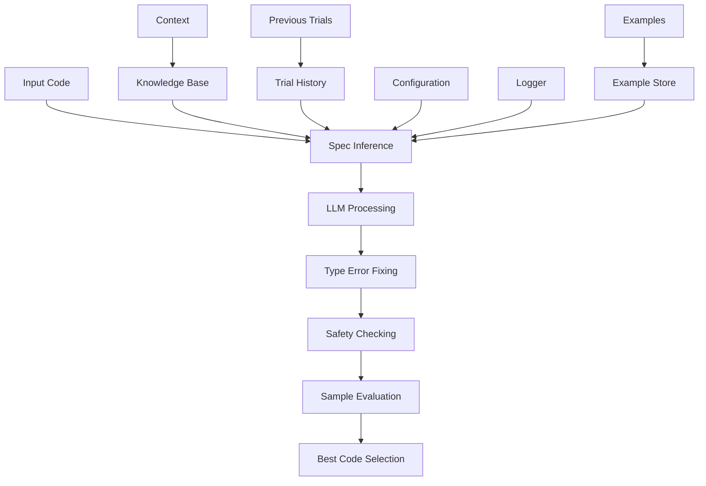

# Specification Inference Module

## Overview

The Specification Inference Module is responsible for inferring and implementing function specifications in Verus code. It focuses on generating appropriate `requires` and `ensures` clauses for functions, implementing spec functions, and handling trait specifications.

## Architecture



## Core Components

### 1. Specification Generator

The module specializes in generating function specifications:

```python
inference_instruction = """
You are an expert in Verus. Your task is to:

1. Add requires and ensures to spec functions:
   - Change function signatures without return type to -> (retname: rettype)
   - Add appropriate requires and ensures clauses
   - For field access in specifications of public functions:
     * If type T implements View: use self.view().field
     * For tuples: use self.view().0, self.view().1

2. Add ensures clauses to trait method implementations:
   - Add appropriate ensures clauses based on method semantics
   - State conditions that determine the return value
   - Follow field access rules as above

3. Implement spec fn functions:
   - Write implementation based on function name and context
   - Follow field access rules for View trait
   - You MAY use match and let inside spec fn bodies
"""
```

### 2. Safety Checking System

Comprehensive safety validation:

```python
def check_code_safety(self, original_code: str, generated_code: str) -> bool:
    """Check if generated code is safe to use."""
    # Check code changes using Lynette
    if not code_change_is_safe(
        original_code, generated_code, self.immutable_funcs, self.logger
    ):
        return False

    # Check TODO marker preservation
    todo_markers = [
        "// TODO: add proof",
        "// TODO: add loop invariant"
    ]

    for marker in todo_markers:
        if original_code.count(marker) > generated_code.count(marker):
            return False

    return True
```

### 3. Response Processing

Sophisticated response handling:

```python
def _process_responses(self, responses: List[str], original_code: str):
    safe_responses = []
    for response in responses:
        # Fix type errors
        fixed_response, _ = debug_type_error(response, logger=self.logger)
        final_response = fixed_response if fixed_response else response

        # Check safety
        if self.check_code_safety(original_code, final_response):
            safe_responses.append(final_response)
    return safe_responses
```

## Workflow

### 1. Initialization
```python
def __init__(self, config, logger, immutable_funcs=None):
    super().__init__(
        name="spec_inference",
        desc="Infer requires and ensures clauses for functions",
        config=config,
        logger=logger,
    )
    self.llm = LLM(config, logger)
    self.immutable_funcs = immutable_funcs or []
```

### 2. Execution Process

1. Code Analysis:
```python
def exec(self, context) -> str:
    code = context.trials[-1].code
    original_code = code
```

2. Multiple Retry Attempts:
```python
max_retries = 3
for retry_attempt in range(max_retries):
    instruction = build_instruction(
        base_instruction=self.inference_instruction,
        add_common=True,
        add_requires_ensures=True,
        code=code,
        knowledge="",  # context.gen_knowledge() currently disabled
    )
```

Note: `exec` currently sets `knowledge=""` instead of calling `context.gen_knowledge()`.

3. Response Evaluation:
```python
best_code, best_score, _ = evaluate_samples(
    samples=safe_responses,
    output_dir=output_dir,
    prefix="04_spec_inference",
    logger=self.logger,
)
```

## Features

### 1. Intelligent Specification Generation
- Function signature enhancement
- Appropriate requires/ensures clauses
- View-aware field access
- Trait method specifications

### 2. Safety Mechanisms
- Code change validation
- TODO marker preservation
- Type safety checking
- Semantic preservation

### 3. Error Handling
- Multiple retry attempts
- Temperature adjustment
- Compilation error repair
- Comprehensive logging

### 4. Result Management
- Best result tracking
- Sample preservation
- Score-based evaluation
- Global optimization

## Best Practices

1. Specification Implementation:
   - Use appropriate field access patterns
   - Maintain type safety
   - Preserve TODO markers
   - Follow View trait patterns

2. Safety Checks:
   - Validate code changes
   - Check marker preservation
   - Ensure type safety
   - Maintain semantics

3. Error Recovery:
   - Multiple attempts
   - Temperature adjustment
   - Compilation repair
   - Detailed logging

4. Result Optimization:
   - Track best results
   - Evaluate samples
   - Preserve history
   - Global tracking

## Extension Points

1. Custom Safety Checks:
```python
def add_safety_check(self, check_function):
    """Add custom safety check."""
    self.safety_checks.append(check_function)
```

2. Specification Patterns:
```python
def add_spec_pattern(self, pattern: str, handler: Callable):
    """Register new specification pattern handler."""
    self.spec_patterns[pattern] = handler
```

3. Result Evaluation:
```python
def add_evaluation_metric(self, metric: Callable):
    """Add custom evaluation metric."""
    self.evaluation_metrics.append(metric)
```

## Guidelines

### 1. Function Specifications
- Add appropriate return type annotations
- Include necessary requires clauses
- Specify ensures clauses
- Handle field access correctly

### 2. Trait Methods
- Add ensures clauses only
- State return value conditions
- Follow field access patterns
- Maintain trait semantics

### 3. Spec Functions
- Implement based on context
- Use match/let as needed
- Follow View trait patterns
- Maintain type safety

## Conclusion

The Specification Inference Module provides a sophisticated system for generating and implementing function specifications in Verus code. Its combination of intelligent generation, comprehensive safety checks, and robust error handling makes it a reliable tool for maintaining code specifications. The module's extensible architecture and clear guidelines ensure consistent and correct specification generation.
