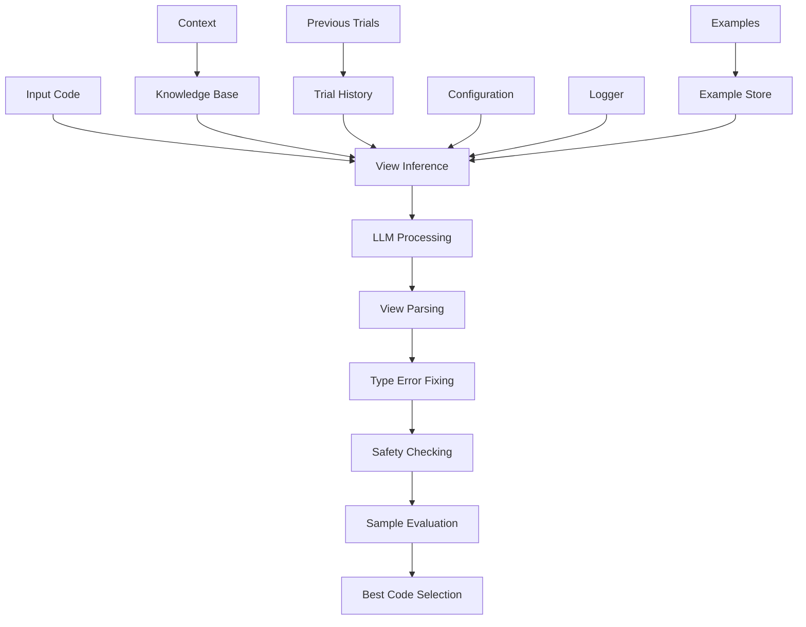

# View Inference Module

## Overview

The View Inference Module is responsible for generating mathematical abstractions for data structures in Verus code. It creates View functions that provide a pure, specification-level representation of data structures, essential for formal verification.

## Architecture



## Core Components

### 1. View Function Generator

The module specializes in generating View implementations with specific characteristics:

```python
view_instruction = """
You are an expert in Verus (verifier for rust). Your task is to generate a View function for the given module. View is the mathematical abstraction for the given data structure. It contains the minimal information to completely represent it. View is used strictly in Verus spec.
    - Add a View spec function that provides a mathematical abstraction
    - For Vec type variables in the View, append "@" to their names
    - Fill in only /* TODO: part of view */
    - Do NOT use reveal keyword in the View implementation

Mathematical types in Verus include:
    - bool
    - int
    - nat
    - Seq<T>
    - Set<T>
    - Map<K, V>
"""
```

### 2. View Response Parser

Sophisticated parsing system for View implementations:

```python
def parse_view_response(self, response: str) -> str:
    """Parse and clean View implementation."""
    # Extract View implementation using patterns
    view_impl_pattern = r"impl\s*<.*?>\s*View\s+for\s+\w+.*?{.*?type\s+V\s*=.*?closed\s+spec\s+fn\s+view.*?}.*?}"
    view_impls = re.findall(view_impl_pattern, parsed_code, re.DOTALL)
    
    if view_impls:
        return view_impls[0]
```

### 3. Type Error Fixing and Safety Checking

Comprehensive type error correction followed by safety validation:

```python
def _process_responses(self, responses: List[str], original_code: str):
    safe_responses = []
    for response in responses:
        # Parse View implementation
        parsed_response = parse_llm_response(response)
        
        # Fix type errors
        fixed_response, _ = debug_type_error(parsed_response)
        final_response = fixed_response if fixed_response else parsed_response
        
        # Check safety
        if self.check_code_safety(original_code, final_response):
            safe_responses.append(final_response)
    return safe_responses
```

## Workflow

### 1. Initialization
```python
def __init__(self, config, logger):
    super().__init__(
        name="view_inference",
        desc="Generate a View function for the data structure's mathematical abstraction",
        config=config,
        logger=logger,
    )
    self.llm = LLM(config, logger)
```

### 2. Execution Process

1. Code Analysis:
```python
def exec(self, context: Context) -> str:
    code = context.trials[-1].code
    original_code = code
    
    instruction = build_instruction(
        base_instruction=self.view_instruction,
        add_common=True,
        add_view=True,
        code=code,
        knowledge=context.gen_knowledge(),
    )
```

2. Example Loading:
```python
examples = get_examples(self.config, "view", self.logger)
```

3. Multiple Retry Attempts:
```python
max_retries = 3
for retry_attempt in range(max_retries):
    responses = self._get_llm_responses(
        instruction, 
        code, 
        examples, 
        retry_attempt=retry_attempt
    )
```

4. Result Evaluation:
```python
best_code, best_score, _ = evaluate_samples(
    samples=safe_responses,
    output_dir=output_dir,
    prefix="01_view_inference",
    logger=self.logger,
)
```

## Features

### 1. Mathematical Abstraction
- Pure specification-level representation
- Minimal complete representation
- Mathematical type system
- Vector handling with @ notation

### 2. Response Processing
- Sophisticated parsing
- Pattern matching
- Error correction
- Safety validation

### 3. Error Handling
- Multiple retry attempts
- Temperature adjustment
- Type error fixing
- Comprehensive logging

### 4. Result Management
- Best result tracking
- Sample preservation
- Score-based evaluation
- Global optimization

## Best Practices

1. View Implementation:
   - Use mathematical types
   - Maintain minimal representation
   - Follow vector naming conventions
   - Avoid reveal keyword

2. Response Processing:
   - Parse View implementations
   - Fix type errors
   - Validate safety
   - Maintain code structure

3. Error Recovery:
   - Multiple attempts
   - Temperature adjustment
   - Pattern matching
   - Detailed logging

4. Result Optimization:
   - Track best results
   - Evaluate samples
   - Preserve history
   - Global tracking

## Extension Points

1. Custom View Patterns:
```python
def add_view_pattern(self, pattern: str, handler: Callable):
    """Register new View pattern handler."""
    self.view_patterns[pattern] = handler
```

2. Mathematical Types:
```python
def register_math_type(self, type_name: str, validator: Callable):
    """Register new mathematical type."""
    self.math_types[type_name] = validator
```

3. Result Evaluation:
```python
def add_evaluation_metric(self, metric: Callable):
    """Add custom evaluation metric."""
    self.evaluation_metrics.append(metric)
```

## Guidelines

### 1. Mathematical Types
- Use appropriate type for abstraction:
  - `bool` for binary states
  - `int`/`nat` for numeric values
  - `Seq<T>` for sequences
  - `Set<T>` for collections
  - `Map<K, V>` for mappings

### 2. Vector Handling
- Append "@" to Vec variable names
- Use appropriate sequence operations
- Maintain vector properties
- Handle bounds correctly

### 3. Implementation Style
- Keep abstractions minimal
- Avoid reveal keyword
- Use closed spec functions
- Follow naming conventions

## Conclusion

The View Inference Module provides a sophisticated system for generating mathematical abstractions in Verus code. Its combination of intelligent generation, comprehensive parsing, and robust error handling makes it a reliable tool for creating View functions. The module's extensible architecture and clear guidelines ensure consistent and correct abstraction generation.
