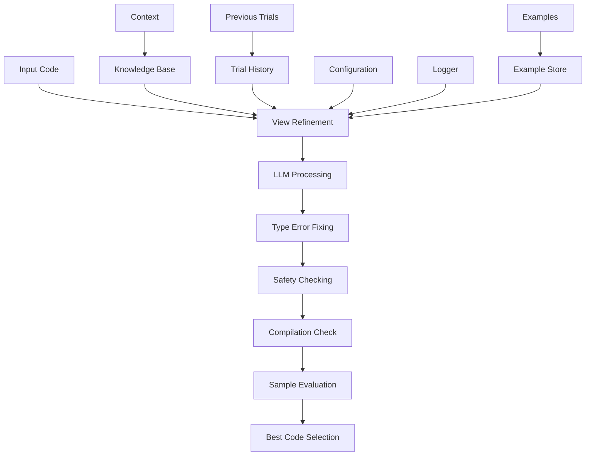

# View Refinement Module

## Overview

The View Refinement Module is responsible for improving and optimizing View functions in Verus code. It focuses on enhancing the mathematical abstraction of data structures while maintaining their semantic correctness.

## Architecture



## Core Components

### 1. View Refinement Generator

The module specializes in refining View implementations:

```python
refinement_instruction = """
You are a highly experienced expert in Verus. Your task is to refine the "View"
function within the given Verus file. The "View" function is the mathematical
abstraction for a data structure, capturing the minimal information needed for
its specification in Verus.

Your responsibilities:
1. Analyze the current "View" function
2. Evaluate abstraction improvements
3. Modify only the "View" function
4. Ensure refined view is more succinct
5. Maintain semantic equivalence
"""
```

### 2. Example Management

Sophisticated example handling system:

```python
def _load_examples(self) -> List[Dict[str, str]]:
    """Load example files for view refinement."""
    examples = []
    base_dir = Path(self.config.get("example_path", "examples"))
    example_path = base_dir / "input-view-refine"

    if not example_path.exists():
        return examples

    for f in sorted(example_path.iterdir()):
        if f.suffix == ".rs":
            input_content = f.read_text()
            answer_path = base_dir / "output-view-refine" / f.name
            if not answer_path.exists():
                continue
            answer = answer_path.read_text()
            examples.append({
                "query": input_content,
                "answer": answer
            })
    return examples
```

### 3. Compilation Retry System

Robust compilation error handling:

```python
def _handle_compilation_retry(
    self,
    code: str,
    original_code: str,
    attempt: int,
    max_compile_attempts: int,
    context,
):
    """Handle compilation retry with fresh responses."""
    if attempt >= max_compile_attempts:
        return []
    retry_instruction = build_instruction(
        base_instruction=self.refinement_instruction +
        "\n\nIMPORTANT: Previous attempts resulted in compilation errors.",
        add_common=True,
        add_view=True,
        code=code,
        knowledge=context.gen_knowledge(),
    )

    responses = self._get_llm_responses(
        retry_instruction,
        code,
        temperature_boost=0.3,
        retry_attempt=attempt,
        max_attempts=max_compile_attempts,
        use_cache=False,
        context=context,
    )
```

## Workflow

### 1. Initialization
```python
def __init__(self, config, logger):
    super().__init__(
        name="view_refinement",
        desc="Refine an existing View function to improve its mathematical abstraction",
        config=config,
        logger=logger,
    )
    self.llm = LLM(config, logger)
```

### 2. Execution Process

1. Code Analysis:
```python
def exec(self, context) -> str:
    code = context.trials[-1].code
    instruction = build_instruction(
        base_instruction=self.refinement_instruction,
        add_common=True,
        add_view=True,
        code=code,
        knowledge=context.gen_knowledge(),
    )
```

2. Multiple Retry Attempts:
```python
max_retries = 3
for retry_attempt in range(max_retries):
    responses = self._get_llm_responses(
        instruction,
        code,
        examples,
        retry_attempt=retry_attempt
    )
```

3. Compilation Handling:
```python
max_compile_attempts = 3
while compile_attempt < max_compile_attempts:
    if compile_attempt > 0:
        new_responses = self._handle_compilation_retry(
            code, original_code, compile_attempt
        )
```

## Features

### 1. View Refinement
- Abstraction improvement
- Semantic preservation
- Minimal representation
- Type safety

### 2. Error Handling
- Multiple retry attempts
- Compilation error recovery
- Type error fixing
- Safety validation

### 3. Example Integration
- Example loading
- Pattern matching
- Answer validation
- Context awareness

### 4. Result Management
- Best result tracking
- Sample preservation
- Score-based evaluation
- Global optimization

## Best Practices

### 1. View Refinement
Example of good refinement:
```rust
// Before
impl<T> View for DataStructure<T> {
    type V = (Vec<T>, usize, bool, usize);

    closed spec fn view(&self) -> Self::V {
        (self.data.clone(), self.size, self.flag, self.capacity)
    }
}

// After
impl<T> View for DataStructure<T> {
    type V = Seq<T>;  // More abstract representation

    closed spec fn view(&self) -> Self::V {
        self.data.view()  // Simpler, more mathematical
    }
}
```

### 2. Safety Checks
```python
def check_code_safety(self, original_code: str, generated_code: str) -> bool:
    """Ensure refinement maintains safety."""
    if not code_change_is_safe(original_code, generated_code):
        return False
    return True
```

### 3. Error Recovery
```python
def _process_responses(self, responses: List[str], original_code: str):
    safe_responses = []
    for response in responses:
        fixed_response, _ = debug_type_error(response)
        if self.check_code_safety(original_code, fixed_response):
            safe_responses.append(fixed_response)
```

## Extension Points

1. Custom Refinement Patterns:
```python
def add_refinement_pattern(self, pattern: str, handler: Callable):
    """Register new refinement pattern handler."""
    self.refinement_patterns[pattern] = handler
```

2. Example Management:
```python
def add_example_source(self, source: ExampleSource):
    """Add new example source."""
    self.example_sources.append(source)
```

3. Result Evaluation:
```python
def add_evaluation_metric(self, metric: Callable):
    """Add custom evaluation metric."""
    self.evaluation_metrics.append(metric)
```

## Guidelines

### 1. Abstraction Principles
- Use mathematical types
- Minimize representation
- Preserve semantics
- Maintain type safety

### 2. Refinement Patterns
- Simplify tuples
- Use sequences
- Abstract collections
- Maintain invariants

### 3. Implementation Style
- Clear abstractions
- Minimal representation
- Type safety
- Semantic preservation

## Common Refinement Patterns

1. Collection Abstraction:
```rust
// Before
type V = (Vec<T>, usize);

// After
type V = Seq<T>;
```

2. State Simplification:
```rust
// Before
type V = (bool, bool, usize);

// After
type V = nat;  // Encode state in a single number
```

3. Map Abstraction:
```rust
// Before
type V = (Vec<K>, Vec<V>);

// After
type V = Map<K, V>;
```

## Conclusion

The View Refinement Module provides a sophisticated system for improving mathematical abstractions in Verus code. Its combination of intelligent refinement, comprehensive safety checks, and robust error handling makes it a reliable tool for enhancing View functions. The module's extensible architecture and clear guidelines ensure consistent and correct abstraction refinement.
