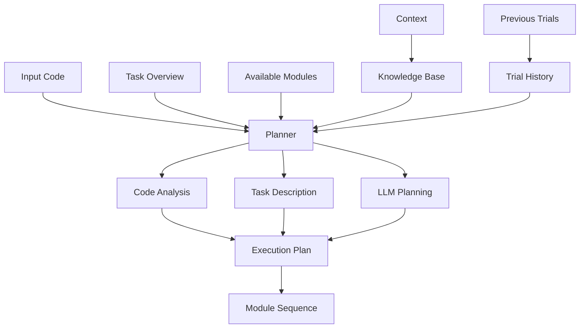

# VerusAgent Planner System

## Overview

The Planner system in VerusAgent is responsible for determining the optimal verification workflow for a given piece of Verus code. It uses a combination of code analysis, LLM-based decision making, and knowledge integration to create an effective verification strategy.

## Architecture



## Core Components

### 1. Task Description Generator

The planner uses a normalized task description system that ensures consistent caching and effective LLM utilization:

```python
def get_normalized_task_desc(self, ctx: Context) -> str:
    """
    Generate a normalized task description for cache consistency.
    Excludes rustc_out to improve cache hit rates.
    """
    if ctx.params.trial_fetch_mode == "naive":
        trial = ctx.trials[-1]
        prevs = ctx.trials[-1 - ctx.params.max_prev_trial : -1]
    else:
        trial = None
        prevs = []

    verus_code = trial.code
    knowledge = ctx.gen_knowledge()
    prev_descs = [
        f"### Failure {i}\n\n{ptrail.desc(rloc, output_rustc_out=False)}"
        for i, ptrail in enumerate(prevs)
    ]

    return fill_template(
        "task_desc",
        {
            "verus_code": verus_code,
            "rustc_out": "",  # Empty for cache consistency
            "knowledge": knowledge,
            "failures": "\n\n".join(prev_descs),
        },
    )
```

### 2. Module Registry Integration

The planner integrates with the module registry to understand available verification capabilities:

```python
def exec(self, ctx: Context):
    """
    Execute the planner to determine verification workflow.
    """
    # Create module descriptions for LLM
    modules = ""
    for module in ctx.modules.values():
        modules += f"- **{module.name}**: {module.desc}\n"

    # Create system prompt
    system = fill_template(
        "plan_system",
        {
            "task_overview": task_overview,
            "modules": modules,
        },
    )

    # Get normalized task description
    prompt = self.get_normalized_task_desc(ctx)

    # Get LLM decision
    return ctx.llm.infer_llm(
        "",
        instruction=None,
        exemplars=[],
        query=prompt,
        system_info=system,
        answer_num=1,
        max_tokens=8192,
        json=False,
        return_msg=True,
    )
```

## Planning Process

### 1. Task Analysis

The planner analyzes the verification task through several lenses:

1. Code Structure Analysis:
   - Function signatures and specifications
   - Data structure definitions
   - Existing verification attempts

2. Verification Requirements:
   - Missing specifications
   - Failed assertions
   - Invariant violations
   - Type safety issues

3. Historical Context:
   - Previous verification attempts
   - Successful strategies
   - Failed approaches

### 2. Module Selection

The planner determines which modules to use based on:

1. Code Characteristics:
   - Presence of data structures (requiring View inference)
   - Loop constructs (requiring invariant inference)
   - Function specifications (requiring spec inference)
   - Verification failures (requiring repairs)

2. Module Dependencies:
   - View inference before refinement
   - Invariant inference before proof generation
   - Specification inference before repairs

3. Module Capabilities:
   - Specialized repair modules for specific errors
   - General-purpose modules for common tasks
   - Fallback strategies for complex cases

## Execution Planning

### 1. Plan Generation

The planner generates an execution plan that specifies:

```python
# Example plan structure
{
    "stages": [
        {
            "name": "view_inference",
            "reason": "Data structure abstraction required",
            "dependencies": []
        },
        {
            "name": "view_refinement",
            "reason": "Optimize view implementations",
            "dependencies": ["view_inference"]
        },
        {
            "name": "spec_inference",
            "reason": "Missing function specifications",
            "dependencies": ["view_refinement"]
        }
    ],
    "fallback_strategies": {
        "compilation_error": "repair_syntax",
        "verification_failure": "repair_registry"
    }
}
```

### 2. Plan Execution

The execution order is determined by:

1. Module Dependencies:
```python
def parse_plan_execution_order(plan_text, available_modules, logger):
    """Parse the plan to determine module execution order."""
    execution_order = []
    for module_name in available_modules:
        if module_name in plan_text.lower():
            execution_order.append(module_name)
    return execution_order
```

2. Error Priorities:
```python
priority_order = {
    "type_errors": 1,
    "compilation_errors": 2,
    "specification_errors": 3,
    "verification_failures": 4
}
```

## Knowledge Integration

The planner integrates multiple knowledge sources:

1. Task Overview:
```markdown
### Verus Specification Synthesis Task

Input consists of:
1. Verus Code: Not fully verified
2. Compilation Error: Compiler reports
3. Knowledge: Component documentation
4. Failures: Previous unsuccessful attempts

Output: Fully verified Verus code
```

2. Module Capabilities:
```python
modules = {
    "view_inference": "Infer view functions for data structures",
    "invariant_inference": "Generate type and loop invariants",
    "spec_inference": "Add requires/ensures clauses",
    "proof_generation": "Generate verification proofs"
}
```

3. Historical Knowledge:
- Previous verification attempts
- Successful repair strategies
- Common failure patterns

## Best Practices

1. Cache Consistency:
   - Normalize task descriptions
   - Exclude variable outputs
   - Maintain consistent formats

2. Plan Validation:
   - Check module availability
   - Verify dependency order
   - Ensure completeness

3. Failure Handling:
   - Provide fallback strategies
   - Track failed attempts
   - Learn from history

4. Performance Optimization:
   - Use cached responses when possible
   - Minimize redundant analysis
   - Prioritize efficient module sequences

## Extension Points

The planner system provides several extension points:

1. Custom Module Integration:
```python
def register_module(name: str, module: BaseModule):
    """Register a new verification module."""
    modules[name] = module
```

2. Plan Templates:
```python
def register_plan_template(name: str, template: Dict):
    """Register a new planning template."""
    plan_templates[name] = template
```

3. Knowledge Sources:
```python
def add_knowledge_source(source: KnowledgeSource):
    """Add a new knowledge source."""
    knowledge_sources.append(source)
```

## Conclusion

The VerusAgent Planner system provides a sophisticated approach to verification workflow planning. By combining code analysis, LLM-based decision making, and extensive knowledge integration, it creates effective verification strategies tailored to specific code characteristics and requirements. The system's modular design and extension points allow for continuous improvement and adaptation to new verification challenges.