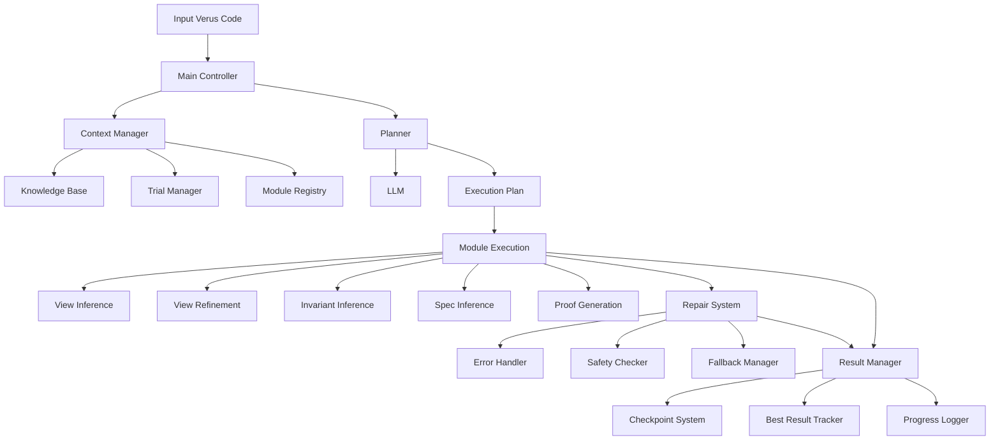
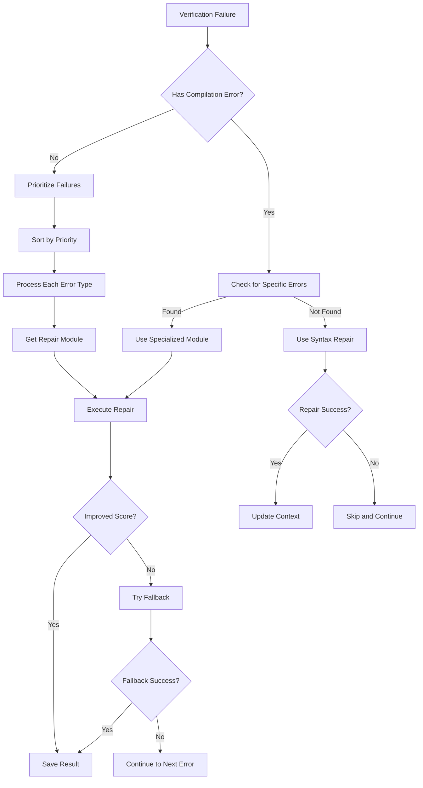
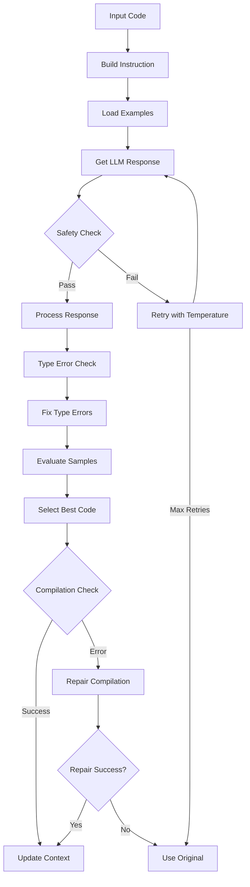

# VerusAgent Technical Workflow Report

## Overview

VerusAgent streamlines Rust code verification in the Verus framework with a modular workflow that coordinates planning, checking, and repair.
Large language models guide these steps, making decisions and generating code to overcome verification challenges.

## System Architecture



## Core Components

### 1. Main Controller (`main.py`)
The main controller orchestrates the entire verification process and handles:
- Configuration management and environment setup
- Input file processing and lemma preprocessing
- Module initialization and registration
- Trial management and evaluation
- Result tracking with checkpoint mechanisms
- Progress logging with detailed metrics
- Multiple fallback strategies for error handling

Example configuration handling:
```python
# Load configuration with fallback
try:
    config_name = os.environ.get("VERUS_CONFIG", "config-azure")
    config = reset_config(config_name)
    logger.info(f"Using {config_name} configuration")

    # Set verus path from config or environment
    if os.environ.get("VERUS_PATH"):
        verus_path = os.environ.get("VERUS_PATH")
        verus.set_verus_path(verus_path)
    elif "verus_path" in config:
        verus.set_verus_path(config["verus_path"])
else:
    logger.warning("Using default configuration")
```

### 2. Context Management (`context.py`)
The Context class serves as the central state manager:
- Maintains verification trials history with trial scoring
- Manages knowledge base for verification
- Tracks global best code and scores
- Handles module registration
- Processes library imports and documentation

Example knowledge management:
```python
def add_knowledge(self, id: str, knowledge: str, append=False):
    """Add knowledge to the context."""
    if append:
        self.knowledge[id] += knowledge
    else:
        self.knowledge[id] = knowledge

def gen_knowledge(self):
    """Generate formatted knowledge."""
    knowledge = "\n\n# relevant vstd lib knowledge\n\n"
    for name, desc in self.knowledge.items():
        knowledge += f"## {name}\n\n{desc}\n\n"
    return knowledge
```

### 3. Planning System (`planner.py`)
The Planner determines the optimal verification workflow:
- Analyzes input code characteristics
- Determines module execution sequence
- Generates verification plans using LLM
- Normalizes task descriptions for consistent caching

Example task description generation:
```python
def get_normalized_task_desc(self, ctx: Context) -> str:
    """Generate normalized task description for cache consistency."""
    trial = ctx.trials[-1]
    prevs = ctx.trials[-1 - ctx.params.max_prev_trial : -1]

    verus_code = trial.code
    knowledge = ctx.gen_knowledge()
    prev_descs = [
        f"### Failure {i}\n\n{ptrail.desc(rloc, output_rustc_out=False)}"
        for i, ptrail in enumerate(prevs)
    ]

    return fill_template(
        "task_desc",
        {
            "verus_code": verus_code,
            "rustc_out": "",  # Empty for caching
            "knowledge": knowledge,
            "failures": "\n\n".join(prev_descs),
        },
    )
```

## Repair Workflow

The repair system follows a sophisticated workflow for handling verification failures:



### Error Priority Order
The system prioritizes errors in the following order:
1. Type errors (MismatchedType)
2. Vector length errors (PreCondFailVecLen)
3. Arithmetic errors (ArithmeticFlow)
4. Invariant failures (InvFailFront, InvFailEnd)
5. Constructor type invariant errors
6. Type annotation errors
7. Decrease failures
8. Missing imports/implementations
9. Mode errors
10. Assertion failures
11. Precondition failures
12. Old(self) errors
13. Postcondition failures
14. Private field access errors

Example priority implementation:
```python
priority_order = {
    VerusErrorType.MismatchedType: 1,
    VerusErrorType.PreCondFailVecLen: 2,
    VerusErrorType.ArithmeticFlow: 3,
    VerusErrorType.InvFailFront: 4,
    VerusErrorType.InvFailEnd: 5,
    # ... more priorities
}

def prioritize_failures(self, failures: List[VerusError]) -> List[VerusError]:
    return sorted(
        failures,
        key=lambda f: priority_order.get(f.error, default_priority)
    )
```

## Specification Inference Workflow

The specification inference process follows this workflow:



### Safety Checking
The system performs multiple safety checks:

```python
def check_code_safety(self, original_code: str, generated_code: str) -> bool:
    """Check if generated code is safe to use."""
    # Check code changes using Lynette
    if not code_change_is_safe(
        original_code, generated_code, self.immutable_funcs, self.logger
    ):
        return False

    # Check TODO marker preservation
    todo_markers = [
        "// TODO: add proof",
        "// TODO: add loop invariant"
    ]

    for marker in todo_markers:
        if original_code.count(marker) > generated_code.count(marker):
            return False

    return True
```

## Result Management

The system maintains multiple types of results:

1. Timestamped Results:
```python
run_timestamp = datetime.now().strftime("%Y%m%d_%H%M%S")
file_id = f"{input_file_base}__{data_structure}_{verification_type}_{run_timestamp}"
```

2. Best Result Tracking:
```python
def handle_checkpoint_best(context, output_dir, file_id, progress_logger, logger):
    checkpoint_best_code = context.get_best_code()
    checkpoint_best_score = context.get_best_score()

    # Save with detailed score information
    checkpoint_best_with_score = (
        f"{checkpoint_best_code}\n\n"
        f"// Checkpoint Best VEval Score: {checkpoint_best_score}\n"
        f"// Verified: {checkpoint_best_score.verified}, "
        f"Errors: {checkpoint_best_score.errors}"
    )
```

## Performance Optimizations

1. LLM Caching:
```python
def _get_llm_responses(self, instruction: str, code: str, retry_attempt: int = 0):
    # Cache only first attempt
    use_cache = (retry_attempt == 0)

    return self.llm.infer_llm(
        instruction,
        code,
        use_cache=use_cache,
        temp=1.0 + (retry_attempt * temperature_boost)
    )
```

2. Trial Management:
```python
def add_trial(self, code: str) -> None:
    trial_id = len(self.trials)
    path = os.path.join(tmp_dir, f"trial_{trial_id}.rs")
    eval = VEval(code, self.logger)
    self.trials.append(Trial(trial_id, eval, path, self.logger))
```

## Extension Points

The system provides several extension points:

1. Module System:
```python
class BaseModule:
    def __init__(self, name: str, desc: str, config: Dict[str, Any]):
        self.name = name
        self.desc = desc
        self.config = config

    def exec(self, context) -> str:
        raise NotImplementedError("Subclasses must implement exec()")
```

2. Repair Registry:
```python
def register_module(self, name: str, module: BaseRepairModule, error_types: List[VerusErrorType]):
    self.repair_modules[name] = module
    for error_type in error_types:
        self.error_to_module_map[error_type] = module
```

## Best Practices

1. Regular Checkpoint Saving:
```python
def update_checkpoint_best(best_code, global_best_score, global_best_code, global_dir, logger):
    if best_code and (not global_best_score or best_score > global_best_score):
        global_best_score = best_score
        global_best_code = best_code
        logger.info(f"Found better repair with score: {global_best_score}")
```

2. Progressive Refinement:
```python
def _process_responses(self, responses: List[str], original_code: str):
    safe_responses = []
    for response in responses:
        fixed_response, _ = debug_type_error(response, logger=self.logger)
        if self.check_code_safety(original_code, fixed_response):
            safe_responses.append(fixed_response)
    return safe_responses
```

## Conclusion

VerusAgent provides a comprehensive, modular, and robust framework for automated verification of Rust code using the Verus verification system. Its sophisticated workflow combines planning, verification, and repair strategies with extensive error handling and result management capabilities. The system's use of LLM for intelligent decision-making, combined with its robust module architecture and safety mechanisms, makes it a powerful tool for code verification.

The system's key strengths lie in:
1. Modular architecture allowing easy extension
2. Sophisticated error handling and repair strategies
3. Comprehensive result management and tracking
4. Performance optimizations through caching and smart trial management
5. Strong safety checks and validation mechanisms
6. Detailed logging and progress tracking
