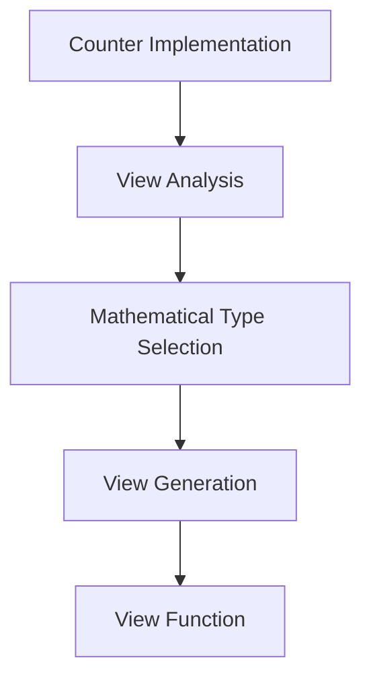
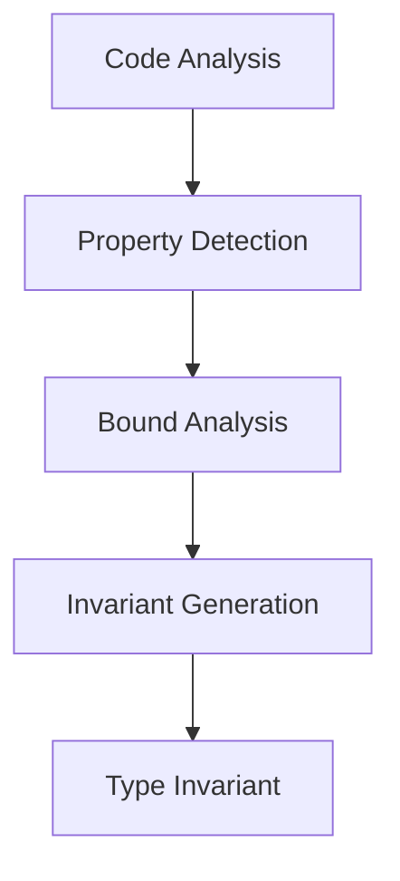
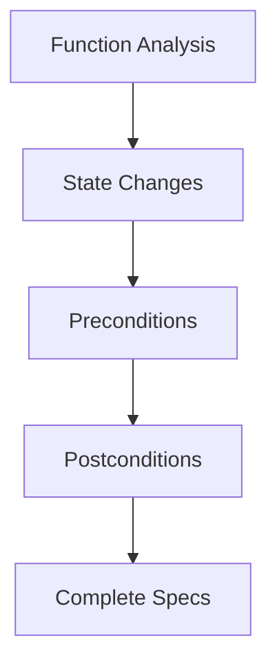

# Getting Started with VerusAgent

## Introduction

Learn how VerusAgent checks Rust code.
This tutorial covers a simple counter, core concepts, and common patterns.

## Basic Concepts

### 1. Mathematical Abstraction

Formal verification models data structures with math:

```rust
// Implementation
pub struct Counter {
    value: u64
}

// Mathematical abstraction
impl Counter {
    spec fn view(&self) -> nat {
        self.value as nat
    }
}
```

### 2. Invariants

Invariants define properties that must always hold:

```rust
impl Counter {
    #[verifier::type_invariant]
    pub closed spec fn inv(&self) -> bool {
        self.value <= 100  // Counter never exceeds 100
    }
}
```

### 3. Specifications

Function specifications define contracts:

```rust
impl Counter {
    pub fn increment(&mut self) -> bool
        requires
            old(self)@.value < 100  // Room to increment
        ensures
            self@.value == old(self)@.value + 1  // Value increased
    {
        self.value += 1;
        true
    }
}
```

## First Verification

Let's verify a simple counter:

```rust
verus! {
    pub struct Counter {
        value: u64
    }

    impl Counter {
        // 1. View Function
        spec fn view(&self) -> nat {
            self.value as nat
        }

        // 2. Type Invariant
        #[verifier::type_invariant]
        pub closed spec fn inv(&self) -> bool {
            self.value <= 100
        }

        // 3. Constructor
        pub fn new() -> (ret: Counter)
            ensures
                ret@.value == 0
        {
            Counter { value: 0 }
        }

        // 4. Operations
        pub fn increment(&mut self) -> bool
            requires
                old(self)@.value < 100
            ensures
                self@.value == old(self)@.value + 1
        {
            self.value += 1;
            true
        }

        pub fn get_value(&self) -> (ret: u64)
            ensures
                ret as nat == self@.value
        {
            self.value
        }
    }
}
```

## Verification Process

### 1. View Inference

VerusAgent first generates the mathematical abstraction:



### 2. Invariant Inference

Next, it identifies and generates invariants:



### 3. Specification Inference

Then, it adds function specifications:



### 4. Proof Generation

Finally, it generates necessary proofs:

```rust
pub fn increment(&mut self) -> bool {
    proof {
        // Prove value stays within bounds
        assert(self.value < 100);
        assert(self.value + 1 <= 100);
    }
    self.value += 1;
    true
}
```

## Common Patterns

### 1. State Updates

```rust
ensures
    self@.value == old(self)@.value + 1  // Clear state change
```

### 2. Bound Checking

```rust
requires
    old(self)@.value < 100  // Explicit bounds
```

### 3. Type Conversion

```rust
ensures
    ret as nat == self@.value  // Safe conversion
```

## Exercises

1. Basic Counter:
   - Implement a counter with maximum value
   - Add decrement operation
   - Verify all operations

2. Bounded Queue:
   - Implement a fixed-size queue
   - Add enqueue/dequeue operations
   - Verify bounds and operations

3. State Machine:
   - Implement a simple state machine
   - Add state transitions
   - Verify state invariants

## Next Steps

- Move on to [Basic Verification](02_basic_verification.md)
- Learn about more complex data structures
- Explore advanced verification techniques

## Common Pitfalls

1. Missing Invariants:

   ```rust
   // Wrong: Missing bound check
   pub fn increment(&mut self) -> bool {
       self.value += 1;
       true
   }
   ```

2. Incomplete Specifications:

   ```rust
   // Wrong: Missing requires clause
   pub fn increment(&mut self) -> bool
       ensures
           self@.value == old(self)@.value + 1
   ```

3. Type Confusion:

   ```rust
   // Wrong: Mixing types without conversion
   ensures
       ret == self@.value  // Should be ret as nat
   ```

## Best Practices

1. Start Simple:
   - Begin with basic operations
   - Add complexity gradually
   - Test each step

2. Use Clear Names:
   - Descriptive function names
   - Meaningful variable names
   - Clear specification names

3. Follow Patterns:
   - Consistent specification style
   - Standard proof structure
   - Common verification patterns

4. Document Everything:
   - Operation purposes
   - Invariant meanings
   - Specification reasoning

## Conclusion

This introduction covered:

- Basic verification concepts
- Simple data structure verification
- Common patterns and practices
- Initial exercises

See [Basic Verification](02_basic_verification.md) for more examples.
