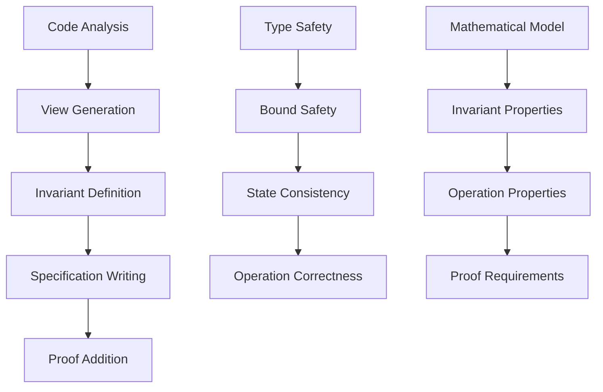

# Basic Verification with VerusAgent

## Introduction

This guide builds on the basics to show how to verify more complex data structures. We'll use the RingBuffer example to demonstrate key verification concepts.

## RingBuffer Overview

A ring buffer is a circular queue with fixed capacity:

```rust
pub struct RingBuffer<T: Copy> {
    ring: Vec<T>,
    head: usize,
    tail: usize,
}
```

## Step-by-Step Verification

### 1. Mathematical Abstraction

First, we define how to view the data structure mathematically:

```rust
impl<T: Copy> View for RingBuffer<T> {
    type V = (Seq<T>, usize);  // Elements and capacity

    closed spec fn view(&self) -> Self::V {
        let cap = self.ring.len();
        if self.tail >= self.head {
            // Simple case
            ((self.ring)@.subrange(self.head as int, self.tail as int),
            cap)
        } else {
            // Wrap-around case
            ((self.ring)@.subrange(self.head as int, cap as int)
                .add((self.ring)@.subrange(0, self.tail as int)),
                cap)
        }
    }
}
```

Key points:

- Use `Seq<T>` for sequence abstraction
- Track capacity separately
- Handle wrap-around case

### 2. Type Invariants

Next, we define structural invariants:

```rust
#[verifier::type_invariant]
closed spec fn inv(&self) -> bool {
    &&& self.head < self.ring.len()  // Head within bounds
    &&& self.tail < self.ring.len()  // Tail within bounds
    &&& self.ring.len() > 0          // Non-empty buffer
}
```

Key points:

- Bound constraints
- Capacity constraints
- Structural properties

### 3. Operation Specifications

Then, we specify operations:

```rust
pub fn enqueue(&mut self, val: T) -> bool
    requires
        old(self)@.0.len() < old(self)@.1 - 1  // Space available
    ensures
        // Success conditions
        self@.1 == old(self)@.1,  // Capacity preserved
        self@.0.len() == old(self)@.0.len() + 1,  // Length increased
        self@.0.last() == val,  // Value added
        // Preservation
        forall|i: int|
            0 <= i < old(self)@.0.len() ==>
                self@.0[i] == old(self)@.0[i]  // Old elements preserved
{
    // Implementation
}
```

Key points:

- Clear preconditions
- Complete postconditions
- State preservation

### 4. Proof Generation

Finally, we add proofs:

```rust
pub fn enqueue(&mut self, val: T) -> bool {
    if self.is_full() {
        false
    } else {
        proof {
            // Prove invariants maintained
            use_type_invariant(&*self);
            // Prove modulo arithmetic
            lemma_mod_auto(self@.1 as int);
        }
        // Implementation
        my_set(&mut self.ring, self.tail, val);
        self.tail = (self.tail + 1) % self.ring.len();
        true
    }
}
```

Key points:

- Invariant usage
- Required lemmas
- State consistency

## Verification Workflow



## Common Patterns

### 1. Sequence Operations

```rust
// Subrange selection
self.ring@.subrange(start, end)

// Sequence concatenation
seq1.add(seq2)

// Length properties
self@.0.len() == old(self)@.0.len() + 1
```

### 2. Bound Checking

```rust
// Index bounds
self.head < self.ring.len()

// Capacity checks
old(self)@.0.len() < old(self)@.1 - 1
```

### 3. State Preservation

```rust
// Capacity preservation
self@.1 == old(self)@.1

// Element preservation
forall|i: int|
    0 <= i < old(self)@.0.len() ==>
        self@.0[i] == old(self)@.0[i]
```

## Exercises

1. Add Operations:
   - Implement dequeue
   - Add peek operation
   - Verify all operations

2. Extend Functionality:
   - Add clear operation
   - Implement resize
   - Add bulk operations

3. Enhance Proofs:
   - Add more assertions
   - Use additional lemmas
   - Strengthen invariants

## Common Challenges

### 1. Wrap-Around Handling

```rust
// Challenge: Handling circular buffer wrap-around
if self.tail >= self.head {
    // Simple case
} else {
    // Wrap-around case
}
```

### 2. Modulo Arithmetic

```rust
// Challenge: Proving modulo properties
proof {
    lemma_mod_auto(self@.1 as int);
}
```

### 3. Quantifier Usage

```rust
// Challenge: Proper quantifier bounds
forall|i: int|
    0 <= i < self@.0.len() ==> ...
```

## Best Practices

1. View Design:
   - Use appropriate types
   - Handle special cases
   - Maintain abstraction

2. Invariant Structure:
   - Focus on essentials
   - Keep it minimal
   - Ensure provability

3. Specification Style:
   - Clear preconditions
   - Complete postconditions
   - State preservation

4. Proof Organization:
   - Logical structure
   - Required lemmas
   - Clear assertions

## Next Steps

- Move on to [Advanced Verification](03_advanced_verification.md)
- Explore bitmap verification
- Learn about complex proofs

## Conclusion

This guide covered:

- RingBuffer verification
- Common patterns
- Verification workflow
- Best practices

Continue to [Advanced Verification](03_advanced_verification.md) for more complex examples.
