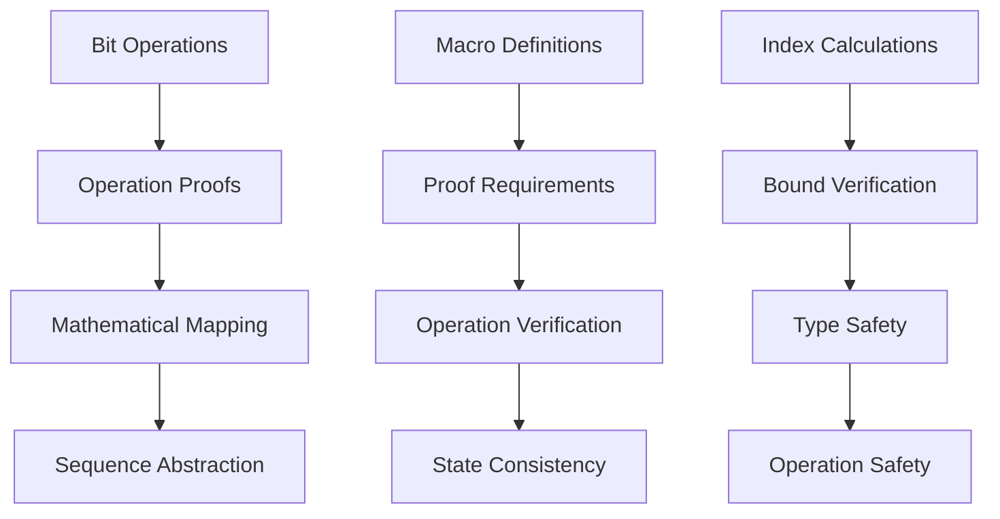

# Advanced Verification with VerusAgent

## Introduction

This guide covers advanced verification techniques using the BitMap example, demonstrating bit-level operations and complex proofs.

## BitMap Overview

A bitmap is a bit vector implementation:

```rust
pub struct BitMap {
    bits: Vec<u64>,
}
```

## Advanced Concepts

### 1. Bit-Level Operations

First, we define bit operations:

```rust
macro_rules! get_bit64_macro {
    ($a:expr, $b:expr) => {{
        (0x1u64 & ($a >> $b)) == 1
    }};
}

macro_rules! set_bit64_macro {
    ($a:expr,$b:expr, $c:expr) => {{
        if $c {
            $a | 1u64 << $b
        } else {
            $a & (!(1u64 << $b))
        }
    }};
}
```

### 2. Mathematical Abstraction

The view maps bits to a boolean sequence:

```rust
impl BitMap {
    spec fn view(&self) -> Seq<bool> {
        let total_bits = self.bits@.len() * 64;
        Seq::new(total_bits, |i: int|
            get_bit64!(self.bits@[i / 64], (i % 64) as u64)
        )
    }
}
```

### 3. Operation Proofs

Complex proofs for bit operations:

```rust
#[verifier::bit_vector]
proof fn set_bit64_proof(bv_new: u64, bv_old: u64, index: u64, bit: bool)
    requires
        bv_new == set_bit64!(bv_old, index, bit),
        index < 64,
    ensures
        get_bit64!(bv_new, index) == bit,
        forall|loc2: u64| #![auto]
            (loc2 < 64 && loc2 != index) ==>
                (get_bit64!(bv_new, loc2) == get_bit64!(bv_old, loc2))
```

## Advanced Verification Workflow



## Complex Patterns

### 1. Bit Manipulation

```rust
// Setting bits
fn set_bit(&mut self, index: u32, bit: bool)
    ensures
        self@ == old(self)@.update(index as int, bit)
{
    let bv_new = set_bit64_macro!(bv_old, bit_index, bit);
    proof {
        set_bit64_proof(bv_new, bv_old, bit_index, bit);
    }
}
```

### 2. Bitwise Operations

```rust
// Bitwise OR
fn or(&self, bm: &BitMap) -> (ret: BitMap)
    ensures
        forall|i: int|
            get_bit64!(ret.bits@[i / 64], (i % 64) as u64) ==
            (get_bit64!(self.bits@[i / 64], (i % 64) as u64) ||
             get_bit64!(bm.bits@[i / 64], (i % 64) as u64))
```

### 3. Index Mapping

```rust
// Bit index calculation
let seq_index: usize = (index / 64) as usize;
let bit_index: u32 = index % 64;
```

## Advanced Proofs

### 1. Bit Operation Proofs

```rust
proof fn bit_or_64_proof(bv1: u64, bv2: u64, bv_new: u64)
    requires
        bv_new == bv1 | bv2,
    ensures
        forall|i: u64| #![auto]
            (i < 64) ==> get_bit64!(bv_new, i) ==
                (get_bit64!(bv1, i) || get_bit64!(bv2, i))
```

### 2. Modulo Arithmetic

```rust
proof fn mod_auto(n: int) -> bool
    recommends
        n > 0,
{
    &&& (n % n == 0 && (-n) % n == 0)
    &&& (forall|x: int| #[trigger] ((x % n) % n) == x % n)
    &&& (forall|x: int| 0 <= x < n <==> #[trigger] (x % n) == x)
}
```

### 3. Sequence Properties

```rust
proof {
    assert_seqs_equal!(
        self.view(),
        old(self).view().update(index as int, bit)
    );
}
```

## Advanced Exercises

1. Bit Operations:
   - Implement AND, XOR
   - Add bit counting
   - Verify all operations

2. Complex Operations:
   - Add bit range operations
   - Implement shift operations
   - Add rotation operations

3. Performance Optimizations:
   - Add bulk operations
   - Optimize bit counting
   - Verify optimizations

## Advanced Challenges

### 1. Bit Pattern Verification

```rust
// Challenge: Proving bit pattern properties
ensures
    forall|i: int|
        0 <= i < 64 ==>
            get_bit64!(result, i) == pattern[i as usize]
```

### 2. Operation Composition

```rust
// Challenge: Proving composed operations
ensures
    forall|i: int|
        get_bit64!(and_result, i) ==
            (get_bit64!(or_result, i) && get_bit64!(xor_result, i))
```

### 3. Performance Properties

```rust
// Challenge: Proving optimization correctness
ensures
    bulk_operation_result@ ==
        sequential_operation_result@
```

## Best Practices

1. Bit Operation Design:
   - Use clear macros
   - Maintain abstraction
   - Handle edge cases

2. Proof Structure:
   - Separate concerns
   - Use appropriate lemmas
   - Maintain clarity

3. Performance Consideration:
   - Balance abstraction
   - Optimize operations
   - Verify correctness

4. Documentation:
   - Document bit patterns
   - Explain operations
   - Note assumptions

## Advanced Topics

1. Bit-Level Verification:
   - Bit pattern proofs
   - Operation composition
   - Pattern matching

2. Performance Verification:
   - Operation complexity
   - Memory usage
   - Optimization correctness

3. Advanced Proofs:
   - Custom lemmas
   - Complex properties
   - Optimization verification

## Next Steps

- Move on to [Troubleshooting](04_troubleshooting.md)
- Explore more complex data structures
- Study advanced proof techniques

## Conclusion

This guide covered:

- Advanced bit operations
- Complex proofs
- Performance considerations
- Advanced verification techniques

Continue to [Troubleshooting](04_troubleshooting.md) for debugging and problem-solving techniques.
