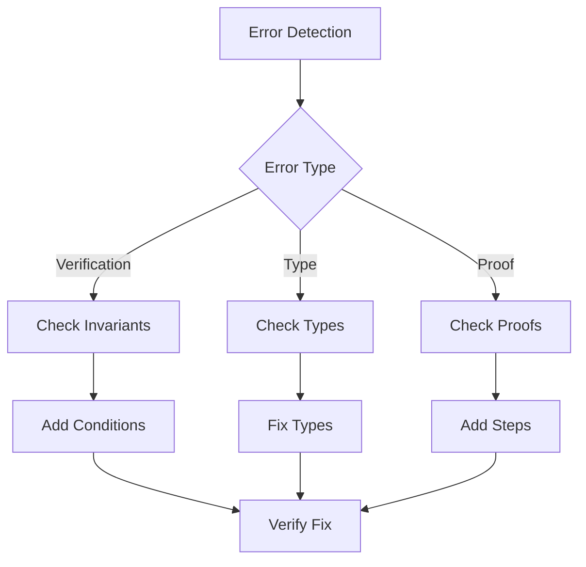

# Troubleshooting Verification Issues

## Introduction

This guide helps you diagnose and fix common verification problems in VeriStruct.

## Common Issues

### 1. Verification Failures

#### Symptom

```rust
error: assertion failed
   |
   |     assert(self.value <= 100);
   |     ^^^^^^^^^^^^^^^^^^^^^^^
```

#### Solutions

1. Check invariants:

```rust
#[verifier::type_invariant]
pub closed spec fn inv(&self) -> bool {
    self.value <= 100  // Add missing invariant
}
```

2. Add preconditions:

```rust
pub fn increment(&mut self) -> bool
    requires
        old(self)@.value < 100  // Add bound check
```

3. Strengthen postconditions:

```rust
ensures
    self@.value <= 100,  // Add explicit bound
    self@.value == old(self)@.value + 1
```

### 2. Type Errors

#### Symptom

```rust
error: type mismatch
   |
   |     ensures ret == self@.value
   |                    ^^^^^^^^^^^
```

#### Solutions

1. Add type conversions:

```rust
ensures
    ret as nat == self@.value  // Add conversion
```

2. Use correct types:

```rust
type V = (Seq<T>, usize)  // Use correct type
```

3. Handle type bounds:

```rust
requires
    index as nat < self@.len()  // Add conversion
```

### 3. Proof Failures

#### Symptom

```rust
error: proof obligation not satisfied
   |
   |     proof { ... }
   |     ^^^^^^^^^^^^
```

#### Solutions

1. Add intermediate assertions:

```rust
proof {
    assert(self.head < self.ring.len());  // Add step
    assert(self.tail < self.ring.len());  // Add step
    use_type_invariant(&*self);
}
```

2. Use appropriate lemmas:

```rust
proof {
    lemma_mod_auto(self@.1 as int);  // Add lemma
}
```

3. Break down complex proofs:

```rust
proof {
    // Step 1: Prove bounds
    assert(index < self.bits.len() * 64);

    // Step 2: Prove bit operation
    set_bit64_proof(bv_new, bv_old, bit_index, bit);

    // Step 3: Prove state update
    assert_seqs_equal!(self.view(), old(self).view().update(index, bit));
}
```

## Diagnostic Process



## Common Patterns

### 1. Missing Invariants

```rust
// Problem
pub fn increment(&mut self) -> bool {
    self.value += 1;
    true
}

// Solution
pub fn increment(&mut self) -> bool
    requires
        old(self)@.value < 100
    ensures
        self@.value == old(self)@.value + 1,
        self@.value <= 100
{
    proof {
        assert(self.value < 100);
    }
    self.value += 1;
    true
}
```

### 2. Type Mismatches

```rust
// Problem
ensures
    ret == self@.value

// Solution
ensures
    ret as nat == self@.value,
    ret <= 100
```

### 3. Incomplete Proofs

```rust
// Problem
proof {
    use_type_invariant(&*self);
}

// Solution
proof {
    // Step 1: Current state
    assert(self.head < self.ring.len());

    // Step 2: Operation effect
    use_type_invariant(&*self);

    // Step 3: New state
    assert(self.tail < self.ring.len());
}
```

## Debugging Techniques

### 1. Isolate Issues

```rust
// Break down complex functions
fn complex_operation(&mut self) {
    proof {
        // Isolate each part
        self.check_bounds();
        self.verify_operation();
        self.confirm_state();
    }
}
```

### 2. Add Assertions

```rust
proof {
    // Add intermediate checks
    assert(condition_1);
    operation_1();
    assert(condition_2);
    operation_2();
    assert(final_condition);
}
```

### 3. Use Debug Output

```rust
self.logger.debug(f"Current state: {self.value}");
self.logger.debug(f"Operation result: {result}");
```

## Best Practices

1. Systematic Approach:
   - Start with types
   - Add invariants
   - Build proofs
   - Test thoroughly

2. Clear Documentation:
   - Document assumptions
   - Explain proofs
   - Note limitations
   - Track changes

3. Incremental Verification:
   - Verify basic properties
   - Add complexity gradually
   - Test each step
   - Document progress

4. Error Handling:
   - Check all cases
   - Handle edge cases
   - Document errors
   - Add recovery

## Prevention Strategies

1. Code Structure:
   - Clear types
   - Strong invariants
   - Complete specs
   - Good proofs

2. Documentation:
   - Clear requirements
   - Detailed specs
   - Proof outlines
   - Known issues

3. Testing:
   - Unit tests
   - Property tests
   - Edge cases
   - Regression tests

## Next Steps

1. Review Code:
   - Check invariants
   - Verify types
   - Test proofs
   - Document issues

2. Improve Process:
   - Better testing
   - Clear docs
   - Strong types
   - Good proofs

3. Learn More:
   - Study examples
   - Read docs
   - Practice proofs
   - Share knowledge

## Conclusion

This guide covered:

- Common issues
- Solutions
- Prevention
- Best practices

Remember:

1. Start simple
2. Build gradually
3. Test thoroughly
4. Document clearly
